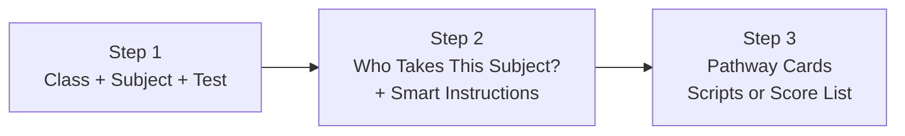

# UX Overhaul — Completed

## What Changed

The start screen was restructured from a flat form into a **guided progressive flow** with elegance and smartness throughout.

### Before → After

| Before | After |
|--------|-------|
| Enrollment hidden behind "More Options" | Enrollment **auto-reveals** after filling dropdowns |
| Smart Mode hidden behind "More Options" | Smart Instructions **always visible** in Step 2 |
| Crude `alert()` for validation | Graceful **inline toast** with red border flash |
| Flat form — everything visible at once | **Progressive 3-step reveal** guiding the teacher |
| Upload card had inline onclick | Clean JS event listener with validation |

### Step-by-Step Flow



1. **Step 1** — 3 dropdowns (class, subject, test) with green glow when filled
2. **Step 2** — Auto-reveals when all 3 are filled: enrollment toggle + smart instructions
3. **Step 3** — Pathway cards start dimmed, activate when ready

### Graceful Validation


- Clicking a dimmed card shows an **inline yellow toast** instead of a browser alert
- **Red border flash** on unfilled dropdowns guides the teacher's eye
- Toast auto-hides after 4 seconds

### Progressive Reveal in Action


- Enrollment with "Everyone in Class" / "Only Some Students" buttons
- Smart Instructions toggle with elegant gradient background
- Pathway cards at full opacity with clear action labels

## Verification
- ✅ All 4 browser tests passed
- ✅ Zero JavaScript console errors
- ✅ Progressive reveal animates smoothly
- ✅ Toast validation replaces all `alert()` calls
- ✅ Green glow on filled dropdowns
- ✅ Red flash on missing dropdowns

## Files Modified

| File | Changes |
|------|---------|
| [index.html](file:///c:/Users/Administrator/Desktop/Script%20recorder/templates/index.html) | Restructured start screen into progressive 3-step flow, moved enrollment + smart mode to auto-revealing Step 2, added toast validation, fixed `mainTargetClass` references, added [checkSetupReady()](file:///c:/Users/Administrator/Desktop/Script%20recorder/templates/index.html#1046-1089) |

```diff:index.html
<!DOCTYPE html>
<html lang="en">

<head>
    <meta charset="UTF-8">
    <meta name="viewport" content="width=device-width, initial-scale=1.0">
    <title>OCR Grader Assistant</title>
    <!-- Tailwind CSS -->
    <script src="https://cdn.tailwindcss.com"></script>
    <!-- Canvas Confetti -->
    <script src="https://cdn.jsdelivr.net/npm/canvas-confetti@1.6.0/dist/confetti.browser.min.js"></script>
    <script>
        tailwind.config = {
            theme: {
                extend: {
                    fontFamily: {
                        sans: ['Inter', 'sans-serif'],
                        heading: ['Plus Jakarta Sans', 'sans-serif'],
                    },
                    colors: {
                        background: 'hsl(215, 10%, 4%)',    /* Deep midnight blue layer 0 */
                        foreground: 'hsl(215, 5%, 98%)',
                        card: 'hsl(215, 10%, 6%)',          /* Elevated surface */
                        'card-foreground': 'hsl(215, 5%, 98%)',
                        muted: 'hsl(215, 10%, 15%)',
                        'muted-foreground': 'hsl(215, 10%, 65%)',
                        primary: 'hsl(215, 90%, 55%)',      /* QSI Blue */
                        'primary-foreground': 'hsl(0, 0%, 98%)',
                        accent: 'hsl(215, 80%, 70%)',
                        destructive: 'hsl(0, 72%, 51%)',
                    },
                    animation: {
                        'fade-in-up': 'fadeInUp 0.5s cubic-bezier(0.25, 0.46, 0.45, 0.94) forwards',
                        'pulse-glow': 'pulseGlow 3s infinite',
                        'spin-slow': 'spin 8s linear infinite',
                    },
                    keyframes: {
                        fadeInUp: {
                            '0%': { opacity: '0', transform: 'translateY(20px)' },
                            '100%': { opacity: '1', transform: 'translateY(0)' },
                        },
                        pulseGlow: {
                            '0%, 100%': { opacity: 0.2 },
                            '50%': { opacity: 0.4 },
                        }
                    }
                }
            }
        }
    </script>
    <!-- Google Fonts -->
    <link rel="preconnect" href="https://fonts.googleapis.com">
    <link rel="preconnect" href="https://fonts.gstatic.com" crossorigin>
    <link
        href="https://fonts.googleapis.com/css2?family=Plus+Jakarta+Sans:wght@600;700;800&family=Inter:wght@400;500;600&display=swap"
        rel="stylesheet">
    <!-- FontAwesome -->
    <link rel="stylesheet" href="https://cdnjs.cloudflare.com/ajax/libs/font-awesome/6.4.0/css/all.min.css">

    <!-- OpenCV.js for Advanced Document Detection -->
    <script async src="https://docs.opencv.org/4.8.0/opencv.js" onload="console.log('OpenCV loaded');"
        type="text/javascript"></script>

    <style>
        :root {
            --brand-rgb: 33, 150, 243;
            /* Matches primary HSL 215, 90%, 55% */
        }

        body {
            background-color: theme('colors.background');
            color: theme('colors.foreground');
        }

        /* 21st.dev Premium Depth & Textures */
        .dot-matrix {
            background: radial-gradient(circle, rgba(255, 255, 255, 0.03) 1px, transparent 1px);
            background-size: 20px 20px;
        }

        .shadow-glow {
            box-shadow: 0 0 20px rgba(var(--brand-rgb), 0.3);
        }

        .shadow-glow-lg {
            box-shadow: 0 0 40px rgba(var(--brand-rgb), 0.4);
        }

        .shadow-bloom {
            box-shadow: 0 0 60px 20px rgba(var(--brand-rgb), 0.15);
        }

        .noise {
            position: relative;
        }

        .noise::after {
            content: '';
            position: absolute;
            inset: 0;
            opacity: 0.03;
            background-image: url("data:image/svg+xml,%3Csvg viewBox='0 0 256 256' xmlns='http://www.w3.org/2000/svg'%3E%3Cfilter id='n'%3E%3CfeTurbulence type='fractalNoise' baseFrequency='0.9' numOctaves='4' stitchTiles='stitch'/%3E%3C/filter%3E%3Crect width='100%25' height='100%25' filter='url(%23n)'/%3E%3C/svg%3E");
            pointer-events: none;
            z-index: 0;
        }

        /* Input Animations */
        .input-wrapper {
            position: relative;
            overflow: hidden;
            border-radius: 0.75rem;
        }

        .input-focus-anim {
            position: absolute;
            inset: -1px;
            background: linear-gradient(90deg, transparent, rgba(var(--brand-rgb), 0.5), transparent);
            opacity: 0;
            transition: opacity 0.3s;
            pointer-events: none;
            border-radius: 0.75rem;
        }

        select:focus~.input-focus-anim,
        input[type="text"]:focus~.input-focus-anim {
            opacity: 1;
        }

        /* Animation Base */
        .reveal {
            opacity: 0;
            transform: translateY(30px) scale(0.98);
            transition: all 0.8s cubic-bezier(0.25, 0.46, 0.45, 0.94);
            will-change: opacity, transform;
        }

        .reveal.visible {
            opacity: 1;
            transform: translateY(0) scale(1);
        }

        .reveal-delay-1 {
            transition-delay: 100ms;
        }

        .reveal-delay-2 {
            transition-delay: 200ms;
        }

        /* Card Light Beam (Active Card Effect) */
        .light-beam-card {
            position: relative;
        }

        .light-beam-card::before {
            content: '';
            position: absolute;
            inset: -1px;
            border-radius: inherit;
            padding: 1px;
            background: linear-gradient(90deg, transparent, rgba(255, 255, 255, 0.2), transparent);
            -webkit-mask: linear-gradient(#fff 0 0) content-box, linear-gradient(#fff 0 0);
            mask: linear-gradient(#fff 0 0) content-box, linear-gradient(#fff 0 0);
            -webkit-mask-composite: xor;
            mask-composite: exclude;
            opacity: 0;
            transition: opacity 0.5s;
            pointer-events: none;
        }

        .light-beam-card:hover::before {
            opacity: 1;
        }

        /* Holographic Sheen */
        .holographic {
            background-image: linear-gradient(75deg, transparent 30%, rgba(255, 255, 255, 0.2) 50%, transparent 70%);
            background-size: 200% 100%;
            background-position: 100% 0;
            transition: background-position 0.6s ease;
        }

        .holographic:hover {
            background-position: -100% 0;
        }

        /* Mobile Touch Ripples */
        .ripple {
            position: absolute;
            border-radius: 50%;
            transform: scale(0);
            animation: ripple-anim 600ms linear;
            background-color: rgba(255, 255, 255, 0.2);
            pointer-events: none;
        }

        @keyframes ripple-anim {
            to {
                transform: scale(4);
                opacity: 0;
            }
        }

        /* Magnetic Button Transition */
        .magnetic {
            transition: transform 0.2s cubic-bezier(0.25, 0.46, 0.45, 0.94), box-shadow 0.2s;
            will-change: transform;
        }

        /* Component Overrides */
        #video-container {
            width: 100%;
            max-width: 800px;
            aspect-ratio: 3/4;
            /* Optimized for portrait document scanning */
            margin: 0 auto;
            border-radius: 1.5rem;
            overflow: hidden;
            position: relative;
            background-color: #000;
            box-shadow: 0 25px 50px -12px rgba(0, 0, 0, 0.7);
        }

        @media (min-width: 768px) {
            #video-container {
                /* Larger screens can handle wider or taller boxes nicely */
                aspect-ratio: 4/5;
            }
        }

        #camera-feed {
            width: 100%;
            height: auto;
            object-fit: cover;
            display: block;
        }

        .captured-thumb {
            width: 60px;
            height: 60px;
            object-fit: cover;
            border-radius: 0.5rem;
            border: 1px solid rgba(255, 255, 255, 0.2);
        }
    </style>
</head>

<body class="min-h-screen font-sans antialiased overflow-x-hidden selection:bg-primary/30 relative bg-background">

    <!-- Scroll Progress Indicator -->
    <div id="scroll-progress"
        class="fixed top-0 left-0 h-1 bg-gradient-to-r from-primary to-accent z-50 transition-all duration-100 origin-left shadow-glow border-b border-primary"
        style="width: 0%;"></div>

    <!-- Depth Layer 1: Atmosphere (Dot Matrix + Single Spotlight Glow) -->
    <div class="fixed inset-0 z-0 noise pointer-events-none"></div>
    <div class="fixed inset-0 z-0 dot-matrix pointer-events-none opacity-50"></div>
    <div
        class="fixed top-[-20%] left-[-10%] w-[60vw] h-[60vw] rounded-full bg-primary/10 blur-[120px] pointer-events-none z-0">
    </div>

    <!-- Depth Layer 3: Foreground Content -->
    <div class="max-w-4xl mx-auto p-4 md:p-8 relative z-10 w-full animate-fade-in-up">

        <!-- Header -->
        <header class="text-center mb-16 pt-12 reveal visible relative">
            <div
                class="absolute top-1/2 left-1/2 -translate-x-1/2 -translate-y-1/2 w-32 h-32 bg-primary/20 blur-[60px] rounded-full -z-10">
            </div>
            <h1 class="text-4xl md:text-5xl lg:text-6xl font-heading font-extrabold text-white mb-4 tracking-tight">
                <i
                    class="fa-solid fa-graduation-cap mr-3 text-primary drop-shadow-[0_0_15px_rgba(var(--brand-rgb),0.5)]"></i>QSI
                Smart Grader
            </h1>
            <p class="text-muted-foreground text-lg max-w-xl mx-auto font-medium">Capture handwritten exam scripts and
                let the AI automatically extract, format, and rank the results directly to Excel.</p>
        </header>

        <main>
            <!-- Step 0: Start Screen -->
            <section id="start-section"
                class="bg-card rounded-[1rem] border border-white/5 p-6 md:p-10 mb-12 shadow-[0_20px_40px_-15px_rgba(0,0,0,0.5)]">
                <div class="text-center mb-6">
                    <i
                        class="fa-solid fa-triangle-exclamation text-5xl text-yellow-500 mb-4 drop-shadow-[0_0_15px_rgba(234,179,8,0.5)]"></i>
                    <h2 class="text-2xl font-heading font-bold text-white mb-2 tracking-tight">Important Notice</h2>
                    <p class="text-muted-foreground max-w-lg mx-auto text-sm leading-relaxed">
                        Teachers must locally save their score sheets on their devices. The central database is purged
                        every term to maintain speed and privacy.
                    </p>
                </div>

                <div
                    class="bg-black/20 rounded-xl border border-white/5 p-4 md:p-6 relative z-10 shadow-inner max-w-2xl mx-auto">
                    <h3
                        class="text-xs font-bold text-muted-foreground uppercase tracking-widest mb-4 flex items-center">
                        <i class="fa-solid fa-sliders text-[10px] mr-2"></i> Session Configuration
                    </h3>

                    <!-- Target Class -->
                    <div class="space-y-4 group mb-5">
                        <label
                            class="block text-[11px] font-bold text-muted-foreground uppercase tracking-widest pl-1">Class
                            Name</label>
                        <div class="flex items-center gap-2">
                            <div
                                class="input-wrapper border border-white/10 bg-black/40 hover:bg-black/60 transition-colors flex-1 relative">
                                <select id="target-class"
                                    class="w-full p-4 bg-transparent text-white text-sm outline-none cursor-pointer appearance-none relative z-10 font-medium tracking-wide">
                                    <option value="" disabled selected class="bg-card">-- Select a Class --</option>
                                </select>
                                <i
                                    class="fa-solid fa-chevron-down absolute right-4 top-1/2 -translate-y-1/2 text-muted-foreground/70 text-xs pointer-events-none z-10"></i>
                                <div class="input-focus-anim"></div>
                            </div>
                            <button type="button" id="btn-open-paste-modal"
                                class="shrink-0 bg-primary/20 hover:bg-primary/40 text-primary border border-primary/30 font-bold px-4 py-4 rounded-xl transition-all shadow-glow text-sm flex items-center gap-2"
                                title="Add New Class">
                                <i class="fa-solid fa-plus"></i> Add
                            </button>
                        </div>
                    </div>

                    <!-- Subject Select -->
                    <div class="space-y-4 focus-within:z-20 relative mb-5">
                        <label
                            class="block text-[11px] font-bold text-muted-foreground uppercase tracking-widest pl-1">Subject
                            Name</label>
                        <div class="flex gap-2 relative">
                            <div
                                class="input-wrapper border border-white/10 bg-black/40 hover:bg-black/60 transition-colors flex-[2] relative">
                                <select id="subject-name"
                                    class="w-full p-4 bg-transparent text-white text-sm outline-none cursor-pointer appearance-none relative z-10 font-medium">
                                    <option value="" disabled selected class="bg-card">-- Select a Subject --</option>
                                    <option value="Mathematics" class="bg-card">Mathematics</option>
                                    <option value="English" class="bg-card">English</option>
                                    <option value="Basic Science" class="bg-card">Basic Science</option>
                                    <option value="Biology" class="bg-card">Biology</option>
                                    <option value="Chemistry" class="bg-card">Chemistry</option>
                                    <option value="Physics" class="bg-card">Physics</option>
                                    <option value="custom" class="bg-card">-- Custom Subject --</option>
                                </select>
                                <i
                                    class="fa-solid fa-chevron-down absolute right-4 top-1/2 -translate-y-1/2 text-muted-foreground/70 text-xs pointer-events-none z-10"></i>
                            </div>
                        </div>
                        <div class="input-wrapper border border-white/10 bg-black/40 mt-2 hidden"
                            id="custom-subject-wrapper">
                            <input type="text" id="custom-subject"
                                class="w-full p-4 bg-transparent text-white text-sm outline-none placeholder:text-muted-foreground/50 relative z-10 font-medium tracking-wide"
                                placeholder="e.g., History">
                            <div class="input-focus-anim"></div>
                        </div>
                    </div>

                    <!-- Assessment Type -->
                    <div class="space-y-4 focus-within:z-20 relative mb-5">
                        <label
                            class="block text-[11px] font-bold text-muted-foreground uppercase tracking-widest pl-1">Assessment
                            Type</label>
                        <div class="flex gap-2 relative">
                            <div
                                class="input-wrapper border border-white/10 bg-black/40 hover:bg-black/60 transition-colors flex-[2] relative">
                                <select id="assessment-type"
                                    class="w-full p-4 bg-transparent text-white text-sm outline-none cursor-pointer appearance-none relative z-10 font-medium tracking-wide">
                                    <option value="" disabled selected class="bg-card">-- Select Assessment Type --
                                    </option>
                                    <option value="1st CA" class="bg-card">1st CA</option>
                                    <option value="2nd CA" class="bg-card">2nd CA</option>
                                    <option value="Exam" class="bg-card">Exam</option>
                                    <option value="Open Day" class="bg-card">Open Day</option>
                                    <option value="Assignment" class="bg-card">Assignment</option>
                                    <option value="custom" class="bg-card">-- Custom --</option>
                                </select>
                                <i
                                    class="fa-solid fa-chevron-down absolute right-4 top-1/2 -translate-y-1/2 text-muted-foreground/70 text-xs pointer-events-none z-10"></i>
                                <div class="input-focus-anim"></div>
                            </div>
                        </div>
                        <div class="input-wrapper border border-white/10 bg-black/40 mt-2 hidden"
                            id="custom-assessment-wrapper">
                            <input type="text" id="custom-assessment"
                                class="w-full p-4 bg-transparent text-white text-sm outline-none placeholder:text-muted-foreground/50 relative z-10 font-medium tracking-wide"
                                placeholder="e.g., Final Project">
                            <div class="input-focus-anim"></div>
                        </div>
                    </div>

                    <!-- Foolproof Enrollment Toggle -->
                    <div class="flex flex-col gap-3 bg-black/20 border border-white/5 rounded-xl p-4 mb-4">
                        <div class="text-center w-full mb-1">
                            <label class="text-[12px] font-bold text-white tracking-widest block">WHO TAKES THIS
                                SUBJECT?</label>
                        </div>
                        <div class="grid grid-cols-2 gap-2 w-full">
                            <button type="button" id="btn-enroll-general"
                                class="relative z-10 w-full py-2.5 text-xs font-bold rounded-lg transition-all text-white bg-primary shadow-[0_0_15px_rgba(16,185,129,0.4)] border border-primary/50 flex flex-col items-center justify-center gap-1 group overflow-hidden">
                                <div
                                    class="absolute inset-0 bg-gradient-to-t from-black/20 to-transparent pointer-events-none">
                                </div>
                                <i
                                    class="fa-solid fa-users text-lg mb-0.5 group-hover:scale-110 transition-transform"></i>
                                <span>Everyone</span>
                            </button>
                            <button type="button" id="btn-enroll-selective"
                                class="relative z-10 w-full py-2.5 text-xs font-bold rounded-lg transition-all text-muted-foreground hover:text-white bg-black/40 border border-white/5 flex flex-col items-center justify-center gap-1 group overflow-hidden">
                                <div
                                    class="absolute inset-0 bg-gradient-to-t from-white/[0.02] to-transparent pointer-events-none fade-in duration-300">
                                </div>
                                <i
                                    class="fa-solid fa-user-check text-lg mb-0.5 opacity-50 group-hover:opacity-100 transition-opacity"></i>
                                <span>Only Some</span>
                            </button>
                        </div>
                    </div>

                    <!-- Inline Roster Manager -->
                    <div id="inline-roster-manager"
                        class="hidden flex-col gap-3 bg-black/40 border border-yellow-500/20 rounded-xl p-4 mb-4 animation-fade-in shadow-inner relative overflow-hidden">
                        <div
                            class="absolute top-0 left-0 w-full h-1 bg-gradient-to-r from-yellow-500/0 via-yellow-500/50 to-yellow-500/0">
                        </div>
                        <div class="flex items-center justify-between pb-3 border-b border-white/5">
                            <h3 class="text-[11px] font-bold text-yellow-500 tracking-widest uppercase"><i
                                    class="fa-solid fa-list-check mr-2"></i>Select Students</h3>
                            <div class="relative overflow-hidden inline-block group">
                                <input type="file" id="inline-enrollment-list-file" accept="image/*"
                                    capture="environment"
                                    class="absolute inset-0 opacity-0 cursor-pointer z-20 w-full h-full">
                                <button type="button"
                                    class="relative z-10 text-[10px] bg-yellow-500/10 text-yellow-400 group-hover:bg-yellow-500 group-hover:text-black transition-all px-2.5 py-1.5 rounded-md border border-yellow-500/30 flex items-center gap-1.5 font-bold shadow-[0_0_10px_rgba(234,179,8,0.1)] pointer-events-none">
                                    <i class="fa-solid fa-camera group-hover:scale-110 transition-transform"></i> <span
                                        id="inline-enrollment-file-label">Scan Paper List</span>
                                </button>
                            </div>
                        </div>
                        <div id="inline-students-list"
                            class="max-h-56 min-h-[100px] overflow-y-auto pr-2 space-y-1.5 my-1 custom-scrollbar">
                            <div class="p-4 text-center text-sm text-muted-foreground">Select a Class and Subject first.
                            </div>
                        </div>
                        <button type="button" id="btn-save-inline-roster"
                            class="w-full bg-white/5 hover:bg-white/10 hover:border-white/20 border border-white/10 text-white text-xs font-bold py-2.5 rounded-lg transition-colors flex items-center justify-center gap-2 mt-1">
                            <i class="fa-solid fa-save"></i> Save Roster
                        </button>
                    </div>

                    <!-- Smart Mode Standalone Toggle -->
                    <div class="bg-indigo-500/10 border border-indigo-500/20 rounded-xl p-3 mb-6">
                        <div class="flex items-center justify-between w-full cursor-pointer group"
                            id="btn-toggle-smart-mode">
                            <div>
                                <label
                                    class="text-[11px] font-bold text-indigo-300 uppercase tracking-widest pl-1 block cursor-pointer flex items-center gap-2 group-hover:text-indigo-200 transition-colors"><i
                                        class="fa-solid fa-wand-magic-sparkles"></i> AI Smart Mode</label>
                                <p class="text-[10px] text-indigo-200/50 pl-1 mt-0.5 max-w-[200px] leading-tight">
                                    Provide custom instructions to the AI grader.</p>
                            </div>
                            <div class="w-10 h-5 bg-black/50 rounded-full relative shadow-inner border border-white/10 transition-colors"
                                id="smart-mode-switch-bg">
                                <div class="w-3 h-3 bg-muted-foreground rounded-full absolute top-1 left-1 transition-all"
                                    id="smart-mode-switch-knob"></div>
                            </div>
                        </div>

                        <!-- Smart Instruction Textarea (Hidden by default) -->
                        <div id="smart-instruction-wrapper" class="hidden mt-3 animation-fade-in relative w-full">
                            <textarea id="smart-instruction-input" rows="2"
                                class="w-full p-3 bg-black/40 border border-indigo-500/30 rounded-lg text-white text-xs outline-none placeholder:text-muted-foreground/50 focus:border-indigo-400 focus:bg-black/60 transition-all font-medium tracking-wide resize-none"
                                placeholder="e.g., 'Grade against JSS 1, but add John Doe to the list. Ignore any absent grades.'"></textarea>
                        </div>
                    </div>

                    <!-- Action Area Div -->
                    <div class="grid grid-cols-1 md:grid-cols-2 gap-3 pt-5 border-t border-white/5">
                        <button id="btn-start-camera"
                            class="magnetic bg-primary hover:bg-primary/90 text-white font-bold py-4 rounded-xl w-full transition-all shadow-glow flex items-center justify-center gap-3 group text-sm tracking-widest uppercase">
                            <i class="fa-solid fa-camera group-hover:scale-110 transition-transform"></i>
                            <span>Start Scanning</span>
                        </button>

                        <button id="btn-upload-scoresheet"
                            onclick="document.getElementById('upload-scoresheet-modal').classList.remove('hidden'); document.getElementById('upload-scoresheet-modal').classList.add('flex'); setTimeout(() => document.getElementById('upload-scoresheet-modal').classList.remove('opacity-0'), 10);"
                            class="magnetic border border-white/10 bg-black/40 hover:bg-black/60 text-white font-bold py-4 rounded-xl w-full transition-all hover:shadow-[0_0_15px_rgba(255,255,255,0.1)] flex items-center justify-center gap-3 group text-sm tracking-widest uppercase relative overflow-hidden">
                            <i
                                class="fa-solid fa-file-invoice text-indigo-400 group-hover:-translate-y-1 transition-transform"></i>
                            <span>Upload Sheet</span>
                        </button>
                    </div>
                </div>
            </section>

            <!-- Step 1: Capture Area -->
            <section id="capture-section"
                class="hidden reveal reveal-delay-1 bg-card rounded-[1.5rem] border border-white/5 p-2 md:p-6 mb-12 relative overflow-hidden shadow-[0_20px_40px_-15px_rgba(0,0,0,0.5)] transition-all duration-300">
                <!-- Inner subtle gradient for volume -->
                <div class="absolute inset-0 bg-gradient-to-br from-white/[0.04] to-transparent pointer-events-none">
                </div>

                <!-- Header (Compact) -->
                <div class="flex justify-between items-center mb-4 relative z-10">
                    <h2 class="text-xl font-heading font-bold text-white tracking-tight flex items-center">
                        <span
                            class="w-8 h-8 rounded-lg bg-primary/10 flex items-center justify-center mr-3 border border-primary/20 shadow-glow"><i
                                class="fa-solid fa-camera text-primary text-sm"></i></span>
                        Capture Scripts
                    </h2>
                </div>

                <!-- Video Feed with Overlays -->
                <div id="video-container"
                    class="mb-6 border-2 border-primary/20 flex items-center justify-center bg-black shadow-inner overflow-hidden relative group z-10 rounded-2xl">
                    <video id="camera-feed" class="w-full h-full object-cover relative z-0" autoplay
                        playsinline></video>

                    <!-- OpenCV Canvas Visualizer -->
                    <canvas id="cv-visualizer"
                        class="absolute inset-0 w-full h-full z-10 pointer-events-none opacity-80 mix-blend-screen"></canvas>

                    <div id="camera-loading"
                        class="absolute z-20 text-muted-foreground text-sm flex flex-col items-center gap-3 bg-black/70 backdrop-blur-xl p-5 rounded-2xl border border-white/5">
                        <i class="fa-solid fa-circle-notch fa-spin text-primary text-3xl"></i>
                        <span class="font-medium tracking-wide">Initializing Camera...</span>
                    </div>

                    <!-- Top Overlays -->
                    <div
                        class="absolute top-3 left-3 right-3 flex justify-between items-start z-20 pointer-events-none">
                        <!-- Queue Count -->
                        <div
                            class="pointer-events-auto bg-black/60 backdrop-blur-md border border-white/10 text-[10px] font-semibold px-3 py-1.5 rounded-full flex items-center gap-2 shadow-sm text-white uppercase tracking-widest hidden">
                            Queue
                            <span id="batch-count"
                                class="bg-primary text-white px-2 py-0.5 rounded-md text-[10px] font-bold shadow-glow border border-primary/30">0/10</span>
                        </div>

                        <div class="flex gap-2">
                            <!-- Flashlight Toggle -->
                            <button id="btn-flashlight"
                                class="pointer-events-auto w-10 h-10 rounded-full bg-black/60 backdrop-blur-md border border-white/10 text-white transition-all hover:scale-105 active:scale-95 shadow-sm flex items-center justify-center hidden">
                                <i class="fa-solid fa-bolt"></i>
                            </button>

                            <!-- Flip Camera -->
                            <button id="btn-camera"
                                class="pointer-events-auto w-10 h-10 rounded-full bg-black/60 backdrop-blur-md border border-white/10 text-white transition-all hover:scale-105 active:scale-95 shadow-sm flex items-center justify-center">
                                <i class="fa-solid fa-camera-rotate"></i>
                            </button>
                        </div>
                    </div>

                    <!-- Bottom Overlays -->
                    <div class="absolute bottom-3 inset-x-3 flex justify-center z-20 pointer-events-none">
                        <!-- Auto-Capture Toggle -->
                        <div
                            class="pointer-events-auto flex items-center gap-3 bg-black/70 backdrop-blur-xl px-4 py-2.5 rounded-full border border-white/10 shadow-[0_4px_20px_-5px_rgba(0,0,0,0.8)]">
                            <label class="relative inline-flex items-center cursor-pointer">
                                <input type="checkbox" id="auto-capture-toggle" class="sr-only peer">
                                <div
                                    class="w-9 h-5 bg-muted-foreground/30 peer-focus:outline-none rounded-full peer peer-checked:after:translate-x-full peer-checked:after:border-white after:content-[''] after:absolute after:top-[2px] after:left-[2px] after:bg-white after:border-gray-300 after:border after:rounded-full after:h-4 after:w-4 after:transition-all peer-checked:bg-primary shadow-inner">
                                </div>
                            </label>
                            <div class="flex flex-col">
                                <span
                                    class="text-[10px] font-bold text-white tracking-widest uppercase leading-tight drop-shadow-md">AI
                                    Auto-Capture</span>
                            </div>
                            <div id="auto-capture-status"
                                class="ml-1 w-2.5 h-2.5 rounded-full bg-muted-foreground/30 transition-colors shadow-glow">
                            </div>
                        </div>
                    </div>
                </div>

                <!-- Capture Controls (SNAP button full width) -->
                <div class="mb-6 relative z-10 px-2 lg:px-0">
                    <button id="btn-capture"
                        class="magnetic shadow-glow bg-primary hover:bg-primary/90 text-white font-bold py-4 rounded-xl w-full mx-auto transition-all active:scale-95 flex items-center justify-center tracking-wide overflow-hidden relative group">
                        <span
                            class="absolute inset-0 w-full h-full bg-white opacity-0 active:opacity-40 transition-opacity duration-100 mix-blend-overlay"></span>
                        <i class="fa-solid fa-camera mr-2 group-hover:scale-110 transition-transform"></i> <span
                            class="tracking-widest uppercase text-sm">Capture Script</span>
                    </button>
                </div>

                <!-- Captured Thumbnails -->
                <div id="thumbnails-container"
                    class="flex overflow-x-auto space-x-3 py-2 mb-6 min-h-[70px] relative z-10 scrollbar-hide"></div>


            </section>

            <!-- Action Area / Action Zone Divider -->
            <div class="relative flex justify-center -my-6 z-20 reveal reveal-delay-2">
                <button id="btn-process" disabled
                    class="magnetic holographic shadow-glow-lg bg-card border border-white/20 disabled:opacity-50 disabled:cursor-not-allowed disabled:shadow-none disabled:bg-card disabled:holographic-none text-white font-extrabold text-sm uppercase px-10 py-5 rounded-full transition-all active:scale-95 flex items-center justify-center tracking-widest group">
                    <span
                        class="absolute inset-0 rounded-full border border-primary/30 group-hover:border-primary/60 transition-colors"></span>
                    <i
                        class="fa-solid fa-wand-magic-sparkles mr-2 text-primary group-hover:scale-110 transition-transform"></i>
                    Grade Scanned Scripts
                </button>
            </div>

            <div id="processing-indicator"
                class="hidden text-center mt-12 mb-4 text-primary font-medium flex flex-col items-center justify-center gap-3">
                <div class="relative flex items-center justify-center p-2">
                    <div class="absolute inset-0 border-2 border-primary/20 border-t-primary rounded-full animate-spin">
                    </div>
                    <i class="fa-solid fa-microchip text-primary"></i>
                </div>
                <span
                    class="text-xs font-bold tracking-widest uppercase border border-primary/20 bg-primary/10 px-5 py-2 rounded-full shadow-glow">AI
                    is Grading Papers...</span>
            </div>

            <!-- Step 2: Review Area -->
            <section id="review-section"
                class="reveal bg-card rounded-[1rem] border border-white/5 p-6 md:p-10 mt-16 mb-8 hidden relative overflow-hidden shadow-[0_20px_40px_-15px_rgba(0,0,0,0.5)] transition-all duration-300">
                <div class="absolute inset-0 bg-gradient-to-br from-white/[0.04] to-transparent pointer-events-none">
                </div>

                <div
                    class="flex flex-col md:flex-row md:justify-between items-start md:items-center mb-10 gap-4 relative z-10">
                    <h2 class="text-xl md:text-2xl font-heading font-bold text-white tracking-tight flex items-center">
                        <span
                            class="w-8 h-8 rounded-lg bg-white/5 flex items-center justify-center mr-3 border border-white/10 shadow-sm"><i
                                class="fa-solid fa-list-check text-white text-sm"></i></span>
                        Review Grades
                    </h2>
                    <button id="btn-reset"
                        class="text-xs font-bold tracking-widest uppercase text-muted-foreground hover:text-white transition-colors px-4 py-2 rounded-lg border border-white/5 hover:border-white/20 bg-black/40 hover:bg-black/60 flex items-center shadow-sm">
                        <i class="fa-solid fa-rotate-left mr-2"></i> Delete these & Start Over
                    </button>
                </div>

                <div class="overflow-x-visible md:overflow-x-auto mb-10 relative z-10">
                    <table class="w-full text-sm text-left block md:table">
                        <thead
                            class="hidden md:table-header-group text-[11px] uppercase bg-black/60 border-b border-white/5 tracking-widest font-bold text-muted-foreground/80">
                            <tr>
                                <th scope="col"
                                    class="px-5 py-4 w-12 text-center rounded-tl-xl border-r border-white/5">#</th>
                                <th scope="col" class="px-5 py-4 border-r border-white/5">Student Name <span
                                        class="text-primary">*</span></th>
                                <th scope="col" class="px-5 py-4 border-r border-white/5">Class</th>
                                <th scope="col" class="px-5 py-4 text-right rounded-tr-xl" id="score-th">Score</th>
                            </tr>
                        </thead>
                        <tbody id="results-tbody" class="block md:table-row-group space-y-4 md:space-y-0">
                            <!-- Results go here via JS -->
                        </tbody>
                    </table>
                </div>

                <button id="btn-export"
                    class="magnetic holographic shadow-glow w-full bg-primary hover:bg-primary/90 text-white font-extrabold text-sm uppercase tracking-widest py-5 px-6 rounded-xl transition-all active:scale-95 flex justify-center items-center group relative z-10 border border-t-white/30 border-primary shadow-[0_4px_14px_0_rgba(var(--brand-rgb),0.39)]">
                    <i class="fa-solid fa-file-csv mr-2 group-hover:-translate-y-1 transition-transform"></i> Save
                    Grades to Active Roster
                </button>
                <div id="export-msg" class="text-center mt-5 text-sm font-bold hidden relative z-10"></div>
            </section>
            <!-- Step 3: Analytics Dashboard (Appears after export) -->
            <section id="analytics-section"
                class="hidden reveal bg-card rounded-[1rem] border border-white/5 p-6 md:p-10 mb-12 shadow-[0_20px_40px_-15px_rgba(0,0,0,0.5)]">
                <div class="flex items-center gap-3 mb-8">
                    <span
                        class="w-8 h-8 rounded-lg bg-emerald-500/10 flex items-center justify-center border border-emerald-500/20 shadow-glow"><i
                            class="fa-solid fa-chart-pie text-emerald-400 text-sm"></i></span>
                    <h2 class="text-xl md:text-2xl font-heading font-bold text-white tracking-tight">Class Statistics
                    </h2>
                </div>

                <div class="grid grid-cols-1 md:grid-cols-3 gap-4 mb-8">
                    <!-- Average Score Card -->
                    <div class="bg-background rounded-xl p-5 border border-white/5 relative overflow-hidden group">
                        <div class="absolute top-0 right-0 p-4 opacity-10 group-hover:opacity-20 transition-opacity"><i
                                class="fa-solid fa-chart-line text-4xl text-primary"></i></div>
                        <p class="text-xs font-bold text-muted-foreground uppercase tracking-widest mb-1">Class Average
                        </p>
                        <p id="stat-avg" class="text-4xl font-extrabold text-white">--</p>
                    </div>
                    <!-- Highest Score Card -->
                    <div class="bg-background rounded-xl p-5 border border-white/5 relative overflow-hidden group">
                        <div class="absolute top-0 right-0 p-4 opacity-10 group-hover:opacity-20 transition-opacity"><i
                                class="fa-solid fa-arrow-trend-up text-4xl text-emerald-400"></i></div>
                        <p class="text-xs font-bold text-muted-foreground uppercase tracking-widest mb-1">Highest Score
                        </p>
                        <p id="stat-high" class="text-4xl font-extrabold text-emerald-400">--</p>
                        <p id="stat-high-name" class="text-xs text-muted-foreground/70 mt-1 truncate">--</p>
                    </div>
                    <!-- Lowest Score Card -->
                    <div class="bg-background rounded-xl p-5 border border-white/5 relative overflow-hidden group">
                        <div class="absolute top-0 right-0 p-4 opacity-10 group-hover:opacity-20 transition-opacity"><i
                                class="fa-solid fa-arrow-trend-down text-4xl text-destructive"></i></div>
                        <p class="text-xs font-bold text-muted-foreground uppercase tracking-widest mb-1">Lowest Score
                        </p>
                        <p id="stat-low" class="text-4xl font-extrabold text-destructive">--</p>
                        <p id="stat-low-name" class="text-xs text-muted-foreground/70 mt-1 truncate">--</p>
                    </div>
                </div>

                <div class="flex flex-col md:flex-row justify-center gap-4">
                    <button id="btn-download-sheet" onclick="window.location.href='/download-sheet'"
                        class="w-full md:w-auto bg-emerald-500 hover:bg-emerald-600 text-white font-bold py-4 px-8 rounded-xl transition-all shadow-glow flex items-center justify-center group mb-2 md:mb-0">
                        <i class="fa-solid fa-download mr-2 group-hover:translate-y-1 transition-transform"></i>
                        Download Complete Excel Sheet
                    </button>
                    <button id="btn-new-batch"
                        class="w-full md:w-auto bg-white/5 hover:bg-white/10 text-white font-bold py-4 px-8 rounded-xl transition-all shadow-sm border border-white/10 flex items-center justify-center group">
                        <i
                            class="fa-solid fa-rotate-right mr-2 group-hover:-rotate-90 transition-transform duration-500"></i>
                        Scan More Papers
                    </button>
                </div>
            </section>
        </main>

        <!-- Footer -->
        <footer
            class="mt-20 mb-10 text-center text-muted-foreground/40 text-[10px] uppercase font-bold tracking-widest animate-fade-in-up flex items-center justify-center gap-2"
            style="animation-delay: 0.5s;">
            <div class="w-8 h-px bg-white/10"></div>
            <p>Made with <span class="text-destructive mx-1 animate-pulse inline-block opacity-80">❤️</span> for <span
                    class="text-white/80">QSI</span></p>
            <div class="w-8 h-px bg-white/10"></div>
        </footer>
    </div>

    <!-- Modal: Selective Enrollment -->
    <div id="selective-enrollment-modal"
        class="hidden fixed inset-0 z-50 bg-black/80 backdrop-blur-sm items-center justify-center p-4 transition-all duration-300 opacity-0">
        <div
            class="bg-card w-full max-w-md rounded-2xl border border-white/10 shadow-[0_0_50px_rgba(0,0,0,0.8)] overflow-hidden scale-95 transition-transform duration-300 flex flex-col max-h-[90vh]">
            <div
                class="px-6 py-4 border-b border-primary/20 flex justify-between items-center bg-black/40 relative overflow-hidden shrink-0">
                <div class="absolute inset-0 bg-gradient-to-r from-primary/10 to-transparent pointer-events-none"></div>
                <h3 class="text-lg font-heading font-bold text-white tracking-tight flex items-center relative z-10"><i
                        class="fa-solid fa-users-viewfinder text-primary mr-3 text-xl drop-shadow-glow"></i> Selective
                    Subject</h3>
                <button id="btn-close-selective-modal"
                    class="text-muted-foreground hover:text-white transition-colors p-2 rounded-lg hover:bg-white/5 relative z-10"><i
                        class="fa-solid fa-xmark text-lg"></i></button>
            </div>

            <div class="p-6 md:p-8 overflow-y-auto flex-1">
                <div class="space-y-1.5 focus-within:z-20 relative border border-primary/30 bg-primary/5 hover:bg-primary/10 transition-colors rounded-xl p-6 border-dashed cursor-pointer shadow-[0_0_15px_rgba(16,185,129,0.05)] group flex flex-col items-center justify-center mb-6"
                    onclick="document.getElementById('enrollment-list-file').click()">
                    <i
                        class="fa-solid fa-wand-magic-sparkles text-3xl text-primary/80 mb-2 group-hover:scale-110 transition-transform"></i>
                    <p class="text-[11px] font-bold text-white uppercase tracking-widest relative z-10">Model
                        Auto-Extract Handwritten List</p>
                    <p class="text-xs text-muted-foreground mt-1 text-center max-w-[80%] relative z-10"
                        id="enrollment-file-label">Snap a photo of the handwritten list.</p>
                    <input type="file" id="enrollment-list-file" accept="image/*, .pdf" class="hidden"
                        onchange="document.getElementById('enrollment-file-label').innerText = this.files[0] ? this.files[0].name : 'Snap a photo of the handwritten list.';">
                </div>

                <div class="space-y-1.5 focus-within:z-20 relative">
                    <label
                        class="block text-[11px] font-bold text-muted-foreground uppercase tracking-widest pl-1 mb-2">Class
                        Roster</label>
                    <div class="bg-black/40 border border-white/10 rounded-xl max-h-48 overflow-y-auto p-2"
                        id="selective-students-list">
                        <div class="p-4 text-center text-sm text-muted-foreground">Select a class first to view
                            students.</div>
                    </div>
                </div>
            </div>

            <div class="p-6 border-t border-white/5 bg-black/20 shrink-0">
                <button type="button" id="btn-save-selective"
                    class="bg-primary hover:bg-primary/90 text-white font-bold py-4 rounded-xl w-full transition-all shadow-glow flex items-center justify-center gap-2 group text-sm tracking-widest uppercase"><i
                        class="fa-solid fa-check group-hover:scale-110 transition-transform"></i> Save
                    Configuration</button>
            </div>
        </div>
    </div>

    <!-- Modal: Upload Batch Score Sheet -->
    <div id="upload-scoresheet-modal"
        class="hidden fixed inset-0 z-50 bg-black/80 backdrop-blur-sm items-center justify-center p-4 transition-all duration-300 opacity-0">
        <div
            class="bg-card w-full max-w-md rounded-2xl border border-white/10 shadow-[0_0_50px_rgba(0,0,0,0.8)] overflow-hidden scale-95 transition-transform duration-300 flex flex-col max-h-[90vh]">
            <div
                class="px-6 py-4 border-b border-indigo-500/20 flex justify-between items-center bg-black/40 relative overflow-hidden shrink-0">
                <div class="absolute inset-0 bg-gradient-to-r from-indigo-500/10 to-transparent pointer-events-none">
                </div>
                <h3 class="text-lg font-heading font-bold text-white tracking-tight flex items-center relative z-10"><i
                        class="fa-solid fa-file-invoice text-indigo-400 mr-3 text-xl drop-shadow-[0_0_10px_rgba(99,102,241,0.5)]"></i>
                    Upload Score Sheet</h3>
                <button id="btn-close-scoresheet-modal"
                    class="text-muted-foreground hover:text-white transition-colors p-2 rounded-lg hover:bg-white/5 relative z-10"><i
                        class="fa-solid fa-xmark text-lg"></i></button>
            </div>

            <div class="p-6 md:p-8 overflow-y-auto flex-1">
                <p class="text-sm text-muted-foreground mb-6 text-center leading-relaxed">Upload a typed or handwritten
                    sheet containing multiple students and their scores. Gemini will parse the full document at once.
                </p>
                <div class="space-y-1.5 focus-within:z-20 relative border border-indigo-500/30 bg-indigo-500/5 hover:bg-indigo-500/10 transition-colors rounded-xl p-6 border-dashed cursor-pointer shadow-[0_0_15px_rgba(99,102,241,0.05)] group flex flex-col items-center justify-center"
                    onclick="document.getElementById('scoresheet-file').click()">
                    <i
                        class="fa-solid fa-cloud-arrow-up text-4xl text-indigo-400/80 mb-3 group-hover:-translate-y-1 transition-transform"></i>
                    <p class="text-[11px] font-bold text-white uppercase tracking-widest text-center">Select Score Sheet
                        Image</p>
                    <p class="text-xs text-muted-foreground mt-1 truncate px-2 text-center" id="scoresheet-file-label">
                        Tap to open camera or gallery</p>
                    <input type="file" id="scoresheet-file" accept="image/*, .pdf" class="hidden"
                        onchange="document.getElementById('scoresheet-file-label').innerText = this.files[0] ? this.files[0].name : 'Tap to open camera or gallery';">
                </div>
            </div>

            <div class="p-6 border-t border-white/5 bg-black/20 shrink-0">
                <button type="button" id="btn-submit-scoresheet"
                    class="bg-indigo-600 hover:bg-indigo-500 text-white font-bold py-4 rounded-xl w-full transition-all shadow-[0_0_15px_rgba(79,70,229,0.4)] flex items-center justify-center gap-2 group text-sm tracking-widest uppercase"><i
                        class="fa-solid fa-brain group-hover:scale-110 transition-transform"></i> Analyze Sheet</button>
                <div id="scoresheet-msg"
                    class="text-xs text-center font-bold mt-4 tracking-wide w-full max-w-full truncate px-2 text-white">
                </div>
            </div>
        </div>
    </div>

    <!-- Invisible Canvas for capturing image frames -->
    <canvas id="canvas" class="hidden"></canvas>

    <!-- Paste Roster Modal -->
    <div id="paste-modal"
        class="fixed inset-0 z-[100] hidden items-center justify-center bg-black/80 backdrop-blur-sm opacity-0 transition-opacity duration-300">
        <div
            class="bg-card w-full max-w-md mx-4 rounded-2xl border border-white/10 shadow-[0_20px_40px_-15px_rgba(0,0,0,0.8)] p-6 transform scale-95 transition-transform duration-300">
            <div class="flex justify-between items-center mb-5">
                <h3 class="text-white font-bold text-lg tracking-wide"><i
                        class="fa-solid fa-paste text-primary mr-2"></i>Type or Paste Student Names</h3>
                <button id="btn-close-paste"
                    class="text-white/50 hover:text-white transition-colors w-8 h-8 flex justify-center items-center rounded-full hover:bg-white/10">
                    <i class="fa-solid fa-xmark"></i>
                </button>
            </div>

            <div class="space-y-4">
                <div class="space-y-2 group">
                    <label
                        class="block text-[11px] font-bold text-muted-foreground uppercase tracking-widest pl-1">Class
                        Name
                    </label>
                    <div class="input-wrapper border border-white/10 bg-black/40 hover:bg-black/60 transition-colors">
                        <input type="text" id="paste-target-class"
                            class="w-full p-4 bg-transparent text-white text-sm outline-none placeholder:text-muted-foreground/50 relative z-10 font-medium tracking-wide"
                            placeholder="e.g., JSS 1, SS 2A" required>
                        <div class="input-focus-anim"></div>
                    </div>
                </div>

                <div class="space-y-2 group">
                    <label
                        class="block text-[11px] font-bold text-muted-foreground uppercase tracking-widest pl-1 flex justify-between">
                        <span>Student Names</span>
                        <span class="text-primary/70">One per line</span>
                    </label>
                    <p class="text-[10px] text-yellow-500/80 px-1 mb-2 leading-tight">Must upload the <b>COMPLETE class
                            list</b> so the AI has 100% handwriting recognition accuracy.</p>
                    <div class="input-wrapper border border-white/10 bg-black/40 hover:bg-black/60 transition-colors">
                        <textarea id="paste-raw-text" rows="8"
                            class="w-full p-4 bg-transparent text-white text-sm outline-none placeholder:text-muted-foreground/50 relative z-10 font-medium tracking-wide resize-none"
                            placeholder="Ajayi Elizabeth&#x0a;Oluwatoyin Jewel&#x0a;..."></textarea>
                        <div class="input-focus-anim"></div>
                    </div>
                </div>

                <button id="btn-submit-paste"
                    class="magnetic w-full bg-primary hover:bg-primary/90 text-white font-bold py-3.5 rounded-xl transition-all shadow-glow mt-2 flex justify-center items-center">
                    Save Student Names
                </button>
            </div>
        </div>
    </div>

    <script>
        // Elements
        const video = document.getElementById('camera-feed');
        const canvas = document.getElementById('canvas');
        const ctx = canvas.getContext('2d');
        const btnCapture = document.getElementById('btn-capture');
        const btnSwitchCam = document.getElementById('btn-camera');
        const btnProcess = document.getElementById('btn-process');
        const loadingIndicator = document.getElementById('camera-loading');
        const batchCountEl = document.getElementById('batch-count');
        const thumbnailsContainer = document.getElementById('thumbnails-container');
        const processingIndicator = document.getElementById('processing-indicator');

        const captureSection = document.getElementById('capture-section');
        const reviewSection = document.getElementById('review-section');
        const analyticsSection = document.getElementById('analytics-section');
        const tbody = document.getElementById('results-tbody');
        const btnReset = document.getElementById('btn-reset');
        const btnExport = document.getElementById('btn-export');
        const exportMsg = document.getElementById('export-msg');
        const btnNewBatch = document.getElementById('btn-new-batch');

        // Auto-Capture Elements
        const autoCaptureToggle = document.getElementById('auto-capture-toggle');
        const autoCaptureStatus = document.getElementById('auto-capture-status');

        // Start Section Elements
        const startSection = document.getElementById('start-section');
        const btnStartCamera = document.getElementById('btn-start-camera');

        // Target Class validation before scanning
        btnStartCamera.addEventListener('click', () => {
            const classSelect = document.getElementById('target-class');
            if (!classSelect.value) {
                alert("Please select a Target Class before starting.");
                return;
            }

            // Apply a loading state
            btnStartCamera.disabled = true;
            btnStartCamera.innerHTML = `<i class="fa-solid fa-circle-notch fa-spin"></i><span>Initializing...</span>`;

            // Immediate UI transition
            startSection.classList.add('hidden');
            captureSection.classList.remove('hidden');

            // Start the actual Camera
            initCamera();
        });

        // Config Elements
        const targetClassSelect = document.getElementById('target-class');
        const subjectNameSelect = document.getElementById('subject-name');
        const customSubjectWrapper = document.getElementById('custom-subject-wrapper');
        const customSubjectInput = document.getElementById('custom-subject');

        const assessmentTypeSelect = document.getElementById('assessment-type');
        const customAssessmentWrapper = document.getElementById('custom-assessment-wrapper');
        const customAssessmentInput = document.getElementById('custom-assessment');
        const scoreTh = document.getElementById('score-th');

        // Analytics Elements
        const statAvg = document.getElementById('stat-avg');
        const statHigh = document.getElementById('stat-high');
        const statHighName = document.getElementById('stat-high-name');
        const statLow = document.getElementById('stat-low');
        const statLowName = document.getElementById('stat-low-name');

        // State
        let imagesBatch = [];
        let extractedData = [];
        let currentFacingMode = 'environment';
        let stream = null;
        let imageIdCounter = 0;
        let finalAssessmentType = '';


        async function initCamera() {
            if (stream) {
                stream.getTracks().forEach(track => track.stop());
            }
            loadingIndicator.classList.remove('hidden');
            try {
                stream = await navigator.mediaDevices.getUserMedia({
                    video: { facingMode: currentFacingMode, width: { ideal: 1920 }, height: { ideal: 1080 } }
                });
                video.srcObject = stream;
                video.onloadedmetadata = () => {
                    canvas.width = video.videoWidth;
                    canvas.height = video.videoHeight;
                    loadingIndicator.classList.add('hidden');
                };
            } catch (err) {
                console.error("Camera error:", err);
                loadingIndicator.innerHTML = `<i class="fa-solid fa-triangle-exclamation text-destructive text-3xl mb-3 block"></i><span class="text-sm font-bold text-destructive">Camera Access Denied</span>`;
            }
        }

        // Smart Image Compression: only downscale if > MAX_WIDTH, preserving quality for low-end cameras
        const COMPRESS_MAX_WIDTH = 1600;
        const COMPRESS_QUALITY = 0.85;
        function compressImage(base64Str) {
            return new Promise((resolve) => {
                const img = new Image();
                img.onload = () => {
                    // If image is already small enough, skip compression entirely
                    if (img.width <= COMPRESS_MAX_WIDTH) {
                        resolve(base64Str);
                        return;
                    }
                    const ratio = COMPRESS_MAX_WIDTH / img.width;
                    const newW = COMPRESS_MAX_WIDTH;
                    const newH = Math.round(img.height * ratio);
                    const offscreen = document.createElement('canvas');
                    offscreen.width = newW;
                    offscreen.height = newH;
                    const octx = offscreen.getContext('2d');
                    octx.drawImage(img, 0, 0, newW, newH);
                    resolve(offscreen.toDataURL('image/jpeg', COMPRESS_QUALITY));
                };
                img.src = base64Str;
            });
        }

        // Initialization
        async function initCamera() {
            loadingIndicator.classList.remove('hidden');
            if (stream) {
                stream.getTracks().forEach(track => track.stop());
            }

            try {
                stream = await navigator.mediaDevices.getUserMedia({
                    video: {
                        facingMode: currentFacingMode,
                        width: { ideal: 1920 },
                        height: { ideal: 1080 }
                    },
                    audio: false
                });

                // Define loader removal handler BEFORE assigning the stream
                video.onloadedmetadata = () => {
                    loadingIndicator.classList.add('hidden');
                    canvas.width = video.videoWidth;
                    canvas.height = video.videoHeight;
                };

                video.srcObject = stream;

                // Fallback in case onloadedmetadata fails to fire
                setTimeout(() => {
                    if (!loadingIndicator.classList.contains('hidden')) {
                        // If video width > 0, it means it loaded but didn't fire
                        if (video.videoWidth > 0) {
                            loadingIndicator.classList.add('hidden');
                            canvas.width = video.videoWidth;
                            canvas.height = video.videoHeight;
                        }
                    }
                }, 2000);

                // Torch/Flashlight Capability Check
                const track = stream.getVideoTracks()[0];
                const capabilities = track.getCapabilities && track.getCapabilities();
                const btnFlashlight = document.getElementById('btn-flashlight');
                if (capabilities && capabilities.torch) {
                    btnFlashlight.classList.remove('hidden');
                } else {
                    btnFlashlight.classList.add('hidden');
                }
            } catch (err) {
                console.error("Error accessing camera:", err);
                loadingIndicator.innerHTML = `Error: Cannot access camera. <br/><span class="text-xs opacity-70 mt-2 block font-normal">Ensure permissions are granted.</span>`;
            }
        }

        // Flashlight Toggle Logic
        let flashEnabled = false;
        const btnFlashlight = document.getElementById('btn-flashlight');
        btnFlashlight.addEventListener('click', async () => {
            if (!stream) return;
            const track = stream.getVideoTracks()[0];
            const capabilities = track.getCapabilities && track.getCapabilities();
            if (capabilities && capabilities.torch) {
                flashEnabled = !flashEnabled;
                try {
                    await track.applyConstraints({
                        advanced: [{ torch: flashEnabled }]
                    });
                    if (flashEnabled) {
                        btnFlashlight.classList.remove('bg-black/60', 'text-white');
                        btnFlashlight.classList.add('bg-yellow-500', 'text-black');
                        btnFlashlight.innerHTML = '<i class="fa-solid fa-bolt text-black"></i>';
                    } else {
                        btnFlashlight.classList.remove('bg-yellow-500', 'text-black');
                        btnFlashlight.classList.add('bg-black/60', 'text-white');
                        btnFlashlight.innerHTML = '<i class="fa-solid fa-bolt"></i>';
                    }
                } catch (e) {
                    console.error("Could not toggle flashlight:", e);
                }
            }
        });

        // Capture Image
        function captureFrame() {
            ctx.drawImage(video, 0, 0, canvas.width, canvas.height);
            const rawBase64 = canvas.toDataURL('image/jpeg', 0.9); // Capture at high quality first
            const imageId = imageIdCounter++;
            const base64ForPreview = canvas.toDataURL('image/jpeg', 0.5); // Fast low res preview

            // Compress asynchronously (won't block the UI)
            compressImage(rawBase64).then(compressedBase64 => {
                imagesBatch.push({ id: imageId, base64: compressedBase64 });
                batchCountEl.innerText = imagesBatch.length;
                btnProcess.disabled = false;
            });

            const thumbDiv = document.createElement('div');
            thumbDiv.className = 'relative flex-shrink-0 group mt-2';
            thumbDiv.dataset.id = imageId;

            const img = document.createElement('img');
            img.src = base64ForPreview;
            img.className = 'captured-thumb shadow-sm group-hover:border-primary/50 transition-colors';

            const cancelBtn = document.createElement('button');
            cancelBtn.className = 'absolute -top-2 -right-2 bg-black backdrop-blur-md hover:bg-destructive text-white border border-white/20 rounded-full w-6 h-6 flex items-center justify-center text-[10px] shadow-lg z-10 transition-all transform hover:scale-110';
            cancelBtn.innerHTML = '<i class="fa-solid fa-xmark"></i>';
            cancelBtn.title = 'Remove image';
            cancelBtn.onclick = function () {
                imagesBatch = imagesBatch.filter(item => item.id !== imageId);
                batchCountEl.innerText = imagesBatch.length;
                thumbDiv.remove();
                if (imagesBatch.length === 0) {
                    btnProcess.disabled = true;
                }
            };

            thumbDiv.appendChild(img);
            thumbDiv.appendChild(cancelBtn);
            thumbnailsContainer.appendChild(thumbDiv);

            if (navigator.vibrate) navigator.vibrate(50);

            // Shutter flash effect
            const container = document.getElementById('video-container');
            const flash = document.createElement('div');
            flash.className = 'absolute inset-0 bg-white z-50 mix-blend-overlay';
            container.appendChild(flash);
            setTimeout(() => {
                flash.style.transition = 'opacity 0.2s';
                flash.style.opacity = '0';
                setTimeout(() => flash.remove(), 200);
            }, 50);
        }

        btnCapture.addEventListener('click', captureFrame);

        // ═══════════════════════════════════════════════════════════════
        //  AUTO-CAPTURE v3: Document-Presence-First Architecture
        //  Instead of waiting for "stillness" (which fails with hand tremor),
        //  we continuously scan for a document and trigger after N consecutive
        //  detections. This is how CamScanner/Google Lens work.
        // ═══════════════════════════════════════════════════════════════
        let scanIntervalId = null;
        let consecutiveDetections = 0;
        const SCAN_INTERVAL_MS = 160;        // ~6 FPS OpenCV scans
        const DETECTIONS_TO_SNAP = 8;        // 8 consecutive = ~1.3s of seeing paper
        const COOLDOWN_AFTER_SNAP_MS = 3000; // 3s pause after snap to swap paper

        function scanForDocument() {
            const hudCanvas = document.getElementById('cv-visualizer');
            if (!hudCanvas) return false;

            const vw = video.videoWidth || 640;
            const vh = video.videoHeight || 480;
            hudCanvas.width = vw;
            hudCanvas.height = vh;
            const hudCtx = hudCanvas.getContext('2d');
            hudCtx.clearRect(0, 0, vw, vh);

            if (!video.videoWidth) return false;

            // Use a small canvas for fast pixel analysis
            const aw = 160, ah = 120;
            const ac = document.createElement('canvas');
            ac.width = aw; ac.height = ah;
            const actx = ac.getContext('2d', { willReadFrequently: true });

            try {
                actx.drawImage(video, 0, 0, aw, ah);
                const imgData = actx.getImageData(0, 0, aw, ah).data;

                // ── CENTER vs EDGE BRIGHTNESS ──────────────────────────
                // When holding paper: center is BRIGHT (white paper), edges are DARK (background)
                // When pointing at floor/wall: brightness is UNIFORM everywhere
                // We measure the ratio to distinguish them.

                const margin = 0.2; // 20% border ring
                let centerSum = 0, centerCount = 0;
                let edgeSum = 0, edgeCount = 0;
                let centerR = 0, centerG = 0, centerB = 0;

                for (let y = 0; y < ah; y++) {
                    for (let x = 0; x < aw; x++) {
                        const idx = (y * aw + x) * 4;
                        const r = imgData[idx], g = imgData[idx + 1], b = imgData[idx + 2];
                        const brightness = (r + g + b) / 3;

                        const inCenterX = x > aw * margin && x < aw * (1 - margin);
                        const inCenterY = y > ah * margin && y < ah * (1 - margin);

                        if (inCenterX && inCenterY) {
                            centerSum += brightness;
                            centerR += r; centerG += g; centerB += b;
                            centerCount++;
                        } else {
                            edgeSum += brightness;
                            edgeCount++;
                        }
                    }
                }

                if (centerCount === 0 || edgeCount === 0) return false;

                const centerBright = centerSum / centerCount;
                const edgeBright = edgeSum / edgeCount;
                const avgR = centerR / centerCount;
                const avgG = centerG / centerCount;
                const avgB = centerB / centerCount;

                // ── GATE 1: Center must be reasonably bright (paper is white/cream) ──
                // This rejects dark scenes entirely
                if (centerBright < 130) return false;

                // ── GATE 2: Center-to-Edge Brightness Ratio ──
                // Paper held by hand: center ~180, edge ~90 = ratio 2.0
                // Floor tiles: center ~140, edge ~140 = ratio 1.0
                // We want ratio > 1.2
                const ratio = edgeBright > 0 ? centerBright / edgeBright : 0;
                if (ratio < 1.2) return false;

                // ── GATE 3: Skin-tone rejection ──
                // Paper center: R - B < 30 (neutral white/gray)
                // Skin center: R - B > 30 (warm tones)
                const warmth = avgR - avgB;
                if (warmth > 30) return false;

                // ── GATE 4: Center must have texture (not a blank white wall) ──
                // Count how many center pixels deviate significantly from the mean
                let textureCount = 0;
                for (let y = Math.floor(ah * margin); y < Math.floor(ah * (1 - margin)); y++) {
                    for (let x = Math.floor(aw * margin); x < Math.floor(aw * (1 - margin)); x++) {
                        const idx = (y * aw + x) * 4;
                        const brightness = (imgData[idx] + imgData[idx + 1] + imgData[idx + 2]) / 3;
                        if (Math.abs(brightness - centerBright) > 25) textureCount++;
                    }
                }
                const textureRatio = textureCount / centerCount;
                // Paper with ink: ~15-40% pixels deviate. Blank wall: <5%
                if (textureRatio < 0.08) return false;

                // ── ALL GATES PASSED: Draw targeting HUD ──
                const pad = 0.18; // 18% inset for the targeting box
                const bx = vw * pad, by = vh * pad;
                const bw = vw * (1 - 2 * pad), bh = vh * (1 - 2 * pad);

                // Dashed green rectangle
                hudCtx.strokeStyle = '#10b981';
                hudCtx.lineWidth = 2;
                hudCtx.shadowColor = '#10b981';
                hudCtx.shadowBlur = 10;
                hudCtx.setLineDash([10, 6]);
                hudCtx.strokeRect(bx, by, bw, bh);

                // Solid corner brackets
                hudCtx.setLineDash([]);
                hudCtx.lineWidth = 4;
                const cLen = 25;
                // Top-left
                hudCtx.beginPath(); hudCtx.moveTo(bx, by + cLen); hudCtx.lineTo(bx, by); hudCtx.lineTo(bx + cLen, by); hudCtx.stroke();
                // Top-right
                hudCtx.beginPath(); hudCtx.moveTo(bx + bw - cLen, by); hudCtx.lineTo(bx + bw, by); hudCtx.lineTo(bx + bw, by + cLen); hudCtx.stroke();
                // Bottom-left
                hudCtx.beginPath(); hudCtx.moveTo(bx, by + bh - cLen); hudCtx.lineTo(bx, by + bh); hudCtx.lineTo(bx + cLen, by + bh); hudCtx.stroke();
                // Bottom-right
                hudCtx.beginPath(); hudCtx.moveTo(bx + bw - cLen, by + bh); hudCtx.lineTo(bx + bw, by + bh); hudCtx.lineTo(bx + bw, by + bh - cLen); hudCtx.stroke();

                return true;

            } catch (e) {
                console.error("Scan error:", e);
                return false;
            }
        }

        function autoCaptureLoop() {
            if (!autoCaptureToggle.checked) return;

            const found = scanForDocument();

            if (found) {
                consecutiveDetections++;
                // Show progress: yellow → orange → green as we approach snap
                const progress = consecutiveDetections / DETECTIONS_TO_SNAP;
                if (progress < 0.5) {
                    autoCaptureStatus.className = 'ml-1 w-2.5 h-2.5 rounded-full bg-yellow-500 transition-colors shadow-glow';
                } else if (progress < 1) {
                    autoCaptureStatus.className = 'ml-1 w-2.5 h-2.5 rounded-full bg-orange-500 transition-colors shadow-glow animate-pulse';
                }

                if (consecutiveDetections >= DETECTIONS_TO_SNAP) {
                    // SNAP!
                    autoCaptureStatus.className = 'ml-1 w-2.5 h-2.5 rounded-full bg-emerald-500 transition-colors shadow-glow ring-2 ring-emerald-500/50';
                    captureFrame();
                    consecutiveDetections = 0;

                    // Cooldown: pause scanning to let user swap paper
                    if (scanIntervalId) clearInterval(scanIntervalId);
                    setTimeout(() => {
                        if (autoCaptureToggle.checked) {
                            consecutiveDetections = 0;
                            scanIntervalId = setInterval(autoCaptureLoop, SCAN_INTERVAL_MS);
                        }
                    }, COOLDOWN_AFTER_SNAP_MS);
                    return;
                }
            } else {
                // Reset streak — paper left the frame or no document detected
                consecutiveDetections = 0;
                autoCaptureStatus.className = 'ml-1 w-2.5 h-2.5 rounded-full bg-blue-500/50 transition-colors shadow-glow';
            }
        }

        autoCaptureToggle.addEventListener('change', (e) => {
            if (e.target.checked) {
                consecutiveDetections = 0;
                scanIntervalId = setInterval(autoCaptureLoop, SCAN_INTERVAL_MS);
            } else {
                if (scanIntervalId) clearInterval(scanIntervalId);
                scanIntervalId = null;
                consecutiveDetections = 0;
                autoCaptureStatus.className = 'ml-1 w-2.5 h-2.5 rounded-full bg-muted-foreground/30 transition-colors shadow-glow';
                const hudCanvas = document.getElementById('cv-visualizer');
                if (hudCanvas) {
                    const hudCtx = hudCanvas.getContext('2d');
                    hudCtx.clearRect(0, 0, hudCanvas.width, hudCanvas.height);
                }
            }
        });

        // Switch Camera
        btnSwitchCam.addEventListener('click', () => {
            currentFacingMode = currentFacingMode === 'environment' ? 'user' : 'environment';
            initCamera();
        });

        // Process Batch (Send to Backend)
        btnProcess.addEventListener('click', async () => {
            if (imagesBatch.length === 0) return;

            btnProcess.disabled = true;
            btnCapture.disabled = true;
            processingIndicator.classList.remove('hidden');

            try {
                const base64List = imagesBatch.map(item => item.base64);
                const targetClassVal = document.getElementById('target-class').value.trim();

                finalAssessmentType = assessmentTypeSelect.value === 'custom'
                    ? (customAssessmentInput.value.trim() || 'Score')
                    : assessmentTypeSelect.value;
                scoreTh.innerText = finalAssessmentType;

                captureSection.classList.add('hidden');
                reviewSection.classList.remove('hidden');

                // Initialize empty table and array
                tbody.innerHTML = '';
                extractedData = new Array(base64List.length).fill({});

                // Check Enrollment Mode State
                const btnSelectiveActive = document.getElementById('btn-enroll-selective').classList.contains('bg-yellow-500');
                const selectiveStudentsList = btnSelectiveActive ? currentSelectiveEnrollment : [];

                // Check Smart Mode
                const smartSwitchBg = document.getElementById('smart-mode-switch-bg');
                const isSmartMode = smartSwitchBg && smartSwitchBg.classList.contains('bg-indigo-500');
                const smartInstruction = isSmartMode ? document.getElementById('smart-instruction-input').value.trim() : "";

                const response = await fetch('/upload-batch', {
                    method: 'POST',
                    headers: { 'Content-Type': 'application/json' },
                    body: JSON.stringify({
                        images: base64List,
                        targetClass: targetClassVal,
                        smartInstruction: smartInstruction,
                        selectiveStudents: selectiveStudentsList
                    })
                });

                if (!response.ok) {
                    let errStr = "Server error";
                    try {
                        const errData = await response.json();
                        errStr = errData.error || errStr;
                    } catch (e) { }
                    throw new Error(errStr);
                }

                // Read SSE Stream
                const reader = response.body.getReader();
                const decoder = new TextDecoder();
                let buffer = '';

                while (true) {
                    const { value, done } = await reader.read();
                    if (done) break;

                    buffer += decoder.decode(value, { stream: true });
                    const lines = buffer.split('\n\n');
                    buffer = lines.pop(); // Keep the last incomplete chunk in the buffer

                    for (const line of lines) {
                        if (line.startsWith('data: ')) {
                            const dataStr = line.replace('data: ', '').trim();
                            if (dataStr === '[DONE]') {
                                continue;
                            }
                            try {
                                const parsed = JSON.parse(dataStr);
                                const idx = parsed.index;
                                const item = parsed.result;
                                extractedData[idx] = item;
                                renderSingleRow(item, idx);
                            } catch (e) {
                                console.error("Error parsing SSE data:", e, dataStr);
                            }
                        }
                    }
                }

            } catch (err) {
                console.error("Processing error:", err);
                alert(`Error processing images: ${err.message}`);
                btnProcess.disabled = false;
                btnCapture.disabled = false;
                reviewSection.classList.add('hidden');
                captureSection.classList.remove('hidden');
            } finally {
                processingIndicator.classList.add('hidden');
            }
        });

        function renderSingleRow(item, index) {
            const tr = document.createElement('tr');

            // Confidence-based styling
            const confidence = (item.confidence || 'high').toLowerCase();
            const isLow = confidence === 'low';
            const isMedium = confidence === 'medium';

            let borderClass = 'border-white/5';
            let confidenceBadge = '';
            if (isLow) {
                borderClass = 'border-destructive/40 ring-1 ring-destructive/20';
                confidenceBadge = `<span class="inline-flex items-center gap-1 text-[9px] font-extrabold uppercase tracking-widest text-destructive bg-destructive/10 border border-destructive/20 px-2 py-0.5 rounded-full ml-2"><i class="fa-solid fa-triangle-exclamation text-[8px]"></i> Low</span>`;
            } else if (isMedium) {
                borderClass = 'border-yellow-500/30 ring-1 ring-yellow-500/10';
                confidenceBadge = `<span class="inline-flex items-center gap-1 text-[9px] font-extrabold uppercase tracking-widest text-yellow-400 bg-yellow-500/10 border border-yellow-500/20 px-2 py-0.5 rounded-full ml-2"><i class="fa-solid fa-circle-exclamation text-[8px]"></i> Med</span>`;
            }

            tr.className = `reveal light-beam-card flex flex-col md:table-row bg-background md:bg-transparent rounded-xl md:rounded-none border ${borderClass} md:border-none md:border-b md:border-white/5 transition-colors group overflow-hidden md:hover:bg-white/[0.02] p-4 md:p-0 my-3 md:my-0 shadow-lg md:shadow-none translate-y-4 opacity-0 transition-all duration-500 hidden`;

            const nameStr = item.name || '';
            const classStr = item.class || '';
            const scoreStr = item.score || '';

            tr.innerHTML = `
            <td class="flex justify-between items-center md:table-cell px-2 md:px-5 py-2 md:py-4 border-b border-white/5 md:border-none text-muted-foreground/50 font-mono text-xs"><span class="md:hidden font-bold text-white/40 uppercase tracking-widest text-[10px]">ID</span> ${index + 1}${confidenceBadge}</td>
            <td class="flex flex-col md:table-cell px-2 md:px-5 py-3 border-b border-white/5 md:border-none md:border-l md:border-white/5"><span class="md:hidden text-[10px] text-muted-foreground/80 mb-1.5 uppercase tracking-widest font-bold">Student Identity <span class="text-primary">*</span></span><input type="text" data-index="${index}" data-field="name" class="w-full bg-transparent border-b border-transparent focus:border-white/20 focus:ring-0 px-0 py-1 text-white text-base md:text-sm font-semibold transition-colors outline-none placeholder:text-muted-foreground/30" value="${nameStr}" placeholder="Enter Name"></td>
            <td class="flex flex-col md:table-cell px-2 md:px-5 py-3 border-b border-white/5 md:border-none md:border-l md:border-white/5"><span class="md:hidden text-[10px] text-muted-foreground/80 mb-1.5 uppercase tracking-widest font-bold">Class</span><input type="text" data-index="${index}" data-field="class" class="w-full bg-transparent border-b border-transparent focus:border-white/20 focus:ring-0 px-0 py-1 text-white text-base md:text-sm transition-colors outline-none placeholder:text-muted-foreground/30 font-medium" value="${classStr}" placeholder="Class"></td>
            <td class="flex justify-between items-center md:table-cell px-2 md:px-5 py-4 bg-black/40 md:bg-transparent -mx-4 px-6 md:mx-0 mt-2 md:mt-0 rounded-b-xl md:rounded-none md:border-l md:border-white/5"><span class="md:hidden text-[11px] text-primary uppercase tracking-widest font-extrabold">Final Score</span><input type="text" data-index="${index}" data-field="score" class="w-24 md:w-full md:min-w-[70px] bg-white/[0.04] md:bg-transparent border border-white/10 md:border-none md:border-b md:border-transparent focus:border-primary/50 focus:bg-primary/5 focus:ring-0 md:px-2 py-2 text-primary md:text-foreground text-right font-bold text-lg md:text-sm rounded-lg md:rounded-none transition-colors outline-none placeholder:text-muted-foreground/30 shadow-inner md:shadow-none" value="${scoreStr}" placeholder="Score"></td>
            `;

            // Insert in order
            const rows = Array.from(tbody.children);
            let inserted = false;
            for (let i = 0; i < rows.length; i++) {
                const rowInput = rows[i].querySelector('input[data-index]');
                if (rowInput) {
                    const rowIndex = parseInt(rowInput.getAttribute('data-index'), 10);
                    if (index < rowIndex) {
                        tbody.insertBefore(tr, rows[i]);
                        inserted = true;
                        break;
                    }
                }
            }
            if (!inserted) {
                tbody.appendChild(tr);
            }

            // Bind events
            const inputs = tr.querySelectorAll('input');
            inputs.forEach(input => {
                input.addEventListener('input', (e) => {
                    const idx = parseInt(e.target.getAttribute('data-index'), 10);
                    const field = e.target.getAttribute('data-field');
                    extractedData[idx][field] = e.target.value;
                });
            });

            // Animate in progressively
            requestAnimationFrame(() => {
                tr.classList.remove('hidden');
                requestAnimationFrame(() => {
                    tr.classList.remove('translate-y-4', 'opacity-0');
                    tr.classList.add('visible');
                });
            });
        }

        // Analytics Calculation
        function calculateAnalytics(data) {
            let validScores = [];
            let high = { score: -1, name: '' };
            let low = { score: 999999, name: '' };

            data.forEach(item => {
                const s = parseFloat(item.score);
                if (!isNaN(s)) {
                    validScores.push(s);
                    if (s > high.score) { high.score = s; high.name = item.name || ''; }
                    if (s < low.score) { low.score = s; low.name = item.name || ''; }
                }
            });

            if (validScores.length > 0) {
                const sum = validScores.reduce((a, b) => a + b, 0);
                const avg = (sum / validScores.length).toFixed(1);
                statAvg.innerText = avg;

                statHigh.innerText = high.score;
                statHighName.innerText = high.name;

                statLow.innerText = low.score;
                statLowName.innerText = low.name;

                // Trigger Confetti for Perfect Scores
                const rawHasPerfect = data.some(item => {
                    if (!item.score) return false;
                    const str = String(item.score).trim();
                    return str === '100' || str.startsWith('100/') || str === '10/10' || str === '20/20';
                });

                if (rawHasPerfect && typeof confetti === 'function') {
                    const duration = 2500;
                    const end = Date.now() + duration;
                    (function frame() {
                        confetti({
                            particleCount: 5,
                            angle: 60,
                            spread: 55,
                            origin: { x: 0 },
                            colors: ['#3b82f6', '#10b981', '#fbbf24'] // brand colors
                        });
                        confetti({
                            particleCount: 5,
                            angle: 120,
                            spread: 55,
                            origin: { x: 1 },
                            colors: ['#3b82f6', '#10b981', '#fbbf24']
                        });
                        if (Date.now() < end) requestAnimationFrame(frame);
                    }());
                }

            } else {
                statAvg.innerText = '--';
                statHigh.innerText = '--';
                statHighName.innerText = '--';
                statLow.innerText = '--';
                statLowName.innerText = '--';
            }
        }

        // Export to Excel / Sheets
        btnExport.addEventListener('click', async () => {
            btnExport.disabled = true;
            btnExport.innerHTML = `<i class="fa-solid fa-circle-notch fa-spin mr-2"></i> APPENDING...`;
            exportMsg.classList.add('hidden');

            try {
                const response = await fetch('/export-excel', {
                    method: 'POST',
                    headers: { 'Content-Type': 'application/json' },
                    body: JSON.stringify({
                        results: extractedData,
                        assessmentType: finalAssessmentType
                    })
                });

                const data = await response.json();
                if (!response.ok) throw new Error(data.error || "Export failed");

                exportMsg.classList.remove('hidden', 'text-destructive');
                exportMsg.classList.add('text-primary');
                exportMsg.innerHTML = `<i class="fa-solid fa-circle-check mr-2"></i> ${data.message}`;

                // Show Analytics Dashboard
                calculateAnalytics(extractedData);
                reviewSection.classList.add('hidden');
                analyticsSection.classList.remove('hidden');

            } catch (err) {
                console.error("Export error:", err);
                exportMsg.classList.remove('hidden', 'text-primary');
                exportMsg.classList.add('text-destructive');
                exportMsg.innerHTML = `<i class="fa-solid fa-triangle-exclamation mr-2"></i> Error: ${err.message}`;
            } finally {
                btnExport.disabled = false;
                btnExport.innerHTML = `<i class="fa-solid fa-file-csv mr-2 group-hover:-translate-y-1 transition-transform"></i> Compile To Dashboard`;
            }
        });

        // Start Next Batch
        btnNewBatch.addEventListener('click', () => {
            imagesBatch = [];
            extractedData = [];
            batchCountEl.innerText = '0';
            thumbnailsContainer.innerHTML = '';
            exportMsg.classList.add('hidden');

            btnProcess.disabled = true;
            btnCapture.disabled = false;

            analyticsSection.classList.add('hidden');
            reviewSection.classList.add('hidden');
            captureSection.classList.remove('hidden');

            if (autoCaptureToggle.checked) {
                stillTimeStart = null;
                previousFrameData = null;
                detectMotion();
            }
        });

        // Reset Flow
        btnReset.addEventListener('click', () => {
            if (confirm("Are you sure? This will discard the current batch.")) {
                imagesBatch = [];
                extractedData = [];
                batchCountEl.innerText = '0';
                thumbnailsContainer.innerHTML = '';

                btnProcess.disabled = true;
                btnCapture.disabled = false;

                reviewSection.classList.remove('visible');
                setTimeout(() => {
                    reviewSection.classList.add('hidden');
                    captureSection.classList.remove('hidden');
                    setTimeout(() => {
                        captureSection.classList.add('visible');
                    }, 50);
                }, 300);

                exportMsg.classList.add('hidden');
            }
        });

        window.addEventListener('load', () => {
            fetchClasses();
            initMagneticButtons();
            initTouchRipples();
            initScrollProgress();
        });

        // 21st.dev Premium Animations

        function triggerRevealObserver() {
            const observerOptions = { root: null, rootMargin: '0px', threshold: 0.1 };
            const observer = new IntersectionObserver((entries, observer) => {
                entries.forEach(entry => {
                    if (entry.isIntersecting) {
                        entry.target.classList.add('visible');
                    }
                });
            }, observerOptions);

            document.querySelectorAll('.reveal').forEach(el => observer.observe(el));
            setTimeout(() => {
                document.querySelectorAll('.reveal:not(.hidden)').forEach(el => el.classList.add('visible'));
            }, 100);
        }

        function initMagneticButtons() {
            const magnetics = document.querySelectorAll('.magnetic');
            magnetics.forEach(btn => {
                btn.addEventListener('mousemove', (e) => {
                    if (window.innerWidth < 768) return;
                    const rect = btn.getBoundingClientRect();
                    const x = e.clientX - rect.left;
                    const y = e.clientY - rect.top;
                    const xc = rect.width / 2;
                    const yc = rect.height / 2;
                    const dx = x - xc;
                    const dy = y - yc;
                    const maxTranslate = 15;
                    const tx = (dx / xc) * maxTranslate;
                    const ty = (dy / yc) * maxTranslate;
                    btn.style.transform = `translate(${tx}px, ${ty}px) scale(1.02)`;
                });

                btn.addEventListener('mouseleave', () => {
                    btn.style.transform = 'translate(0px, 0px) scale(1)';
                });

                btn.addEventListener('mousedown', () => {
                    const span = btn.querySelector('span.absolute');
                    if (span) {
                        span.style.transform = 'scale(1)';
                        span.style.opacity = '1';
                        setTimeout(() => {
                            span.style.transform = 'scale(0)';
                            span.style.opacity = '0';
                        }, 500);
                    }
                });
            });
        }

        function initTouchRipples() {
            const buttons = document.querySelectorAll('button:not(#btn-capture)');
            buttons.forEach(btn => {
                btn.style.position = 'relative';
                btn.style.overflow = 'hidden';

                const createRipple = (e) => {
                    const circle = document.createElement('span');
                    const diameter = Math.max(btn.clientWidth, btn.clientHeight);
                    const radius = diameter / 2;

                    let clientX, clientY;
                    if (e.touches && e.touches.length > 0) {
                        clientX = e.touches[0].clientX;
                        clientY = e.touches[0].clientY;
                    } else {
                        clientX = e.clientX;
                        clientY = e.clientY;
                    }

                    const rect = btn.getBoundingClientRect();

                    circle.style.width = circle.style.height = `${diameter}px`;
                    circle.style.left = `${clientX - rect.left - radius}px`;
                    circle.style.top = `${clientY - rect.top - radius}px`;
                    circle.classList.add('ripple');

                    const ripple = btn.querySelector('.ripple');
                    if (ripple) ripple.remove();

                    btn.appendChild(circle);
                };

                btn.addEventListener('mousedown', createRipple);
                btn.addEventListener('touchstart', createRipple, { passive: true });
            });
        }

        // Roster Management Event Listeners
        const rosterUpload = document.getElementById('roster-upload');
        const btnClearRoster = document.getElementById('btn-clear-roster');

        // Paste Modal Elements
        const btnOpenPaste = document.getElementById('btn-open-paste-modal');
        const pasteModal = document.getElementById('paste-modal');
        const btnClosePaste = document.getElementById('btn-close-paste');
        const btnSubmitPaste = document.getElementById('btn-submit-paste');
        const pasteTargetClass = document.getElementById('paste-target-class');
        const pasteRawText = document.getElementById('paste-raw-text');

        // Enrollment logic handled at the bottom of the file where loadSelectiveStudents is defined.
        if (btnOpenPaste && pasteModal) {
            btnOpenPaste.addEventListener('click', () => {
                // Pre-fill class if already set
                if (mainTargetClass && mainTargetClass.value) {
                    pasteTargetClass.value = mainTargetClass.value;
                }

                pasteModal.classList.remove('hidden');
                pasteModal.classList.add('flex');

                // Animate in
                setTimeout(() => {
                    pasteModal.classList.remove('opacity-0');
                    pasteModal.querySelector('div').classList.remove('scale-95');
                }, 10);

                pasteRawText.focus();
            });

            const closePasteModal = () => {
                pasteModal.classList.add('opacity-0');
                pasteModal.querySelector('div').classList.add('scale-95');
                setTimeout(() => {
                    pasteModal.classList.add('hidden');
                    pasteModal.classList.remove('flex');
                }, 300);
            };

            btnClosePaste.addEventListener('click', closePasteModal);
            pasteModal.addEventListener('click', (e) => {
                if (e.target === pasteModal) closePasteModal();
            });

            btnSubmitPaste.addEventListener('click', async () => {
                const targetClass = pasteTargetClass.value.trim();
                const rawText = pasteRawText.value.trim();

                if (!targetClass) {
                    alert('Please enter a Target Class.');
                    pasteTargetClass.focus();
                    return;
                }
                if (!rawText) {
                    alert('Please paste the list of student names.');
                    pasteRawText.focus();
                    return;
                }

                const originalBtnText = btnSubmitPaste.innerHTML;
                btnSubmitPaste.innerHTML = '<i class="fa-solid fa-circle-notch fa-spin mr-2"></i> Processing...';

                try {
                    const response = await fetch('/api/classes', {
                        method: 'POST',
                        headers: {
                            'Content-Type': 'application/json'
                        },
                        body: JSON.stringify({ name: targetClass, names_text: rawText })
                    });

                    const result = await response.json();

                    if (response.ok) {
                        alert(`Success: ${result.message}\n\nThe OCR AI will now strictly match extracted names against this official roster.`);

                        // Keep UI in sync
                        if (mainTargetClass) {
                            // Let's add the new class to the dropdown list if it doesn't already exist
                            let exists = false;
                            for (let i = 0; i < mainTargetClass.options.length; i++) {
                                if (mainTargetClass.options[i].text === targetClass) {
                                    exists = true;
                                    mainTargetClass.selectedIndex = i;
                                    break;
                                }
                            }
                            if (!exists) {
                                const newOption = new Option(targetClass, targetClass, false, true);
                                newOption.className = "bg-card";
                                mainTargetClass.add(newOption);
                            }
                        }

                        // Clear textarea
                        pasteRawText.value = '';
                        closePasteModal();
                    } else {
                        alert(`Error: ${result.error}`);
                    }
                } catch (error) {
                    console.error('Error pasting roster:', error);
                    alert('An error occurred. Please check the console.');
                } finally {
                    btnSubmitPaste.innerHTML = originalBtnText;
                }
            });
        }

        if (rosterUpload) {
            rosterUpload.addEventListener('change', async (e) => {
                const file = e.target.files[0];
                if (!file) return;

                const formData = new FormData();
                formData.append('file', file);

                try {
                    const response = await fetch('/upload-sheet', {
                        method: 'POST',
                        body: formData
                    });

                    const result = await response.json();
                    if (response.ok) {
                        alert(`Success: ${result.message}\n\nThe OCR AI will now strictly match extracted names against this official roster to ensure 100% accuracy.`);
                        // Auto-fill target class if it was a text file
                        if (file.name.toLowerCase().endsWith('.txt') || file.name.toLowerCase().endsWith('.md')) {
                            let baseName = file.name.replace(/\.[^/.]+$/, "");
                            let clean = baseName.toUpperCase().replace(/[^A-Z0-9]/g, '');
                            let match = clean.match(/([A-Z]+)(\d+.*)/);
                            if (match && document.getElementById('target-class')) {
                                document.getElementById('target-class').value = `${match[1]} ${match[2]}`;
                            }
                        }
                    } else {
                        alert(`Error: ${result.error}`);
                    }
                } catch (error) {
                    console.error('Error uploading roster:', error);
                    alert('An error occurred while uploading. Please check the console.');
                }

                // Reset file input so the same file can be uploaded again if needed
                e.target.value = '';
            });
        }

        // ------ Added UI Hooks & Processing Logic ------
        if (subjectNameSelect && customSubjectWrapper) {
            subjectNameSelect.addEventListener('change', (e) => {
                if (e.target.value === 'custom') {
                    customSubjectWrapper.classList.remove('hidden');
                    customSubjectInput.focus();
                } else {
                    customSubjectWrapper.classList.add('hidden');
                }
            });
        }

        if (assessmentTypeSelect && customAssessmentWrapper) {
            assessmentTypeSelect.addEventListener('change', (e) => {
                if (e.target.value === 'custom') {
                    customAssessmentWrapper.classList.remove('hidden');
                    customAssessmentInput.focus();
                } else {
                    customAssessmentWrapper.classList.add('hidden');
                }
            });
        }

        async function fetchClasses() {
            try {
                const response = await fetch('/api/classes');
                if (response.ok) {
                    const classes = await response.json();
                    if (targetClassSelect) {
                        targetClassSelect.innerHTML = '<option value="" disabled selected class="bg-card">-- Select a Class --</option>';
                        classes.forEach(c => {
                            const opt = document.createElement('option');
                            opt.value = c.name;
                            opt.textContent = c.name;
                            opt.className = 'bg-card text-white font-medium';
                            targetClassSelect.appendChild(opt);
                        });
                    }
                }
            } catch (error) {
                console.error('Error fetching classes:', error);
            }
        }

        window.addEventListener('load', () => {
            fetchClasses();
            // Removed old initCamera from early load
        });

        const btnStartCameraArea = document.getElementById('btn-start-camera');
        if (btnStartCameraArea) {
            btnStartCameraArea.addEventListener('click', () => {
                const selClass = document.getElementById('target-class').value;
                if (!selClass) {
                    alert("Please select a Target Class first.");
                    return;
                }
                document.getElementById('start-section').classList.add('hidden');
                document.getElementById('capture-section').classList.remove('hidden');
                if (typeof initCamera === 'function') {
                    initCamera();
                }
                // Trigger reveals
                if (typeof triggerRevealObserver === 'function') {
                    triggerRevealObserver();
                }
            });
        }

        const btnEnrollGeneral = document.getElementById('btn-enroll-general');
        const btnEnrollSelective = document.getElementById('btn-enroll-selective');
        const inlineRosterManager = document.getElementById('inline-roster-manager');
        const inlineStudentsList = document.getElementById('inline-students-list');
        const btnSaveInlineRoster = document.getElementById('btn-save-inline-roster');
        const inlineEnrollmentFile = document.getElementById('inline-enrollment-list-file');
        const inlineEnrollmentLabel = document.getElementById('inline-enrollment-file-label');

        let currentSelectiveEnrollment = [];

        async function loadInlineStudents() {
            const className = document.getElementById('target-class').value;
            if (!className) {
                inlineStudentsList.innerHTML = '<div class="p-4 text-center text-sm text-yellow-500 font-bold">Please select a Target Class above first.</div>';
                return;
            }

            inlineStudentsList.innerHTML = '<div class="p-4 text-center text-sm text-muted-foreground"><i class="fa-solid fa-spinner fa-spin mr-2"></i>Loading students...</div>';

            try {
                // Fetch all students for the class
                const response = await fetch(`/api/students?class_name=${encodeURIComponent(className)}`);
                if (!response.ok) throw new Error('Failed to fetch students');
                const students = await response.json();

                if (students.length === 0) {
                    inlineStudentsList.innerHTML = '<div class="p-4 text-center text-sm text-muted-foreground">No students found in this class.</div>';
                    return;
                }

                // TODO: Fetch existing selective enrollment for this specific Class + Subject combo if we wanted persistency 
                // For now, default to unchecked

                inlineStudentsList.innerHTML = '';
                students.forEach(student => {
                    const div = document.createElement('div');
                    div.className = 'flex items-center gap-3 p-2 hover:bg-white/5 rounded-lg transition-colors cursor-pointer group';

                    const isChecked = currentSelectiveEnrollment.includes(student.name);

                    div.innerHTML = `
                        <div class="relative flex items-center">
                            <input type="checkbox" id="inline-student-${student.id}" value="${student.name}" ${isChecked ? 'checked' : ''}
                                class="peer sr-only">
                            <div class="w-5 h-5 rounded border-2 border-muted-foreground/50 peer-checked:bg-yellow-500 peer-checked:border-yellow-500 flex items-center justify-center transition-all">
                                <i class="fa-solid fa-check text-black text-xs opacity-0 peer-checked:opacity-100 scale-50 peer-checked:scale-100 transition-all"></i>
                            </div>
                        </div>
                        <label for="inline-student-${student.id}" class="text-sm font-medium text-white/80 peer-checked:text-white cursor-pointer select-none flex-1 group-hover:text-yellow-400 transition-colors">
                            ${student.name}
                        </label>
                    `;
                    // Make the whole row clickable
                    div.addEventListener('click', (e) => {
                        if (e.target.tagName !== 'INPUT' && e.target.tagName !== 'LABEL') {
                            const checkbox = div.querySelector('input');
                            checkbox.checked = !checkbox.checked;
                        }
                    });
                    inlineStudentsList.appendChild(div);
                });
                inlineStudentsList.innerHTML = '<div class="p-4 text-center text-sm text-red-400/80"><i class="fa-solid fa-triangle-exclamation mb-2 text-xl text-red-400"></i><br/><span class="font-medium">Could not load the student list.</span><br/><span class="text-xs mt-1 block">Please verify your connection and try again.</span></div>';
            }
        }

        if (btnEnrollGeneral && btnEnrollSelective) {
            btnEnrollGeneral.addEventListener('click', () => {
                btnEnrollGeneral.className = "relative z-10 w-full py-2.5 text-xs font-bold rounded-lg transition-all text-white bg-primary shadow-[0_0_15px_rgba(16,185,129,0.4)] border border-primary/50 flex flex-col items-center justify-center gap-1 group overflow-hidden";
                btnEnrollSelective.className = "relative z-10 w-full py-2.5 text-xs font-bold rounded-lg transition-all text-muted-foreground hover:text-white bg-black/40 border border-white/5 flex flex-col items-center justify-center gap-1 group overflow-hidden";
                if (inlineRosterManager) inlineRosterManager.classList.add('hidden');
                inlineRosterManager.classList.remove('flex');
            });

            btnEnrollSelective.addEventListener('click', () => {
                btnEnrollSelective.className = "relative z-10 w-full py-2.5 text-xs font-bold rounded-lg transition-all text-black bg-yellow-500 shadow-[0_0_15px_rgba(234,179,8,0.4)] border border-yellow-400 flex flex-col items-center justify-center gap-1 group overflow-hidden";
                btnEnrollGeneral.className = "relative z-10 w-full py-2.5 text-xs font-bold rounded-lg transition-all text-muted-foreground hover:text-white bg-black/40 border border-white/5 flex flex-col items-center justify-center gap-1 group overflow-hidden";
                if (inlineRosterManager) {
                    inlineRosterManager.classList.remove('hidden');
                    inlineRosterManager.classList.add('flex');
                    loadInlineStudents();
                }
            });
        }

        if (btnSaveInlineRoster) {
            btnSaveInlineRoster.addEventListener('click', () => {
                const checkboxes = inlineStudentsList.querySelectorAll('input[type="checkbox"]:checked');
                currentSelectiveEnrollment = Array.from(checkboxes).map(cb => cb.value);

                const btnIcon = btnSaveInlineRoster.querySelector('i');
                const originalHTML = btnSaveInlineRoster.innerHTML;

                btnSaveInlineRoster.innerHTML = `<i class="fa-solid fa-check text-green-400"></i> <span class="text-green-400">Saved (${currentSelectiveEnrollment.length} students)</span>`;
                btnSaveInlineRoster.classList.add('border-green-500/50', 'bg-green-500/10');

                setTimeout(() => {
                    btnSaveInlineRoster.innerHTML = originalHTML;
                    btnSaveInlineRoster.classList.remove('border-green-500/50', 'bg-green-500/10');
                    inlineRosterManager.classList.add('hidden');
                    inlineRosterManager.classList.remove('flex');
                }, 2000);
            });
        }

        if (inlineEnrollmentFile) {
            inlineEnrollmentFile.addEventListener('change', async (e) => {
                const file = e.target.files[0];
                if (!file) return;

                const className = document.getElementById('target-class').value;
                if (!className) {
                    alert("Please select a Target Class first.");
                    e.target.value = '';
                    return;
                }

                inlineEnrollmentLabel.innerHTML = '<i class="fa-solid fa-spinner fa-spin"></i> Scanning...';

                const reader = new FileReader();
                reader.onload = async (event) => {
                    const base64Image = event.target.result;
                    try {
                        const response = await fetch('/api/extract-names', {
                            method: 'POST',
                            headers: { 'Content-Type': 'application/json' },
                            body: JSON.stringify({
                                image: base64Image,
                                class_name: className
                            })
                        });

                        const data = await response.json();

                        // Uncheck all first
                        const allCheckboxes = inlineStudentsList.querySelectorAll('input[type="checkbox"]');
                        allCheckboxes.forEach(cb => cb.checked = false);

                        // Check the ones returned by the AI
                        if (data.names && data.names.length > 0) {
                            let matchCount = 0;
                            data.names.forEach(extractedName => {
                                allCheckboxes.forEach(cb => {
                                    if (cb.value.toLowerCase() === extractedName.toLowerCase()) {
                                        cb.checked = true;
                                        matchCount++;
                                    }
                                });
                            });
                            inlineEnrollmentLabel.innerHTML = `<i class="fa-solid fa-check"></i> Found ${matchCount}`;
                            setTimeout(() => inlineEnrollmentLabel.innerText = "Scan Paper List", 3000);
                        } else {
                            inlineEnrollmentLabel.innerHTML = `<i class="fa-solid fa-triangle-exclamation text-red-400"></i> No Matches`;
                            setTimeout(() => inlineEnrollmentLabel.innerText = "Scan Paper List", 3000);
                        }
                    } catch (err) {
                        console.error("Extraction error:", err);
                        inlineEnrollmentLabel.innerHTML = `<i class="fa-solid fa-xmark text-red-400"></i> Error`;
                        setTimeout(() => inlineEnrollmentLabel.innerText = "Scan Paper List", 3000);
                    }
                };
                reader.readAsDataURL(file);
            });
        }

        if (btnToggleSmartMode && smartSwitchBg && smartSwitchKnob && smartInstructionWrapper) {
            btnToggleSmartMode.addEventListener('click', () => {
                const isSmartOn = smartSwitchBg.classList.contains('bg-indigo-500');
                if (isSmartOn) {
                    // Turn off
                    smartSwitchBg.className = 'w-10 h-5 bg-black/50 rounded-full relative shadow-inner border border-white/10 transition-colors';
                    smartSwitchKnob.className = 'w-3 h-3 bg-muted-foreground rounded-full absolute top-1 left-1 transition-all';
                    smartInstructionWrapper.classList.add('hidden');
                } else {
                    // Turn on
                    smartSwitchBg.className = 'w-10 h-5 bg-indigo-500 rounded-full relative shadow-[0_0_10px_rgba(99,102,241,0.5)] transition-colors border border-indigo-400';
                    smartSwitchKnob.className = 'w-3 h-3 bg-white rounded-full absolute top-1 left-6 shadow-md transition-all';
                    smartInstructionWrapper.classList.remove('hidden');
                    document.getElementById('smart-instruction-input').focus();
                }
            });
        }

        async function loadSelectiveStudents() {
            const tc = document.getElementById('target-class').value;
            const sn = document.getElementById('subject-name').value === 'custom'
                ? document.getElementById('custom-subject').value.trim()
                : document.getElementById('subject-name').value;

            const listContainer = document.getElementById('selective-students-list');

            if (!tc || !sn) {
                listContainer.innerHTML = '<div class="p-4 text-center text-sm text-muted-foreground">Please select a Target Class and Subject first.</div>';
                return;
            }

            listContainer.innerHTML = '<div class="p-4 text-center text-sm text-primary"><i class="fa-solid fa-circle-notch fa-spin mr-2"></i>Loading students...</div>';

            try {
                const classesRes = await fetch('/api/classes');
                const classes = await classesRes.json();
                const cls = classes.find(c => c.name === tc);
                if (!cls) {
                    listContainer.innerHTML = '<div class="p-4 text-center text-sm text-destructive">Class not found in database.</div>';
                    return;
                }

                const studentsRes = await fetch(`/api/students?class_id=${cls.id}`);
                const students = await studentsRes.json();

                const enrollRes = await fetch(`/api/enrollments?class_id=${cls.id}&subject_name=${encodeURIComponent(sn)}`);
                const enrollData = await enrollRes.json();
                const enrolledIds = enrollData.enrolled || [];

                if (students.length === 0) {
                    listContainer.innerHTML = '<div class="p-4 text-center text-sm text-muted-foreground">No students found in this class.</div>';
                    return;
                }

                let html = '';
                students.forEach(student => {
                    const isChecked = enrolledIds.includes(student.id) ? 'checked' : '';
                    html += `
                        <label class="flex items-center gap-3 p-3 hover:bg-white/5 rounded-lg cursor-pointer transition-colors border-b border-white/5 last:border-0">
                            <input type="checkbox" class="selective-student-checkbox h-5 w-5 rounded border-white/20 bg-black/40 text-primary focus:ring-primary focus:ring-offset-background" value="${student.id}" data-name="${student.name}" ${isChecked}>
                            <span class="text-sm font-medium text-white">${student.name}</span>
                        </label>
                     `;
                });
                listContainer.innerHTML = html;
                listContainer.dataset.classId = cls.id;
            } catch (err) {
                console.error(err);
                listContainer.innerHTML = '<div class="p-4 text-center text-sm text-destructive">Failed to load students.</div>';
            }
        }

        const btnSaveSelective = document.getElementById('btn-save-selective');
        if (btnSaveSelective) {
            btnSaveSelective.addEventListener('click', async () => {
                const listContainer = document.getElementById('selective-students-list');
                const classId = listContainer.dataset.classId;
                const sn = document.getElementById('subject-name').value === 'custom'
                    ? document.getElementById('custom-subject').value.trim()
                    : document.getElementById('subject-name').value;

                if (!classId || !sn) {
                    alert("Invalid class or subject configuration.");
                    return;
                }

                const checkboxes = listContainer.querySelectorAll('.selective-student-checkbox');
                const studentIds = Array.from(checkboxes).filter(cb => cb.checked).map(cb => parseInt(cb.value));

                const origHtml = btnSaveSelective.innerHTML;
                btnSaveSelective.innerHTML = '<i class="fa-solid fa-circle-notch fa-spin"></i> Saving...';

                try {
                    const res = await fetch('/api/enrollments', {
                        method: 'POST',
                        headers: { 'Content-Type': 'application/json' },
                        body: JSON.stringify({
                            class_id: classId,
                            subject_name: sn,
                            student_ids: studentIds
                        })
                    });

                    if (!res.ok) throw new Error("Failed to save enrollments");

                    btnSaveSelective.innerHTML = '<i class="fa-solid fa-check"></i> Saved successfully!';
                    setTimeout(() => {
                        const selectiveModal = document.getElementById('selective-enrollment-modal');
                        if (selectiveModal) {
                            selectiveModal.classList.remove('flex');
                            selectiveModal.classList.add('hidden');
                        }
                        btnSaveSelective.innerHTML = origHtml;
                    }, 1000);
                } catch (err) {
                    alert(err.message);
                    btnSaveSelective.innerHTML = origHtml;
                }
            });
        }

        const enrollmentListFile = document.getElementById('enrollment-list-file');
        const enrollmentFileLabel = document.getElementById('enrollment-file-label');
        if (enrollmentListFile) {
            enrollmentListFile.addEventListener('change', async (e) => {
                const file = e.target.files[0];
                if (!file) return;

                const tc = document.getElementById('target-class').value;
                if (!tc) {
                    alert('Please select a Target Class in the main form first.');
                    return;
                }

                enrollmentFileLabel.innerHTML = '<i class="fa-solid fa-circle-notch fa-spin text-primary"></i> Extracting names...';

                const reader = new FileReader();
                reader.onload = async (event) => {
                    const base64Data = event.target.result.split(',')[1];
                    try {
                        const response = await fetch('/api/extract-names', {
                            method: 'POST',
                            headers: { 'Content-Type': 'application/json' },
                            body: JSON.stringify({
                                image: base64Data,
                                targetClass: tc
                            })
                        });

                        const result = await response.json();
                        if (response.ok && result.names) {
                            enrollmentFileLabel.innerHTML = `<span class="text-emerald-400"><i class="fa-solid fa-check"></i> Found ${result.names.length} names. Updating checklist...</span>`;

                            const listContainer = document.getElementById('selective-students-list');
                            const checkboxes = listContainer.querySelectorAll('.selective-student-checkbox');

                            checkboxes.forEach(cb => {
                                cb.checked = false;
                                const studentName = cb.dataset.name.toLowerCase();
                                if (result.names.some(n => studentName === String(n).toLowerCase())) {
                                    cb.checked = true;
                                }
                            });

                            setTimeout(() => {
                                enrollmentFileLabel.innerText = 'Snap a photo of the handwritten list.';
                                enrollmentListFile.value = '';
                            }, 3000);
                        } else {
                            throw new Error(result.error || "Failed to extract names");
                        }
                    } catch (err) {
                        console.error('Extraction error:', err);
                        enrollmentFileLabel.innerHTML = `<span class="text-destructive"><i class="fa-solid fa-triangle-exclamation"></i> Error extracting. Try again.</span>`;
                    }
                };
                reader.readAsDataURL(file);
            });
        }

        if (btnCloseSelective) {
            btnCloseSelective.addEventListener('click', () => {
                if (selectiveModal) {
                    selectiveModal.classList.remove('flex');
                    selectiveModal.classList.add('hidden');
                }
            });
        }

        const btnCloseScoresheetModal = document.getElementById('btn-close-scoresheet-modal');
        if (btnCloseScoresheetModal) {
            btnCloseScoresheetModal.addEventListener('click', () => {
                const uModal = document.getElementById('upload-scoresheet-modal');
                if (uModal) {
                    uModal.classList.remove('flex');
                    uModal.classList.add('hidden');
                }
            });
        }

        const btnSubmitScoresheet = document.getElementById('btn-submit-scoresheet');
        const scoresheetFile = document.getElementById('scoresheet-file');
        const scoresheetMsg = document.getElementById('scoresheet-msg');

        if (btnSubmitScoresheet) {
            btnSubmitScoresheet.addEventListener('click', async () => {
                if (!scoresheetFile || !scoresheetFile.files || scoresheetFile.files.length === 0) {
                    if (scoresheetMsg) {
                        scoresheetMsg.textContent = "Please select an image file first.";
                        scoresheetMsg.className = "text-xs text-center font-bold mt-4 tracking-wide w-full max-w-full truncate px-2 text-yellow-400";
                    }
                    return;
                }
                const tc = document.getElementById('target-class');
                if (!tc || !tc.value) {
                    if (scoresheetMsg) {
                        scoresheetMsg.textContent = "Please set a target class in the main setup window first.";
                        scoresheetMsg.className = "text-xs text-center font-bold mt-4 tracking-wide w-full max-w-full truncate px-2 text-yellow-400";
                    }
                    return;
                }

                btnSubmitScoresheet.disabled = true;
                const originalHtml = btnSubmitScoresheet.innerHTML;
                btnSubmitScoresheet.innerHTML = `<i class="fa-solid fa-circle-notch fa-spin"></i> Processing...`;
                if (scoresheetMsg) {
                    scoresheetMsg.textContent = "Gemini is analyzing the batch score sheet. This may take 10-30 seconds...";
                    scoresheetMsg.className = "text-xs text-center font-bold mt-4 tracking-wide w-full max-w-full truncate px-2 text-indigo-300";
                }

                const formData = new FormData();
                formData.append('file', scoresheetFile.files[0]);
                formData.append('target_class', tc.value);

                try {
                    const response = await fetch('/upload-scoresheet', {
                        method: 'POST',
                        body: formData
                    });

                    const result = await response.json();

                    if (response.ok) {
                        if (scoresheetMsg) {
                            scoresheetMsg.textContent = `Success! Extracting ${result.records ? result.records.length : 0} student records.`;
                            scoresheetMsg.className = "text-xs text-center font-bold mt-4 tracking-wide w-full max-w-full truncate px-2 text-emerald-400";
                        }

                        setTimeout(() => {
                            const uModal = document.getElementById('upload-scoresheet-modal');
                            if (uModal) {
                                uModal.classList.add('hidden');
                                uModal.classList.remove('flex');
                            }

                            // Route result.records array into the Review table
                            if (typeof extractedData !== 'undefined') {
                                extractedData = [];
                            }
                            const tbody = document.getElementById('results-tbody');
                            if (tbody) tbody.innerHTML = '';

                            const stSec = document.getElementById('start-section');
                            if (stSec) stSec.classList.add('hidden');

                            const capSec = document.getElementById('capture-section');
                            if (capSec) capSec.classList.add('hidden');

                            const rs = document.getElementById('review-section');
                            if (rs) rs.classList.remove('hidden');

                            setTimeout(() => {
                                if (rs) rs.classList.add('visible');
                            }, 50);

                            const primaryAssesment = result.assessment_types_found && result.assessment_types_found.length > 0 ? result.assessment_types_found[0] : 'Score';

                            if (result.records) {
                                result.records.forEach((record, idx) => {
                                    let finalScore = '';
                                    if (record.scores) {
                                        if (record.scores[primaryAssesment] !== undefined) {
                                            finalScore = record.scores[primaryAssesment];
                                        } else {
                                            const firstKey = Object.keys(record.scores)[0];
                                            if (firstKey) finalScore = record.scores[firstKey];
                                        }
                                    }

                                    const item = {
                                        name: record.name,
                                        class: tc.value,
                                        score: finalScore,
                                        confidence: 'high'
                                    };
                                    if (typeof extractedData !== 'undefined') {
                                        extractedData[idx] = item;
                                    }
                                    if (typeof renderSingleRow === 'function') {
                                        renderSingleRow(item, idx);
                                    }
                                });
                            }
                        }, 1000);
                    } else {
                        if (scoresheetMsg) {
                            scoresheetMsg.textContent = `Error: ${result.error || 'Failed to analyze'}`;
                            scoresheetMsg.className = "text-xs text-center font-bold mt-4 tracking-wide w-full max-w-full truncate px-2 text-destructive";
                        }
                    }

                    btnSubmitScoresheet.innerHTML = originalHtml;
                    btnSubmitScoresheet.disabled = false;
                } catch (error) {
                    console.error('Error processing batch score sheet:', error);
                    if (scoresheetMsg) {
                        scoresheetMsg.textContent = `Error: ${error.message}`;
                        scoresheetMsg.className = "text-xs text-center font-bold mt-4 tracking-wide w-full max-w-full truncate px-2 text-destructive";
                    }
                    btnSubmitScoresheet.innerHTML = originalHtml;
                    btnSubmitScoresheet.disabled = false;
                }
            });
        }


        function initScrollProgress() {
            const progressBar = document.getElementById('scroll-progress');
            if (!progressBar) return;

            window.addEventListener('scroll', () => {
                const winScroll = document.body.scrollTop || document.documentElement.scrollTop;
                const height = document.documentElement.scrollHeight - document.documentElement.clientHeight;
                if (height <= 0) return;
                const scrolled = (winScroll / height) * 100;
                progressBar.style.width = scrolled + '%';
            }, { passive: true });
        }
    </script>
</body>

</html>
===
<!DOCTYPE html>
<html lang="en">

<head>
    <meta charset="UTF-8">
    <meta name="viewport" content="width=device-width, initial-scale=1.0">
    <title>OCR Grader Assistant</title>
    <!-- Tailwind CSS -->
    <script src="https://cdn.tailwindcss.com"></script>
    <!-- Canvas Confetti -->
    <script src="https://cdn.jsdelivr.net/npm/canvas-confetti@1.6.0/dist/confetti.browser.min.js"></script>
    <script>
        tailwind.config = {
            theme: {
                extend: {
                    fontFamily: {
                        sans: ['Inter', 'sans-serif'],
                        heading: ['Plus Jakarta Sans', 'sans-serif'],
                    },
                    colors: {
                        background: 'hsl(215, 10%, 4%)',    /* Deep midnight blue layer 0 */
                        foreground: 'hsl(215, 5%, 98%)',
                        card: 'hsl(215, 10%, 6%)',          /* Elevated surface */
                        'card-foreground': 'hsl(215, 5%, 98%)',
                        muted: 'hsl(215, 10%, 15%)',
                        'muted-foreground': 'hsl(215, 10%, 65%)',
                        primary: 'hsl(215, 90%, 55%)',      /* QSI Blue */
                        'primary-foreground': 'hsl(0, 0%, 98%)',
                        accent: 'hsl(215, 80%, 70%)',
                        destructive: 'hsl(0, 72%, 51%)',
                    },
                    animation: {
                        'fade-in-up': 'fadeInUp 0.5s cubic-bezier(0.25, 0.46, 0.45, 0.94) forwards',
                        'pulse-glow': 'pulseGlow 3s infinite',
                        'spin-slow': 'spin 8s linear infinite',
                    },
                    keyframes: {
                        fadeInUp: {
                            '0%': { opacity: '0', transform: 'translateY(20px)' },
                            '100%': { opacity: '1', transform: 'translateY(0)' },
                        },
                        pulseGlow: {
                            '0%, 100%': { opacity: 0.2 },
                            '50%': { opacity: 0.4 },
                        }
                    }
                }
            }
        }
    </script>
    <!-- Google Fonts -->
    <link rel="preconnect" href="https://fonts.googleapis.com">
    <link rel="preconnect" href="https://fonts.gstatic.com" crossorigin>
    <link
        href="https://fonts.googleapis.com/css2?family=Plus+Jakarta+Sans:wght@600;700;800&family=Inter:wght@400;500;600&display=swap"
        rel="stylesheet">
    <!-- FontAwesome -->
    <link rel="stylesheet" href="https://cdnjs.cloudflare.com/ajax/libs/font-awesome/6.4.0/css/all.min.css">

    <!-- OpenCV.js for Advanced Document Detection -->
    <script async src="https://docs.opencv.org/4.8.0/opencv.js" onload="console.log('OpenCV loaded');"
        type="text/javascript"></script>

    <style>
        :root {
            --brand-rgb: 33, 150, 243;
            /* Matches primary HSL 215, 90%, 55% */
        }

        body {
            background-color: theme('colors.background');
            color: theme('colors.foreground');
        }

        /* 21st.dev Premium Depth & Textures */
        .dot-matrix {
            background: radial-gradient(circle, rgba(255, 255, 255, 0.03) 1px, transparent 1px);
            background-size: 20px 20px;
        }

        .shadow-glow {
            box-shadow: 0 0 20px rgba(var(--brand-rgb), 0.3);
        }

        .shadow-glow-lg {
            box-shadow: 0 0 40px rgba(var(--brand-rgb), 0.4);
        }

        .shadow-bloom {
            box-shadow: 0 0 60px 20px rgba(var(--brand-rgb), 0.15);
        }

        .noise {
            position: relative;
        }

        .noise::after {
            content: '';
            position: absolute;
            inset: 0;
            opacity: 0.03;
            background-image: url("data:image/svg+xml,%3Csvg viewBox='0 0 256 256' xmlns='http://www.w3.org/2000/svg'%3E%3Cfilter id='n'%3E%3CfeTurbulence type='fractalNoise' baseFrequency='0.9' numOctaves='4' stitchTiles='stitch'/%3E%3C/filter%3E%3Crect width='100%25' height='100%25' filter='url(%23n)'/%3E%3C/svg%3E");
            pointer-events: none;
            z-index: 0;
        }

        /* Input Animations */
        .input-wrapper {
            position: relative;
            overflow: hidden;
            border-radius: 0.75rem;
        }

        .input-focus-anim {
            position: absolute;
            inset: -1px;
            background: linear-gradient(90deg, transparent, rgba(var(--brand-rgb), 0.5), transparent);
            opacity: 0;
            transition: opacity 0.3s;
            pointer-events: none;
            border-radius: 0.75rem;
        }

        select:focus~.input-focus-anim,
        input[type="text"]:focus~.input-focus-anim {
            opacity: 1;
        }

        /* Animation Base */
        .reveal {
            opacity: 0;
            transform: translateY(30px) scale(0.98);
            transition: all 0.8s cubic-bezier(0.25, 0.46, 0.45, 0.94);
            will-change: opacity, transform;
        }

        .reveal.visible {
            opacity: 1;
            transform: translateY(0) scale(1);
        }

        .reveal-delay-1 {
            transition-delay: 100ms;
        }

        .reveal-delay-2 {
            transition-delay: 200ms;
        }

        /* Card Light Beam (Active Card Effect) */
        .light-beam-card {
            position: relative;
        }

        .light-beam-card::before {
            content: '';
            position: absolute;
            inset: -1px;
            border-radius: inherit;
            padding: 1px;
            background: linear-gradient(90deg, transparent, rgba(255, 255, 255, 0.2), transparent);
            -webkit-mask: linear-gradient(#fff 0 0) content-box, linear-gradient(#fff 0 0);
            mask: linear-gradient(#fff 0 0) content-box, linear-gradient(#fff 0 0);
            -webkit-mask-composite: xor;
            mask-composite: exclude;
            opacity: 0;
            transition: opacity 0.5s;
            pointer-events: none;
        }

        .light-beam-card:hover::before {
            opacity: 1;
        }

        /* Holographic Sheen */
        .holographic {
            background-image: linear-gradient(75deg, transparent 30%, rgba(255, 255, 255, 0.2) 50%, transparent 70%);
            background-size: 200% 100%;
            background-position: 100% 0;
            transition: background-position 0.6s ease;
        }

        .holographic:hover {
            background-position: -100% 0;
        }

        /* Mobile Touch Ripples */
        .ripple {
            position: absolute;
            border-radius: 50%;
            transform: scale(0);
            animation: ripple-anim 600ms linear;
            background-color: rgba(255, 255, 255, 0.2);
            pointer-events: none;
        }

        @keyframes ripple-anim {
            to {
                transform: scale(4);
                opacity: 0;
            }
        }

        /* Magnetic Button Transition */
        .magnetic {
            transition: transform 0.2s cubic-bezier(0.25, 0.46, 0.45, 0.94), box-shadow 0.2s;
            will-change: transform;
        }

        /* Component Overrides */
        #video-container {
            width: 100%;
            max-width: 800px;
            aspect-ratio: 3/4;
            /* Optimized for portrait document scanning */
            margin: 0 auto;
            border-radius: 1.5rem;
            overflow: hidden;
            position: relative;
            background-color: #000;
            box-shadow: 0 25px 50px -12px rgba(0, 0, 0, 0.7);
        }

        @media (min-width: 768px) {
            #video-container {
                /* Larger screens can handle wider or taller boxes nicely */
                aspect-ratio: 4/5;
            }
        }

        #camera-feed {
            width: 100%;
            height: auto;
            object-fit: cover;
            display: block;
        }

        .captured-thumb {
            width: 60px;
            height: 60px;
            object-fit: cover;
            border-radius: 0.5rem;
            border: 1px solid rgba(255, 255, 255, 0.2);
        }
    </style>
</head>

<body class="min-h-screen font-sans antialiased overflow-x-hidden selection:bg-primary/30 relative bg-background">

    <!-- Scroll Progress Indicator -->
    <div id="scroll-progress"
        class="fixed top-0 left-0 h-1 bg-gradient-to-r from-primary to-accent z-50 transition-all duration-100 origin-left shadow-glow border-b border-primary"
        style="width: 0%;"></div>

    <!-- Depth Layer 1: Atmosphere (Dot Matrix + Single Spotlight Glow) -->
    <div class="fixed inset-0 z-0 noise pointer-events-none"></div>
    <div class="fixed inset-0 z-0 dot-matrix pointer-events-none opacity-50"></div>
    <div
        class="fixed top-[-20%] left-[-10%] w-[60vw] h-[60vw] rounded-full bg-primary/10 blur-[120px] pointer-events-none z-0">
    </div>

    <!-- Depth Layer 3: Foreground Content -->
    <div class="max-w-4xl mx-auto p-4 md:p-8 relative z-10 w-full animate-fade-in-up">

        <!-- Header -->
        <header class="text-center mb-16 pt-12 reveal visible relative">
            <div
                class="absolute top-1/2 left-1/2 -translate-x-1/2 -translate-y-1/2 w-32 h-32 bg-primary/20 blur-[60px] rounded-full -z-10">
            </div>
            <h1 class="text-4xl md:text-5xl lg:text-6xl font-heading font-extrabold text-white mb-4 tracking-tight">
                <i
                    class="fa-solid fa-graduation-cap mr-3 text-primary drop-shadow-[0_0_15px_rgba(var(--brand-rgb),0.5)]"></i>QSI
                Smart Grader
            </h1>
            <p class="text-muted-foreground text-lg max-w-xl mx-auto font-medium">Capture handwritten exam scripts and
                let the AI automatically extract, format, and rank the results directly to Excel.</p>
        </header>

        <main>
            <!-- Step 0: Start Screen -->
            <section id="start-section"
                class="bg-card rounded-[1rem] border border-white/5 p-6 md:p-10 mb-12 shadow-[0_20px_40px_-15px_rgba(0,0,0,0.5)]">

                <!-- Session History (hidden until first export) -->
                <div id="session-history" class="hidden mb-6 animate-fade-in-up">
                    <div class="flex items-center gap-2 mb-3">
                        <i class="fa-solid fa-circle-check text-emerald-400 text-sm"></i>
                        <span class="text-xs font-bold text-emerald-400 uppercase tracking-widest">Already Graded
                            Today</span>
                    </div>
                    <div id="session-history-badges" class="flex flex-wrap gap-2 mb-3"></div>
                    <button type="button" id="btn-grade-next-test"
                        class="w-full bg-emerald-500/10 hover:bg-emerald-500/20 text-emerald-400 border border-emerald-500/20 font-bold text-xs py-3 rounded-xl transition-all flex items-center justify-center gap-2">
                        <i class="fa-solid fa-arrow-rotate-right"></i> Grade Next Test for Same Class & Subject
                    </button>
                </div>

                <!-- 3-Step Mini Guide -->
                <div class="flex items-center justify-center gap-3 md:gap-6 mb-8 text-center">
                    <div class="flex flex-col items-center gap-1.5 flex-1">
                        <div
                            class="w-10 h-10 rounded-full bg-primary/10 border border-primary/20 flex items-center justify-center text-primary text-sm font-bold shadow-glow">
                            1</div>
                        <span
                            class="text-[10px] text-muted-foreground font-bold uppercase tracking-wider leading-tight">Choose<br>Class
                            & Test</span>
                    </div>
                    <div class="w-8 h-px bg-white/10 mt-[-10px]"></div>
                    <div class="flex flex-col items-center gap-1.5 flex-1">
                        <div
                            class="w-10 h-10 rounded-full bg-white/5 border border-white/10 flex items-center justify-center text-muted-foreground text-sm font-bold">
                            2</div>
                        <span
                            class="text-[10px] text-muted-foreground font-bold uppercase tracking-wider leading-tight">Snap
                            or<br>Upload</span>
                    </div>
                    <div class="w-8 h-px bg-white/10 mt-[-10px]"></div>
                    <div class="flex flex-col items-center gap-1.5 flex-1">
                        <div
                            class="w-10 h-10 rounded-full bg-white/5 border border-white/10 flex items-center justify-center text-muted-foreground text-sm font-bold">
                            3</div>
                        <span
                            class="text-[10px] text-muted-foreground font-bold uppercase tracking-wider leading-tight">Review
                            &<br>Download</span>
                    </div>
                </div>

                <div
                    class="bg-black/20 rounded-xl border border-white/5 p-4 md:p-6 relative z-10 shadow-inner max-w-2xl mx-auto">

                    <!-- ═══ STEP 1: What are you grading? ═══ -->
                    <h3 class="text-sm font-bold text-white mb-5 flex items-center gap-2">
                        <i class="fa-solid fa-pen-to-square text-primary text-xs"></i> What are you grading?
                    </h3>

                    <!-- Compact 3-Dropdown Row -->
                    <div class="grid grid-cols-1 md:grid-cols-3 gap-3 mb-4">
                        <!-- Which Class? -->
                        <div class="space-y-1.5">
                            <label
                                class="block text-[10px] font-bold text-muted-foreground uppercase tracking-widest pl-1">Which
                                class?</label>
                            <div class="flex items-center gap-1.5">
                                <div class="input-wrapper border border-white/10 bg-black/40 hover:bg-black/60 transition-all flex-1 relative rounded-lg"
                                    id="wrapper-target-class">
                                    <select id="target-class"
                                        class="w-full p-3 bg-transparent text-white text-sm outline-none cursor-pointer appearance-none relative z-10 font-medium">
                                        <option value="" disabled selected class="bg-card">-- Select --</option>
                                    </select>
                                    <i
                                        class="fa-solid fa-chevron-down absolute right-3 top-1/2 -translate-y-1/2 text-muted-foreground/70 text-[10px] pointer-events-none z-10"></i>
                                    <div class="input-focus-anim"></div>
                                </div>
                                <button type="button" id="btn-open-paste-modal"
                                    class="shrink-0 bg-primary/20 hover:bg-primary/40 text-primary border border-primary/30 font-bold w-10 h-10 rounded-lg transition-all shadow-glow text-sm flex items-center justify-center"
                                    title="Add New Class">
                                    <i class="fa-solid fa-plus text-xs"></i>
                                </button>
                            </div>
                        </div>

                        <!-- Which Subject? -->
                        <div class="space-y-1.5">
                            <label
                                class="block text-[10px] font-bold text-muted-foreground uppercase tracking-widest pl-1">Which
                                subject?</label>
                            <div class="input-wrapper border border-white/10 bg-black/40 hover:bg-black/60 transition-all relative rounded-lg"
                                id="wrapper-subject-name">
                                <select id="subject-name"
                                    class="w-full p-3 bg-transparent text-white text-sm outline-none cursor-pointer appearance-none relative z-10 font-medium">
                                    <option value="" disabled selected class="bg-card">-- Select --</option>
                                    <option value="Mathematics" class="bg-card">Mathematics</option>
                                    <option value="English" class="bg-card">English</option>
                                    <option value="Basic Science" class="bg-card">Basic Science</option>
                                    <option value="Biology" class="bg-card">Biology</option>
                                    <option value="Chemistry" class="bg-card">Chemistry</option>
                                    <option value="Physics" class="bg-card">Physics</option>
                                    <option value="custom" class="bg-card">Other...</option>
                                </select>
                                <i
                                    class="fa-solid fa-chevron-down absolute right-3 top-1/2 -translate-y-1/2 text-muted-foreground/70 text-[10px] pointer-events-none z-10"></i>
                            </div>
                            <div class="input-wrapper border border-white/10 bg-black/40 mt-1.5 hidden rounded-lg"
                                id="custom-subject-wrapper">
                                <input type="text" id="custom-subject"
                                    class="w-full p-3 bg-transparent text-white text-sm outline-none placeholder:text-muted-foreground/50 relative z-10 font-medium"
                                    placeholder="Type subject name">
                                <div class="input-focus-anim"></div>
                            </div>
                        </div>

                        <!-- What kind of test? -->
                        <div class="space-y-1.5">
                            <label
                                class="block text-[10px] font-bold text-muted-foreground uppercase tracking-widest pl-1">What
                                kind of test?</label>
                            <div class="input-wrapper border border-white/10 bg-black/40 hover:bg-black/60 transition-all relative rounded-lg"
                                id="wrapper-assessment-type">
                                <select id="assessment-type"
                                    class="w-full p-3 bg-transparent text-white text-sm outline-none cursor-pointer appearance-none relative z-10 font-medium">
                                    <option value="" disabled selected class="bg-card">-- Select --</option>
                                    <option value="1st CA" class="bg-card">1st Test (CA1)</option>
                                    <option value="2nd CA" class="bg-card">2nd Test (CA2)</option>
                                    <option value="Exam" class="bg-card">Final Exam</option>
                                    <option value="Open Day" class="bg-card">Open Day</option>
                                    <option value="Assignment" class="bg-card">Assignment</option>
                                    <option value="custom" class="bg-card">Other...</option>
                                </select>
                                <i
                                    class="fa-solid fa-chevron-down absolute right-3 top-1/2 -translate-y-1/2 text-muted-foreground/70 text-[10px] pointer-events-none z-10"></i>
                                <div class="input-focus-anim"></div>
                            </div>
                            <div class="input-wrapper border border-white/10 bg-black/40 mt-1.5 hidden rounded-lg"
                                id="custom-assessment-wrapper">
                                <input type="text" id="custom-assessment"
                                    class="w-full p-3 bg-transparent text-white text-sm outline-none placeholder:text-muted-foreground/50 relative z-10 font-medium"
                                    placeholder="Type test name">
                                <div class="input-focus-anim"></div>
                            </div>
                        </div>
                    </div>

                    <!-- ═══ STEP 2: Enrollment & Smart Mode (auto-reveals when dropdowns filled) ═══ -->
                    <div id="step-2-panel" class="overflow-hidden transition-all duration-500"
                        style="max-height: 0; opacity: 0;">
                        <div class="pt-4 border-t border-white/5 space-y-3">

                            <!-- Enrollment Toggle -->
                            <div class="flex flex-col gap-3 bg-black/20 border border-white/5 rounded-xl p-4">
                                <div class="text-center w-full mb-1">
                                    <label class="text-[11px] font-bold text-white tracking-wider block"><i
                                            class="fa-solid fa-users-between-lines text-yellow-400 mr-1.5"></i> Who
                                        takes this subject?</label>
                                    <p class="text-[10px] text-muted-foreground/50 mt-0.5">If only some students in this
                                        class take this subject, you can choose them here</p>
                                </div>
                                <div class="grid grid-cols-2 gap-2 w-full">
                                    <button type="button" id="btn-enroll-general"
                                        class="relative z-10 w-full py-2.5 text-xs font-bold rounded-lg transition-all text-white bg-primary shadow-[0_0_15px_rgba(16,185,129,0.4)] border border-primary/50 flex flex-col items-center justify-center gap-1 group overflow-hidden">
                                        <div
                                            class="absolute inset-0 bg-gradient-to-t from-black/20 to-transparent pointer-events-none">
                                        </div>
                                        <i
                                            class="fa-solid fa-users text-lg mb-0.5 group-hover:scale-110 transition-transform"></i>
                                        <span>Everyone in Class</span>
                                    </button>
                                    <button type="button" id="btn-enroll-selective"
                                        class="relative z-10 w-full py-2.5 text-xs font-bold rounded-lg transition-all text-muted-foreground hover:text-white bg-black/40 border border-white/5 flex flex-col items-center justify-center gap-1 group overflow-hidden">
                                        <div
                                            class="absolute inset-0 bg-gradient-to-t from-white/[0.02] to-transparent pointer-events-none fade-in duration-300">
                                        </div>
                                        <i
                                            class="fa-solid fa-user-check text-lg mb-0.5 opacity-50 group-hover:opacity-100 transition-opacity"></i>
                                        <span>Only Some Students</span>
                                    </button>
                                </div>
                            </div>

                            <!-- Inline Roster Manager -->
                            <div id="inline-roster-manager"
                                class="hidden flex-col gap-3 bg-black/40 border border-yellow-500/20 rounded-xl p-4 animation-fade-in shadow-inner relative overflow-hidden">
                                <div
                                    class="absolute top-0 left-0 w-full h-1 bg-gradient-to-r from-yellow-500/0 via-yellow-500/50 to-yellow-500/0">
                                </div>
                                <div class="flex items-center justify-between pb-3 border-b border-white/5">
                                    <h3 class="text-[11px] font-bold text-yellow-500 tracking-widest uppercase"><i
                                            class="fa-solid fa-list-check mr-2"></i>Tick the students who take this
                                        subject</h3>
                                    <div class="relative overflow-hidden inline-block group">
                                        <input type="file" id="inline-enrollment-list-file" accept="image/*"
                                            capture="environment"
                                            class="absolute inset-0 opacity-0 cursor-pointer z-20 w-full h-full">
                                        <button type="button"
                                            class="relative z-10 text-[10px] bg-yellow-500/10 text-yellow-400 group-hover:bg-yellow-500 group-hover:text-black transition-all px-2.5 py-1.5 rounded-md border border-yellow-500/30 flex items-center gap-1.5 font-bold shadow-[0_0_10px_rgba(234,179,8,0.1)] pointer-events-none">
                                            <i
                                                class="fa-solid fa-camera group-hover:scale-110 transition-transform"></i>
                                            <span id="inline-enrollment-file-label">Scan Written List</span>
                                        </button>
                                    </div>
                                </div>
                                <div id="inline-students-list"
                                    class="max-h-56 min-h-[100px] overflow-y-auto pr-2 space-y-1.5 my-1 custom-scrollbar">
                                    <div class="p-4 text-center text-sm text-muted-foreground">Select a Class and
                                        Subject first.</div>
                                </div>
                                <button type="button" id="btn-save-inline-roster"
                                    class="w-full bg-white/5 hover:bg-white/10 hover:border-white/20 border border-white/10 text-white text-xs font-bold py-2.5 rounded-lg transition-colors flex items-center justify-center gap-2 mt-1">
                                    <i class="fa-solid fa-save"></i> Save Student List
                                </button>
                            </div>

                            <!-- Smart Mode (always visible, elegant inline) -->
                            <div
                                class="bg-gradient-to-br from-indigo-500/10 to-purple-500/5 border border-indigo-500/20 rounded-xl p-3">
                                <div class="flex items-center justify-between w-full cursor-pointer group"
                                    id="btn-toggle-smart-mode">
                                    <div>
                                        <label
                                            class="text-[11px] font-bold text-indigo-300 uppercase tracking-widest pl-1 block cursor-pointer flex items-center gap-2 group-hover:text-indigo-200 transition-colors"><i
                                                class="fa-solid fa-wand-magic-sparkles"></i> Smart
                                            Instructions</label>
                                        <p
                                            class="text-[10px] text-indigo-200/50 pl-1 mt-0.5 max-w-[280px] leading-tight">
                                            Give the AI hints about your score sheets — e.g. "scores are in the second
                                            column"</p>
                                    </div>
                                    <div class="w-10 h-5 bg-black/50 rounded-full relative shadow-inner border border-white/10 transition-colors"
                                        id="smart-mode-switch-bg">
                                        <div class="w-3 h-3 bg-muted-foreground rounded-full absolute top-1 left-1 transition-all"
                                            id="smart-mode-switch-knob"></div>
                                    </div>
                                </div>
                                <div id="smart-instruction-wrapper"
                                    class="hidden mt-3 animation-fade-in relative w-full">
                                    <textarea id="smart-instruction-input" rows="2"
                                        class="w-full p-3 bg-black/40 border border-indigo-500/30 rounded-lg text-white text-xs outline-none placeholder:text-muted-foreground/50 focus:border-indigo-400 focus:bg-black/60 transition-all font-medium tracking-wide resize-none"
                                        placeholder="e.g., 'The scores are written in blue pen, not red' or 'Ignore the first column'"></textarea>
                                </div>
                            </div>
                        </div>
                    </div>

                    <!-- ═══ STEP 3: TWO PATHWAY CARDS (dimmed until ready) ═══ -->
                    <div class="pt-5 border-t border-white/5 mt-5 transition-all duration-500"
                        id="pathway-cards-section">
                        <p
                            class="text-[10px] text-muted-foreground/60 uppercase tracking-widest font-bold text-center mb-4">
                            How do you want to enter the scores?</p>

                        <!-- Inline toast for validation (replaces alert) -->
                        <div id="setup-toast"
                            class="hidden mb-3 bg-yellow-500/10 border border-yellow-500/20 rounded-lg p-2.5 text-center transition-all">
                            <p class="text-[11px] text-yellow-400 font-bold" id="setup-toast-text">
                                <i class="fa-solid fa-arrow-up mr-1"></i> Please fill in the class, subject, and test
                                type above
                            </p>
                        </div>

                        <div class="grid grid-cols-1 md:grid-cols-2 gap-3" id="pathway-cards-grid">
                            <!-- Pathway A: I have individual scripts -->
                            <button id="btn-start-camera"
                                class="magnetic light-beam-card bg-black/30 hover:bg-black/50 border border-white/10 hover:border-primary/30 rounded-xl p-5 transition-all text-left group flex flex-col gap-3 relative overflow-hidden">
                                <div
                                    class="absolute top-0 left-0 w-full h-1 bg-gradient-to-r from-primary/0 via-primary/40 to-primary/0 opacity-0 group-hover:opacity-100 transition-opacity">
                                </div>
                                <div class="flex items-center gap-3">
                                    <div
                                        class="w-12 h-12 rounded-xl bg-primary/10 border border-primary/20 flex items-center justify-center shadow-glow shrink-0">
                                        <i class="fa-solid fa-camera text-primary text-lg"></i>
                                    </div>
                                    <div>
                                        <p class="text-white font-bold text-sm tracking-wide">I Have the Scripts</p>
                                        <p class="text-[10px] text-primary font-bold uppercase tracking-widest mt-0.5">
                                            Scan One by One</p>
                                    </div>
                                </div>
                                <p class="text-xs text-muted-foreground/70 leading-relaxed">
                                    Each test script has <strong class="text-white/80">one student's score</strong> on
                                    it.
                                    Point your camera at each script — the AI reads the name and score automatically.
                                </p>
                                <div class="flex items-center gap-2 text-primary text-xs font-bold mt-auto pt-2">
                                    <span>Open Camera</span>
                                    <i
                                        class="fa-solid fa-arrow-right group-hover:translate-x-1 transition-transform text-[10px]"></i>
                                </div>
                            </button>

                            <!-- Pathway B: I have a score list -->
                            <button id="btn-upload-scoresheet"
                                class="magnetic light-beam-card bg-black/30 hover:bg-black/50 border border-white/10 hover:border-indigo-400/30 rounded-xl p-5 transition-all text-left group flex flex-col gap-3 relative overflow-hidden">
                                <div
                                    class="absolute top-0 left-0 w-full h-1 bg-gradient-to-r from-indigo-500/0 via-indigo-500/40 to-indigo-500/0 opacity-0 group-hover:opacity-100 transition-opacity">
                                </div>
                                <div class="flex items-center gap-3">
                                    <div
                                        class="w-12 h-12 rounded-xl bg-indigo-500/10 border border-indigo-500/20 flex items-center justify-center shrink-0">
                                        <i class="fa-solid fa-table-list text-indigo-400 text-lg"></i>
                                    </div>
                                    <div>
                                        <p class="text-white font-bold text-sm tracking-wide">I Have a Score List</p>
                                        <p
                                            class="text-[10px] text-indigo-400 font-bold uppercase tracking-widest mt-0.5">
                                            Upload Photos</p>
                                    </div>
                                </div>
                                <p class="text-xs text-muted-foreground/70 leading-relaxed">
                                    You already wrote <strong class="text-white/80">all names and scores</strong> on one
                                    or more pages. Snap or upload — the AI reads everyone at once.
                                </p>
                                <div class="flex items-center gap-2 text-indigo-400 text-xs font-bold mt-auto pt-2">
                                    <span>Upload Score List</span>
                                    <i
                                        class="fa-solid fa-arrow-right group-hover:translate-x-1 transition-transform text-[10px]"></i>
                                </div>
                            </button>
                        </div>
                    </div>
                </div>
            </section>

            <!-- Step 1: Capture Area -->
            <section id="capture-section"
                class="hidden reveal reveal-delay-1 bg-card rounded-[1.5rem] border border-white/5 p-2 md:p-6 mb-12 relative overflow-hidden shadow-[0_20px_40px_-15px_rgba(0,0,0,0.5)] transition-all duration-300">
                <!-- Inner subtle gradient for volume -->
                <div class="absolute inset-0 bg-gradient-to-br from-white/[0.04] to-transparent pointer-events-none">
                </div>

                <!-- Header (Compact) -->
                <div class="flex justify-between items-center mb-4 relative z-10">
                    <h2 class="text-xl font-heading font-bold text-white tracking-tight flex items-center">
                        <span
                            class="w-8 h-8 rounded-lg bg-primary/10 flex items-center justify-center mr-3 border border-primary/20 shadow-glow"><i
                                class="fa-solid fa-camera text-primary text-sm"></i></span>
                        Capture Scripts
                    </h2>
                </div>

                <!-- Video Feed with Overlays -->
                <div id="video-container"
                    class="mb-6 border-2 border-primary/20 flex items-center justify-center bg-black shadow-inner overflow-hidden relative group z-10 rounded-2xl">
                    <video id="camera-feed" class="w-full h-full object-cover relative z-0" autoplay
                        playsinline></video>

                    <!-- OpenCV Canvas Visualizer -->
                    <canvas id="cv-visualizer"
                        class="absolute inset-0 w-full h-full z-10 pointer-events-none opacity-80 mix-blend-screen"></canvas>

                    <div id="camera-loading"
                        class="absolute z-20 text-muted-foreground text-sm flex flex-col items-center gap-3 bg-black/70 backdrop-blur-xl p-5 rounded-2xl border border-white/5">
                        <i class="fa-solid fa-circle-notch fa-spin text-primary text-3xl"></i>
                        <span class="font-medium tracking-wide">Initializing Camera...</span>
                    </div>

                    <!-- Top Overlays -->
                    <div
                        class="absolute top-3 left-3 right-3 flex justify-between items-start z-20 pointer-events-none">
                        <!-- Queue Count -->
                        <div
                            class="pointer-events-auto bg-black/60 backdrop-blur-md border border-white/10 text-[10px] font-semibold px-3 py-1.5 rounded-full flex items-center gap-2 shadow-sm text-white uppercase tracking-widest hidden">
                            Queue
                            <span id="batch-count"
                                class="bg-primary text-white px-2 py-0.5 rounded-md text-[10px] font-bold shadow-glow border border-primary/30">0/10</span>
                        </div>

                        <div class="flex gap-2">
                            <!-- Flashlight Toggle -->
                            <button id="btn-flashlight"
                                class="pointer-events-auto w-10 h-10 rounded-full bg-black/60 backdrop-blur-md border border-white/10 text-white transition-all hover:scale-105 active:scale-95 shadow-sm flex items-center justify-center hidden">
                                <i class="fa-solid fa-bolt"></i>
                            </button>

                            <!-- Flip Camera -->
                            <button id="btn-camera"
                                class="pointer-events-auto w-10 h-10 rounded-full bg-black/60 backdrop-blur-md border border-white/10 text-white transition-all hover:scale-105 active:scale-95 shadow-sm flex items-center justify-center">
                                <i class="fa-solid fa-camera-rotate"></i>
                            </button>
                        </div>
                    </div>

                    <!-- Bottom Overlays -->
                    <div class="absolute bottom-3 inset-x-3 flex justify-center z-20 pointer-events-none">
                        <!-- Auto-Capture Toggle -->
                        <div
                            class="pointer-events-auto flex items-center gap-3 bg-black/70 backdrop-blur-xl px-4 py-2.5 rounded-full border border-white/10 shadow-[0_4px_20px_-5px_rgba(0,0,0,0.8)]">
                            <label class="relative inline-flex items-center cursor-pointer">
                                <input type="checkbox" id="auto-capture-toggle" class="sr-only peer">
                                <div
                                    class="w-9 h-5 bg-muted-foreground/30 peer-focus:outline-none rounded-full peer peer-checked:after:translate-x-full peer-checked:after:border-white after:content-[''] after:absolute after:top-[2px] after:left-[2px] after:bg-white after:border-gray-300 after:border after:rounded-full after:h-4 after:w-4 after:transition-all peer-checked:bg-primary shadow-inner">
                                </div>
                            </label>
                            <div class="flex flex-col">
                                <span
                                    class="text-[10px] font-bold text-white tracking-widest uppercase leading-tight drop-shadow-md">AI
                                    Auto-Capture</span>
                            </div>
                            <div id="auto-capture-status"
                                class="ml-1 w-2.5 h-2.5 rounded-full bg-muted-foreground/30 transition-colors shadow-glow">
                            </div>
                        </div>
                    </div>
                </div>

                <!-- Capture Controls (SNAP button full width) -->
                <div class="mb-6 relative z-10 px-2 lg:px-0">
                    <button id="btn-capture"
                        class="magnetic shadow-glow bg-primary hover:bg-primary/90 text-white font-bold py-4 rounded-xl w-full mx-auto transition-all active:scale-95 flex items-center justify-center tracking-wide overflow-hidden relative group">
                        <span
                            class="absolute inset-0 w-full h-full bg-white opacity-0 active:opacity-40 transition-opacity duration-100 mix-blend-overlay"></span>
                        <i class="fa-solid fa-camera mr-2 group-hover:scale-110 transition-transform"></i> <span
                            class="tracking-widest uppercase text-sm">Capture Script</span>
                    </button>
                </div>

                <!-- Captured Thumbnails -->
                <div id="thumbnails-container"
                    class="flex overflow-x-auto space-x-3 py-2 mb-6 min-h-[70px] relative z-10 scrollbar-hide"></div>


            </section>

            <!-- Action Area / Action Zone Divider -->
            <div class="relative flex justify-center -my-6 z-20 reveal reveal-delay-2">
                <button id="btn-process" disabled
                    class="magnetic holographic shadow-glow-lg bg-card border border-white/20 disabled:opacity-50 disabled:cursor-not-allowed disabled:shadow-none disabled:bg-card disabled:holographic-none text-white font-extrabold text-sm uppercase px-10 py-5 rounded-full transition-all active:scale-95 flex items-center justify-center tracking-widest group">
                    <span
                        class="absolute inset-0 rounded-full border border-primary/30 group-hover:border-primary/60 transition-colors"></span>
                    <i
                        class="fa-solid fa-wand-magic-sparkles mr-2 text-primary group-hover:scale-110 transition-transform"></i>
                    Grade Scanned Scripts
                </button>
            </div>

            <div id="processing-indicator"
                class="hidden text-center mt-12 mb-4 text-primary font-medium flex flex-col items-center justify-center gap-3">
                <div class="relative flex items-center justify-center p-2">
                    <div class="absolute inset-0 border-2 border-primary/20 border-t-primary rounded-full animate-spin">
                    </div>
                    <i class="fa-solid fa-microchip text-primary"></i>
                </div>
                <span
                    class="text-xs font-bold tracking-widest uppercase border border-primary/20 bg-primary/10 px-5 py-2 rounded-full shadow-glow">AI
                    is Reading Scripts...</span>
            </div>

            <!-- Step 2: Review Area -->
            <section id="review-section"
                class="reveal bg-card rounded-[1rem] border border-white/5 p-6 md:p-10 mt-16 mb-8 hidden relative overflow-hidden shadow-[0_20px_40px_-15px_rgba(0,0,0,0.5)] transition-all duration-300">
                <div class="absolute inset-0 bg-gradient-to-br from-white/[0.04] to-transparent pointer-events-none">
                </div>

                <div
                    class="flex flex-col md:flex-row md:justify-between items-start md:items-center mb-10 gap-4 relative z-10">
                    <h2 class="text-xl md:text-2xl font-heading font-bold text-white tracking-tight flex items-center">
                        <span
                            class="w-8 h-8 rounded-lg bg-white/5 flex items-center justify-center mr-3 border border-white/10 shadow-sm"><i
                                class="fa-solid fa-list-check text-white text-sm"></i></span>
                        Review Grades
                    </h2>
                    <button id="btn-reset"
                        class="text-xs font-bold tracking-widest uppercase text-muted-foreground hover:text-white transition-colors px-4 py-2 rounded-lg border border-white/5 hover:border-white/20 bg-black/40 hover:bg-black/60 flex items-center shadow-sm">
                        <i class="fa-solid fa-rotate-left mr-2"></i> Delete these & Start Over
                    </button>
                </div>

                <div class="overflow-x-visible md:overflow-x-auto mb-10 relative z-10">
                    <table class="w-full text-sm text-left block md:table">
                        <thead
                            class="hidden md:table-header-group text-[11px] uppercase bg-black/60 border-b border-white/5 tracking-widest font-bold text-muted-foreground/80">
                            <tr>
                                <th scope="col"
                                    class="px-5 py-4 w-12 text-center rounded-tl-xl border-r border-white/5">#</th>
                                <th scope="col" class="px-5 py-4 border-r border-white/5">Student Name <span
                                        class="text-primary">*</span></th>
                                <th scope="col" class="px-5 py-4 border-r border-white/5">Class</th>
                                <th scope="col" class="px-5 py-4 text-right rounded-tr-xl" id="score-th">Score</th>
                            </tr>
                        </thead>
                        <tbody id="results-tbody" class="block md:table-row-group space-y-4 md:space-y-0">
                            <!-- Results go here via JS -->
                        </tbody>
                    </table>
                </div>

                <button id="btn-export"
                    class="magnetic holographic shadow-glow w-full bg-primary hover:bg-primary/90 text-white font-extrabold text-sm uppercase tracking-widest py-5 px-6 rounded-xl transition-all active:scale-95 flex justify-center items-center group relative z-10 border border-t-white/30 border-primary shadow-[0_4px_14px_0_rgba(var(--brand-rgb),0.39)]">
                    <i class="fa-solid fa-circle-check mr-2 group-hover:scale-110 transition-transform"></i> Save All
                    Grades
                </button>
                <div id="export-msg" class="text-center mt-5 text-sm font-bold hidden relative z-10"></div>
            </section>
            <!-- Step 3: Analytics Dashboard (Appears after export) -->
            <section id="analytics-section"
                class="hidden reveal bg-card rounded-[1rem] border border-white/5 p-6 md:p-10 mb-12 shadow-[0_20px_40px_-15px_rgba(0,0,0,0.5)]">
                <div class="flex items-center gap-3 mb-8">
                    <span
                        class="w-8 h-8 rounded-lg bg-emerald-500/10 flex items-center justify-center border border-emerald-500/20 shadow-glow"><i
                            class="fa-solid fa-chart-pie text-emerald-400 text-sm"></i></span>
                    <h2 class="text-xl md:text-2xl font-heading font-bold text-white tracking-tight">Class Statistics
                    </h2>
                </div>

                <div class="grid grid-cols-1 md:grid-cols-3 gap-4 mb-8">
                    <!-- Average Score Card -->
                    <div class="bg-background rounded-xl p-5 border border-white/5 relative overflow-hidden group">
                        <div class="absolute top-0 right-0 p-4 opacity-10 group-hover:opacity-20 transition-opacity"><i
                                class="fa-solid fa-chart-line text-4xl text-primary"></i></div>
                        <p class="text-xs font-bold text-muted-foreground uppercase tracking-widest mb-1">Class Average
                        </p>
                        <p id="stat-avg" class="text-4xl font-extrabold text-white">--</p>
                    </div>
                    <!-- Highest Score Card -->
                    <div class="bg-background rounded-xl p-5 border border-white/5 relative overflow-hidden group">
                        <div class="absolute top-0 right-0 p-4 opacity-10 group-hover:opacity-20 transition-opacity"><i
                                class="fa-solid fa-arrow-trend-up text-4xl text-emerald-400"></i></div>
                        <p class="text-xs font-bold text-muted-foreground uppercase tracking-widest mb-1">Highest Score
                        </p>
                        <p id="stat-high" class="text-4xl font-extrabold text-emerald-400">--</p>
                        <p id="stat-high-name" class="text-xs text-muted-foreground/70 mt-1 truncate">--</p>
                    </div>
                    <!-- Lowest Score Card -->
                    <div class="bg-background rounded-xl p-5 border border-white/5 relative overflow-hidden group">
                        <div class="absolute top-0 right-0 p-4 opacity-10 group-hover:opacity-20 transition-opacity"><i
                                class="fa-solid fa-arrow-trend-down text-4xl text-destructive"></i></div>
                        <p class="text-xs font-bold text-muted-foreground uppercase tracking-widest mb-1">Lowest Score
                        </p>
                        <p id="stat-low" class="text-4xl font-extrabold text-destructive">--</p>
                        <p id="stat-low-name" class="text-xs text-muted-foreground/70 mt-1 truncate">--</p>
                    </div>
                </div>

                <div class="flex flex-col md:flex-row justify-center gap-4">
                    <button id="btn-download-sheet" onclick="window.location.href='/download-sheet'"
                        class="w-full md:w-auto bg-emerald-500 hover:bg-emerald-600 text-white font-bold py-4 px-8 rounded-xl transition-all shadow-glow flex items-center justify-center group mb-2 md:mb-0">
                        <i class="fa-solid fa-download mr-2 group-hover:translate-y-1 transition-transform"></i>
                        Download Complete Excel Sheet
                    </button>
                    <button id="btn-new-batch"
                        class="w-full md:w-auto bg-white/5 hover:bg-white/10 text-white font-bold py-4 px-8 rounded-xl transition-all shadow-sm border border-white/10 flex items-center justify-center group">
                        <i
                            class="fa-solid fa-rotate-right mr-2 group-hover:-rotate-90 transition-transform duration-500"></i>
                        Grade Another Set of Scripts
                    </button>
                </div>
            </section>
        </main>

        <!-- Footer -->
        <footer
            class="mt-20 mb-10 text-center text-muted-foreground/40 text-[10px] uppercase font-bold tracking-widest animate-fade-in-up flex items-center justify-center gap-2"
            style="animation-delay: 0.5s;">
            <div class="w-8 h-px bg-white/10"></div>
            <p>Made with <span class="text-destructive mx-1 animate-pulse inline-block opacity-80">❤️</span> for <span
                    class="text-white/80">QSI</span></p>
            <div class="w-8 h-px bg-white/10"></div>
        </footer>
    </div>

    <!-- Modal: Selective Enrollment -->
    <div id="selective-enrollment-modal"
        class="hidden fixed inset-0 z-50 bg-black/80 backdrop-blur-sm items-center justify-center p-4 transition-all duration-300 opacity-0">
        <div
            class="bg-card w-full max-w-md rounded-2xl border border-white/10 shadow-[0_0_50px_rgba(0,0,0,0.8)] overflow-hidden scale-95 transition-transform duration-300 flex flex-col max-h-[90vh]">
            <div
                class="px-6 py-4 border-b border-primary/20 flex justify-between items-center bg-black/40 relative overflow-hidden shrink-0">
                <div class="absolute inset-0 bg-gradient-to-r from-primary/10 to-transparent pointer-events-none"></div>
                <h3 class="text-lg font-heading font-bold text-white tracking-tight flex items-center relative z-10"><i
                        class="fa-solid fa-users-viewfinder text-primary mr-3 text-xl drop-shadow-glow"></i> Selective
                    Subject</h3>
                <button id="btn-close-selective-modal"
                    class="text-muted-foreground hover:text-white transition-colors p-2 rounded-lg hover:bg-white/5 relative z-10"><i
                        class="fa-solid fa-xmark text-lg"></i></button>
            </div>

            <div class="p-6 md:p-8 overflow-y-auto flex-1">
                <div class="space-y-1.5 focus-within:z-20 relative border border-primary/30 bg-primary/5 hover:bg-primary/10 transition-colors rounded-xl p-6 border-dashed cursor-pointer shadow-[0_0_15px_rgba(16,185,129,0.05)] group flex flex-col items-center justify-center mb-6"
                    onclick="document.getElementById('enrollment-list-file').click()">
                    <i
                        class="fa-solid fa-wand-magic-sparkles text-3xl text-primary/80 mb-2 group-hover:scale-110 transition-transform"></i>
                    <p class="text-[11px] font-bold text-white uppercase tracking-widest relative z-10">Model
                        Auto-Extract Handwritten List</p>
                    <p class="text-xs text-muted-foreground mt-1 text-center max-w-[80%] relative z-10"
                        id="enrollment-file-label">Snap a photo of the handwritten list.</p>
                    <input type="file" id="enrollment-list-file" accept="image/*, .pdf" class="hidden"
                        onchange="document.getElementById('enrollment-file-label').innerText = this.files[0] ? this.files[0].name : 'Snap a photo of the handwritten list.';">
                </div>

                <div class="space-y-1.5 focus-within:z-20 relative">
                    <label
                        class="block text-[11px] font-bold text-muted-foreground uppercase tracking-widest pl-1 mb-2">Class
                        Roster</label>
                    <div class="bg-black/40 border border-white/10 rounded-xl max-h-48 overflow-y-auto p-2"
                        id="selective-students-list">
                        <div class="p-4 text-center text-sm text-muted-foreground">Select a class first to view
                            students.</div>
                    </div>
                </div>
            </div>

            <div class="p-6 border-t border-white/5 bg-black/20 shrink-0">
                <button type="button" id="btn-save-selective"
                    class="bg-primary hover:bg-primary/90 text-white font-bold py-4 rounded-xl w-full transition-all shadow-glow flex items-center justify-center gap-2 group text-sm tracking-widest uppercase"><i
                        class="fa-solid fa-check group-hover:scale-110 transition-transform"></i> Save
                    Configuration</button>
            </div>
        </div>
    </div>

    <!-- Modal: Upload Batch Score Sheet (Multi-Page) -->
    <div id="upload-scoresheet-modal"
        class="hidden fixed inset-0 z-50 bg-black/80 backdrop-blur-sm items-center justify-center p-4 transition-all duration-300 opacity-0">
        <div
            class="bg-card w-full max-w-md rounded-2xl border border-white/10 shadow-[0_0_50px_rgba(0,0,0,0.8)] overflow-hidden scale-95 transition-transform duration-300 flex flex-col max-h-[90vh]">
            <div
                class="px-6 py-4 border-b border-indigo-500/20 flex justify-between items-center bg-black/40 relative overflow-hidden shrink-0">
                <div class="absolute inset-0 bg-gradient-to-r from-indigo-500/10 to-transparent pointer-events-none">
                </div>
                <h3 class="text-lg font-heading font-bold text-white tracking-tight flex items-center relative z-10"><i
                        class="fa-solid fa-table-list text-indigo-400 mr-3 text-xl drop-shadow-[0_0_10px_rgba(99,102,241,0.5)]"></i>
                    Upload Score List</h3>
                <button id="btn-close-scoresheet-modal"
                    class="text-muted-foreground hover:text-white transition-colors p-2 rounded-lg hover:bg-white/5 relative z-10"><i
                        class="fa-solid fa-xmark text-lg"></i></button>
            </div>

            <div class="p-6 md:p-8 overflow-y-auto flex-1">
                <p class="text-sm text-muted-foreground mb-5 text-center leading-relaxed">
                    Upload photos of your score list. If the list spans <strong class="text-white/80">multiple
                        pages</strong>, add all pages — the AI reads them all together.
                </p>

                <!-- Thumbnails Strip (hidden until first image) -->
                <div id="scoresheet-thumbs-strip" class="hidden mb-4">
                    <div class="flex items-center justify-between mb-2">
                        <span class="text-[10px] font-bold text-indigo-300 uppercase tracking-widest">
                            <i class="fa-solid fa-images mr-1"></i> <span id="scoresheet-page-count">0</span> page(s)
                            added
                        </span>
                        <button type="button" id="btn-clear-scoresheet-images"
                            class="text-[10px] font-bold text-red-400/60 hover:text-red-400 uppercase tracking-widest transition-colors">
                            <i class="fa-solid fa-trash-can mr-1"></i> Remove All
                        </button>
                    </div>
                    <div id="scoresheet-thumbs" class="flex gap-2 overflow-x-auto pb-2 custom-scrollbar"></div>
                </div>

                <!-- Upload Area -->
                <div class="space-y-1.5 focus-within:z-20 relative border border-indigo-500/30 bg-indigo-500/5 hover:bg-indigo-500/10 transition-colors rounded-xl p-5 border-dashed cursor-pointer shadow-[0_0_15px_rgba(99,102,241,0.05)] group flex flex-col items-center justify-center"
                    onclick="document.getElementById('scoresheet-file').click()">
                    <i
                        class="fa-solid fa-cloud-arrow-up text-3xl text-indigo-400/80 mb-2 group-hover:-translate-y-1 transition-transform"></i>
                    <p class="text-[11px] font-bold text-white uppercase tracking-widest text-center"
                        id="scoresheet-upload-label">
                        Add Score List Page</p>
                    <p class="text-[10px] text-muted-foreground mt-1 text-center">
                        Tap to snap a photo or choose from gallery</p>
                    <input type="file" id="scoresheet-file" accept="image/*" class="hidden" multiple>
                </div>
            </div>

            <div class="p-6 border-t border-white/5 bg-black/20 shrink-0">
                <button type="button" id="btn-submit-scoresheet"
                    class="bg-indigo-600 hover:bg-indigo-500 text-white font-bold py-4 rounded-xl w-full transition-all shadow-[0_0_15px_rgba(79,70,229,0.4)] flex items-center justify-center gap-2 group text-sm tracking-widest uppercase"><i
                        class="fa-solid fa-brain group-hover:scale-110 transition-transform"></i> Analyze All
                    Pages</button>
                <div id="scoresheet-msg"
                    class="text-xs text-center font-bold mt-4 tracking-wide w-full max-w-full truncate px-2 text-white">
                </div>
            </div>
        </div>
    </div>

    <!-- Invisible Canvas for capturing image frames -->
    <canvas id="canvas" class="hidden"></canvas>

    <!-- Paste Roster Modal -->
    <div id="paste-modal"
        class="fixed inset-0 z-[100] hidden items-center justify-center bg-black/80 backdrop-blur-sm opacity-0 transition-opacity duration-300">
        <div
            class="bg-card w-full max-w-md mx-4 rounded-2xl border border-white/10 shadow-[0_20px_40px_-15px_rgba(0,0,0,0.8)] p-6 transform scale-95 transition-transform duration-300">
            <div class="flex justify-between items-center mb-5">
                <h3 class="text-white font-bold text-lg tracking-wide"><i
                        class="fa-solid fa-paste text-primary mr-2"></i>Type or Paste Student Names</h3>
                <button id="btn-close-paste"
                    class="text-white/50 hover:text-white transition-colors w-8 h-8 flex justify-center items-center rounded-full hover:bg-white/10">
                    <i class="fa-solid fa-xmark"></i>
                </button>
            </div>

            <div class="space-y-4">
                <div class="space-y-2 group">
                    <label
                        class="block text-[11px] font-bold text-muted-foreground uppercase tracking-widest pl-1">Class
                        Name
                    </label>
                    <div class="input-wrapper border border-white/10 bg-black/40 hover:bg-black/60 transition-colors">
                        <input type="text" id="paste-target-class"
                            class="w-full p-4 bg-transparent text-white text-sm outline-none placeholder:text-muted-foreground/50 relative z-10 font-medium tracking-wide"
                            placeholder="e.g., JSS 1, SS 2A" required>
                        <div class="input-focus-anim"></div>
                    </div>
                </div>

                <div class="space-y-2 group">
                    <label
                        class="block text-[11px] font-bold text-muted-foreground uppercase tracking-widest pl-1 flex justify-between">
                        <span>Student Names</span>
                        <span class="text-primary/70">One per line</span>
                    </label>
                    <p class="text-[10px] text-yellow-500/80 px-1 mb-2 leading-tight">Must upload the <b>COMPLETE class
                            list</b> so the AI has 100% handwriting recognition accuracy.</p>
                    <div class="input-wrapper border border-white/10 bg-black/40 hover:bg-black/60 transition-colors">
                        <textarea id="paste-raw-text" rows="8"
                            class="w-full p-4 bg-transparent text-white text-sm outline-none placeholder:text-muted-foreground/50 relative z-10 font-medium tracking-wide resize-none"
                            placeholder="Ajayi Elizabeth&#x0a;Oluwatoyin Jewel&#x0a;..."></textarea>
                        <div class="input-focus-anim"></div>
                    </div>
                </div>

                <button id="btn-submit-paste"
                    class="magnetic w-full bg-primary hover:bg-primary/90 text-white font-bold py-3.5 rounded-xl transition-all shadow-glow mt-2 flex justify-center items-center">
                    Save Student Names
                </button>
            </div>
        </div>
    </div>

    <script>
        // Elements
        const video = document.getElementById('camera-feed');
        const canvas = document.getElementById('canvas');
        const ctx = canvas.getContext('2d');
        const btnCapture = document.getElementById('btn-capture');
        const btnSwitchCam = document.getElementById('btn-camera');
        const btnProcess = document.getElementById('btn-process');
        const loadingIndicator = document.getElementById('camera-loading');
        const batchCountEl = document.getElementById('batch-count');
        const thumbnailsContainer = document.getElementById('thumbnails-container');
        const processingIndicator = document.getElementById('processing-indicator');

        const captureSection = document.getElementById('capture-section');
        const reviewSection = document.getElementById('review-section');
        const analyticsSection = document.getElementById('analytics-section');
        const tbody = document.getElementById('results-tbody');
        const btnReset = document.getElementById('btn-reset');
        const btnExport = document.getElementById('btn-export');
        const exportMsg = document.getElementById('export-msg');
        const btnNewBatch = document.getElementById('btn-new-batch');

        // Auto-Capture Elements
        const autoCaptureToggle = document.getElementById('auto-capture-toggle');
        const autoCaptureStatus = document.getElementById('auto-capture-status');

        // Start Section Elements
        const startSection = document.getElementById('start-section');
        const btnStartCamera = document.getElementById('btn-start-camera');

        // ═══ PROGRESSIVE REVEAL & GRACEFUL VALIDATION ═══
        const step2Panel = document.getElementById('step-2-panel');
        const pathwayCardsSection = document.getElementById('pathway-cards-section');
        const pathwayCardsGrid = document.getElementById('pathway-cards-grid');
        const setupToast = document.getElementById('setup-toast');
        const setupToastText = document.getElementById('setup-toast-text');
        let setupReady = false;

        function checkSetupReady() {
            const classVal = document.getElementById('target-class').value;
            const subjectVal = document.getElementById('subject-name').value;
            const assessmentVal = document.getElementById('assessment-type').value;

            // Green glow on filled dropdowns
            ['wrapper-target-class', 'wrapper-subject-name', 'wrapper-assessment-type'].forEach((id, idx) => {
                const wrapper = document.getElementById(id);
                if (!wrapper) return;
                const val = [classVal, subjectVal, assessmentVal][idx];
                if (val) {
                    wrapper.style.borderColor = 'rgba(16, 185, 129, 0.3)';
                    wrapper.style.boxShadow = '0 0 8px rgba(16, 185, 129, 0.1)';
                } else {
                    wrapper.style.borderColor = '';
                    wrapper.style.boxShadow = '';
                }
            });

            const ready = !!(classVal && subjectVal && assessmentVal);

            if (ready && !setupReady) {
                // Reveal Step 2 with smooth animation
                step2Panel.style.maxHeight = step2Panel.scrollHeight + 200 + 'px';
                step2Panel.style.opacity = '1';
                // Activate pathway cards
                pathwayCardsGrid.style.opacity = '1';
                pathwayCardsGrid.style.pointerEvents = 'auto';
                setupReady = true;
                // Hide any toast
                setupToast.classList.add('hidden');
            } else if (!ready && setupReady) {
                // Collapse Step 2
                step2Panel.style.maxHeight = '0';
                step2Panel.style.opacity = '0';
                // Dim pathway cards
                pathwayCardsGrid.style.opacity = '0.5';
                pathwayCardsGrid.style.pointerEvents = 'auto'; // let them click for toast
                setupReady = false;
            } else if (!ready) {
                pathwayCardsGrid.style.opacity = '0.5';
            }
        }

        function showSetupToast(msg) {
            setupToastText.innerHTML = '<i class="fa-solid fa-arrow-up mr-1"></i> ' + msg;
            setupToast.classList.remove('hidden');
            setupToast.classList.add('animate-fade-in-up');
            // Flash the missing dropdowns red
            const classVal = document.getElementById('target-class').value;
            const subjectVal = document.getElementById('subject-name').value;
            const assessmentVal = document.getElementById('assessment-type').value;
            if (!classVal) flashWrapper('wrapper-target-class');
            if (!subjectVal) flashWrapper('wrapper-subject-name');
            if (!assessmentVal) flashWrapper('wrapper-assessment-type');
            // Auto-hide after 4s
            setTimeout(() => {
                setupToast.classList.add('hidden');
                setupToast.classList.remove('animate-fade-in-up');
            }, 4000);
        }

        function flashWrapper(id) {
            const wrapper = document.getElementById(id);
            if (!wrapper) return;
            wrapper.style.borderColor = 'rgba(239, 68, 68, 0.6)';
            wrapper.style.boxShadow = '0 0 12px rgba(239, 68, 68, 0.3)';
            setTimeout(() => {
                wrapper.style.borderColor = '';
                wrapper.style.boxShadow = '';
            }, 1500);
        }

        // Target Class validation before scanning
        btnStartCamera.addEventListener('click', () => {
            if (!setupReady) {
                showSetupToast('Please select a class, subject, and test type first');
                return;
            }

            // Immediate UI transition
            startSection.classList.add('hidden');
            captureSection.classList.remove('hidden');

            // Start the actual Camera
            initCamera();
        });

        // Upload scoresheet pathway — graceful validation + modal open
        const btnUploadScoresheet = document.getElementById('btn-upload-scoresheet');
        if (btnUploadScoresheet) {
            btnUploadScoresheet.addEventListener('click', () => {
                if (!setupReady) {
                    showSetupToast('Please select a class, subject, and test type first');
                    return;
                }
                const uModal = document.getElementById('upload-scoresheet-modal');
                if (uModal) {
                    uModal.classList.remove('hidden');
                    uModal.classList.add('flex');
                    setTimeout(() => uModal.classList.remove('opacity-0'), 10);
                }
            });
        }

        // Initialize dimmed state
        checkSetupReady();

        // Config Elements
        const targetClassSelect = document.getElementById('target-class');
        const subjectNameSelect = document.getElementById('subject-name');
        const customSubjectWrapper = document.getElementById('custom-subject-wrapper');
        const customSubjectInput = document.getElementById('custom-subject');

        const assessmentTypeSelect = document.getElementById('assessment-type');
        const customAssessmentWrapper = document.getElementById('custom-assessment-wrapper');
        const customAssessmentInput = document.getElementById('custom-assessment');
        const scoreTh = document.getElementById('score-th');

        // Analytics Elements
        const statAvg = document.getElementById('stat-avg');
        const statHigh = document.getElementById('stat-high');
        const statHighName = document.getElementById('stat-high-name');
        const statLow = document.getElementById('stat-low');
        const statLowName = document.getElementById('stat-low-name');

        // State
        let imagesBatch = [];
        let extractedData = [];
        let currentFacingMode = 'environment';
        let stream = null;
        let imageIdCounter = 0;
        let finalAssessmentType = '';
        let completedSessions = [];


        // First initCamera definition removed (duplicate) — keeping the one below with fallback timeout

        // Smart Image Compression: only downscale if > MAX_WIDTH, preserving quality for low-end cameras
        const COMPRESS_MAX_WIDTH = 1600;
        const COMPRESS_QUALITY = 0.85;
        function compressImage(base64Str) {
            return new Promise((resolve) => {
                const img = new Image();
                img.onload = () => {
                    // If image is already small enough, skip compression entirely
                    if (img.width <= COMPRESS_MAX_WIDTH) {
                        resolve(base64Str);
                        return;
                    }
                    const ratio = COMPRESS_MAX_WIDTH / img.width;
                    const newW = COMPRESS_MAX_WIDTH;
                    const newH = Math.round(img.height * ratio);
                    const offscreen = document.createElement('canvas');
                    offscreen.width = newW;
                    offscreen.height = newH;
                    const octx = offscreen.getContext('2d');
                    octx.drawImage(img, 0, 0, newW, newH);
                    resolve(offscreen.toDataURL('image/jpeg', COMPRESS_QUALITY));
                };
                img.src = base64Str;
            });
        }

        // Initialization
        async function initCamera() {
            loadingIndicator.classList.remove('hidden');
            if (stream) {
                stream.getTracks().forEach(track => track.stop());
            }

            try {
                stream = await navigator.mediaDevices.getUserMedia({
                    video: {
                        facingMode: currentFacingMode,
                        width: { ideal: 1920 },
                        height: { ideal: 1080 }
                    },
                    audio: false
                });

                // Define loader removal handler BEFORE assigning the stream
                video.onloadedmetadata = () => {
                    loadingIndicator.classList.add('hidden');
                    canvas.width = video.videoWidth;
                    canvas.height = video.videoHeight;
                };

                video.srcObject = stream;

                // Fallback in case onloadedmetadata fails to fire
                setTimeout(() => {
                    if (!loadingIndicator.classList.contains('hidden')) {
                        // If video width > 0, it means it loaded but didn't fire
                        if (video.videoWidth > 0) {
                            loadingIndicator.classList.add('hidden');
                            canvas.width = video.videoWidth;
                            canvas.height = video.videoHeight;
                        }
                    }
                }, 2000);

                // Torch/Flashlight Capability Check
                const track = stream.getVideoTracks()[0];
                const capabilities = track.getCapabilities && track.getCapabilities();
                const btnFlashlight = document.getElementById('btn-flashlight');
                if (capabilities && capabilities.torch) {
                    btnFlashlight.classList.remove('hidden');
                } else {
                    btnFlashlight.classList.add('hidden');
                }
            } catch (err) {
                console.error("Error accessing camera:", err);
                loadingIndicator.innerHTML = `Error: Cannot access camera. <br/><span class="text-xs opacity-70 mt-2 block font-normal">Ensure permissions are granted.</span>`;
            }
        }

        // Flashlight Toggle Logic
        let flashEnabled = false;
        const btnFlashlight = document.getElementById('btn-flashlight');
        btnFlashlight.addEventListener('click', async () => {
            if (!stream) return;
            const track = stream.getVideoTracks()[0];
            const capabilities = track.getCapabilities && track.getCapabilities();
            if (capabilities && capabilities.torch) {
                flashEnabled = !flashEnabled;
                try {
                    await track.applyConstraints({
                        advanced: [{ torch: flashEnabled }]
                    });
                    if (flashEnabled) {
                        btnFlashlight.classList.remove('bg-black/60', 'text-white');
                        btnFlashlight.classList.add('bg-yellow-500', 'text-black');
                        btnFlashlight.innerHTML = '<i class="fa-solid fa-bolt text-black"></i>';
                    } else {
                        btnFlashlight.classList.remove('bg-yellow-500', 'text-black');
                        btnFlashlight.classList.add('bg-black/60', 'text-white');
                        btnFlashlight.innerHTML = '<i class="fa-solid fa-bolt"></i>';
                    }
                } catch (e) {
                    console.error("Could not toggle flashlight:", e);
                }
            }
        });

        // Capture Image
        function captureFrame() {
            ctx.drawImage(video, 0, 0, canvas.width, canvas.height);
            const rawBase64 = canvas.toDataURL('image/jpeg', 0.9); // Capture at high quality first
            const imageId = imageIdCounter++;
            const base64ForPreview = canvas.toDataURL('image/jpeg', 0.5); // Fast low res preview

            // Compress asynchronously (won't block the UI)
            compressImage(rawBase64).then(compressedBase64 => {
                imagesBatch.push({ id: imageId, base64: compressedBase64 });
                batchCountEl.innerText = imagesBatch.length;
                btnProcess.disabled = false;
            });

            const thumbDiv = document.createElement('div');
            thumbDiv.className = 'relative flex-shrink-0 group mt-2';
            thumbDiv.dataset.id = imageId;

            const img = document.createElement('img');
            img.src = base64ForPreview;
            img.className = 'captured-thumb shadow-sm group-hover:border-primary/50 transition-colors';

            const cancelBtn = document.createElement('button');
            cancelBtn.className = 'absolute -top-2 -right-2 bg-black backdrop-blur-md hover:bg-destructive text-white border border-white/20 rounded-full w-6 h-6 flex items-center justify-center text-[10px] shadow-lg z-10 transition-all transform hover:scale-110';
            cancelBtn.innerHTML = '<i class="fa-solid fa-xmark"></i>';
            cancelBtn.title = 'Remove image';
            cancelBtn.onclick = function () {
                imagesBatch = imagesBatch.filter(item => item.id !== imageId);
                batchCountEl.innerText = imagesBatch.length;
                thumbDiv.remove();
                if (imagesBatch.length === 0) {
                    btnProcess.disabled = true;
                }
            };

            thumbDiv.appendChild(img);
            thumbDiv.appendChild(cancelBtn);
            thumbnailsContainer.appendChild(thumbDiv);

            if (navigator.vibrate) navigator.vibrate(50);

            // Shutter flash effect
            const container = document.getElementById('video-container');
            const flash = document.createElement('div');
            flash.className = 'absolute inset-0 bg-white z-50 mix-blend-overlay';
            container.appendChild(flash);
            setTimeout(() => {
                flash.style.transition = 'opacity 0.2s';
                flash.style.opacity = '0';
                setTimeout(() => flash.remove(), 200);
            }, 50);
        }

        btnCapture.addEventListener('click', captureFrame);

        // ═══════════════════════════════════════════════════════════════
        //  AUTO-CAPTURE v3: Document-Presence-First Architecture
        //  Instead of waiting for "stillness" (which fails with hand tremor),
        //  we continuously scan for a document and trigger after N consecutive
        //  detections. This is how CamScanner/Google Lens work.
        // ═══════════════════════════════════════════════════════════════
        let scanIntervalId = null;
        let consecutiveDetections = 0;
        const SCAN_INTERVAL_MS = 160;        // ~6 FPS OpenCV scans
        const DETECTIONS_TO_SNAP = 8;        // 8 consecutive = ~1.3s of seeing paper
        const COOLDOWN_AFTER_SNAP_MS = 3000; // 3s pause after snap to swap paper

        function scanForDocument() {
            const hudCanvas = document.getElementById('cv-visualizer');
            if (!hudCanvas) return false;

            const vw = video.videoWidth || 640;
            const vh = video.videoHeight || 480;
            hudCanvas.width = vw;
            hudCanvas.height = vh;
            const hudCtx = hudCanvas.getContext('2d');
            hudCtx.clearRect(0, 0, vw, vh);

            if (!video.videoWidth) return false;

            // Use a small canvas for fast pixel analysis
            const aw = 160, ah = 120;
            const ac = document.createElement('canvas');
            ac.width = aw; ac.height = ah;
            const actx = ac.getContext('2d', { willReadFrequently: true });

            try {
                actx.drawImage(video, 0, 0, aw, ah);
                const imgData = actx.getImageData(0, 0, aw, ah).data;

                // ── CENTER vs EDGE BRIGHTNESS ──────────────────────────
                // When holding paper: center is BRIGHT (white paper), edges are DARK (background)
                // When pointing at floor/wall: brightness is UNIFORM everywhere
                // We measure the ratio to distinguish them.

                const margin = 0.2; // 20% border ring
                let centerSum = 0, centerCount = 0;
                let edgeSum = 0, edgeCount = 0;
                let centerR = 0, centerG = 0, centerB = 0;

                for (let y = 0; y < ah; y++) {
                    for (let x = 0; x < aw; x++) {
                        const idx = (y * aw + x) * 4;
                        const r = imgData[idx], g = imgData[idx + 1], b = imgData[idx + 2];
                        const brightness = (r + g + b) / 3;

                        const inCenterX = x > aw * margin && x < aw * (1 - margin);
                        const inCenterY = y > ah * margin && y < ah * (1 - margin);

                        if (inCenterX && inCenterY) {
                            centerSum += brightness;
                            centerR += r; centerG += g; centerB += b;
                            centerCount++;
                        } else {
                            edgeSum += brightness;
                            edgeCount++;
                        }
                    }
                }

                if (centerCount === 0 || edgeCount === 0) return false;

                const centerBright = centerSum / centerCount;
                const edgeBright = edgeSum / edgeCount;
                const avgR = centerR / centerCount;
                const avgG = centerG / centerCount;
                const avgB = centerB / centerCount;

                // ── GATE 1: Center must be reasonably bright (paper is white/cream) ──
                // This rejects dark scenes entirely
                if (centerBright < 130) return false;

                // ── GATE 2: Center-to-Edge Brightness Ratio ──
                // Paper held by hand: center ~180, edge ~90 = ratio 2.0
                // Floor tiles: center ~140, edge ~140 = ratio 1.0
                // We want ratio > 1.2
                const ratio = edgeBright > 0 ? centerBright / edgeBright : 0;
                if (ratio < 1.2) return false;

                // ── GATE 3: Skin-tone rejection ──
                // Paper center: R - B < 30 (neutral white/gray)
                // Skin center: R - B > 30 (warm tones)
                const warmth = avgR - avgB;
                if (warmth > 30) return false;

                // ── GATE 4: Center must have texture (not a blank white wall) ──
                // Count how many center pixels deviate significantly from the mean
                let textureCount = 0;
                for (let y = Math.floor(ah * margin); y < Math.floor(ah * (1 - margin)); y++) {
                    for (let x = Math.floor(aw * margin); x < Math.floor(aw * (1 - margin)); x++) {
                        const idx = (y * aw + x) * 4;
                        const brightness = (imgData[idx] + imgData[idx + 1] + imgData[idx + 2]) / 3;
                        if (Math.abs(brightness - centerBright) > 25) textureCount++;
                    }
                }
                const textureRatio = textureCount / centerCount;
                // Paper with ink: ~15-40% pixels deviate. Blank wall: <5%
                if (textureRatio < 0.08) return false;

                // ── ALL GATES PASSED: Draw targeting HUD ──
                const pad = 0.18; // 18% inset for the targeting box
                const bx = vw * pad, by = vh * pad;
                const bw = vw * (1 - 2 * pad), bh = vh * (1 - 2 * pad);

                // Dashed green rectangle
                hudCtx.strokeStyle = '#10b981';
                hudCtx.lineWidth = 2;
                hudCtx.shadowColor = '#10b981';
                hudCtx.shadowBlur = 10;
                hudCtx.setLineDash([10, 6]);
                hudCtx.strokeRect(bx, by, bw, bh);

                // Solid corner brackets
                hudCtx.setLineDash([]);
                hudCtx.lineWidth = 4;
                const cLen = 25;
                // Top-left
                hudCtx.beginPath(); hudCtx.moveTo(bx, by + cLen); hudCtx.lineTo(bx, by); hudCtx.lineTo(bx + cLen, by); hudCtx.stroke();
                // Top-right
                hudCtx.beginPath(); hudCtx.moveTo(bx + bw - cLen, by); hudCtx.lineTo(bx + bw, by); hudCtx.lineTo(bx + bw, by + cLen); hudCtx.stroke();
                // Bottom-left
                hudCtx.beginPath(); hudCtx.moveTo(bx, by + bh - cLen); hudCtx.lineTo(bx, by + bh); hudCtx.lineTo(bx + cLen, by + bh); hudCtx.stroke();
                // Bottom-right
                hudCtx.beginPath(); hudCtx.moveTo(bx + bw - cLen, by + bh); hudCtx.lineTo(bx + bw, by + bh); hudCtx.lineTo(bx + bw, by + bh - cLen); hudCtx.stroke();

                return true;

            } catch (e) {
                console.error("Scan error:", e);
                return false;
            }
        }

        function autoCaptureLoop() {
            if (!autoCaptureToggle.checked) return;

            const found = scanForDocument();

            if (found) {
                consecutiveDetections++;
                // Show progress: yellow → orange → green as we approach snap
                const progress = consecutiveDetections / DETECTIONS_TO_SNAP;
                if (progress < 0.5) {
                    autoCaptureStatus.className = 'ml-1 w-2.5 h-2.5 rounded-full bg-yellow-500 transition-colors shadow-glow';
                } else if (progress < 1) {
                    autoCaptureStatus.className = 'ml-1 w-2.5 h-2.5 rounded-full bg-orange-500 transition-colors shadow-glow animate-pulse';
                }

                if (consecutiveDetections >= DETECTIONS_TO_SNAP) {
                    // SNAP!
                    autoCaptureStatus.className = 'ml-1 w-2.5 h-2.5 rounded-full bg-emerald-500 transition-colors shadow-glow ring-2 ring-emerald-500/50';
                    captureFrame();
                    consecutiveDetections = 0;

                    // Cooldown: pause scanning to let user swap paper
                    if (scanIntervalId) clearInterval(scanIntervalId);
                    setTimeout(() => {
                        if (autoCaptureToggle.checked) {
                            consecutiveDetections = 0;
                            scanIntervalId = setInterval(autoCaptureLoop, SCAN_INTERVAL_MS);
                        }
                    }, COOLDOWN_AFTER_SNAP_MS);
                    return;
                }
            } else {
                // Reset streak — paper left the frame or no document detected
                consecutiveDetections = 0;
                autoCaptureStatus.className = 'ml-1 w-2.5 h-2.5 rounded-full bg-blue-500/50 transition-colors shadow-glow';
            }
        }

        autoCaptureToggle.addEventListener('change', (e) => {
            if (e.target.checked) {
                consecutiveDetections = 0;
                scanIntervalId = setInterval(autoCaptureLoop, SCAN_INTERVAL_MS);
            } else {
                if (scanIntervalId) clearInterval(scanIntervalId);
                scanIntervalId = null;
                consecutiveDetections = 0;
                autoCaptureStatus.className = 'ml-1 w-2.5 h-2.5 rounded-full bg-muted-foreground/30 transition-colors shadow-glow';
                const hudCanvas = document.getElementById('cv-visualizer');
                if (hudCanvas) {
                    const hudCtx = hudCanvas.getContext('2d');
                    hudCtx.clearRect(0, 0, hudCanvas.width, hudCanvas.height);
                }
            }
        });

        // Switch Camera
        btnSwitchCam.addEventListener('click', () => {
            currentFacingMode = currentFacingMode === 'environment' ? 'user' : 'environment';
            initCamera();
        });

        // Process Batch (Send to Backend)
        btnProcess.addEventListener('click', async () => {
            if (imagesBatch.length === 0) return;

            btnProcess.disabled = true;
            btnCapture.disabled = true;
            processingIndicator.classList.remove('hidden');

            try {
                const base64List = imagesBatch.map(item => item.base64);
                const targetClassVal = document.getElementById('target-class').value.trim();

                finalAssessmentType = assessmentTypeSelect.value === 'custom'
                    ? (customAssessmentInput.value.trim() || 'Score')
                    : assessmentTypeSelect.value;
                scoreTh.innerText = finalAssessmentType;

                captureSection.classList.add('hidden');
                reviewSection.classList.remove('hidden');

                // Initialize empty table and array
                tbody.innerHTML = '';
                extractedData = new Array(base64List.length).fill({});

                // Check Enrollment Mode State
                const btnSelectiveActive = document.getElementById('btn-enroll-selective').classList.contains('bg-yellow-500');
                const selectiveStudentsList = btnSelectiveActive ? currentSelectiveEnrollment : [];

                // Check Smart Mode
                const smartSwitchBg = document.getElementById('smart-mode-switch-bg');
                const isSmartMode = smartSwitchBg && smartSwitchBg.classList.contains('bg-indigo-500');
                const smartInstruction = isSmartMode ? document.getElementById('smart-instruction-input').value.trim() : "";

                const response = await fetch('/upload-batch', {
                    method: 'POST',
                    headers: { 'Content-Type': 'application/json' },
                    body: JSON.stringify({
                        images: base64List,
                        targetClass: targetClassVal,
                        smartInstruction: smartInstruction,
                        selectiveStudents: selectiveStudentsList
                    })
                });

                if (!response.ok) {
                    let errStr = "Server error";
                    try {
                        const errData = await response.json();
                        errStr = errData.error || errStr;
                    } catch (e) { }
                    throw new Error(errStr);
                }

                // Read SSE Stream
                const reader = response.body.getReader();
                const decoder = new TextDecoder();
                let buffer = '';

                while (true) {
                    const { value, done } = await reader.read();
                    if (done) break;

                    buffer += decoder.decode(value, { stream: true });
                    const lines = buffer.split('\n\n');
                    buffer = lines.pop(); // Keep the last incomplete chunk in the buffer

                    for (const line of lines) {
                        if (line.startsWith('data: ')) {
                            const dataStr = line.replace('data: ', '').trim();
                            if (dataStr === '[DONE]') {
                                continue;
                            }
                            try {
                                const parsed = JSON.parse(dataStr);
                                const idx = parsed.index;
                                const item = parsed.result;
                                extractedData[idx] = item;
                                renderSingleRow(item, idx);
                            } catch (e) {
                                console.error("Error parsing SSE data:", e, dataStr);
                            }
                        }
                    }
                }

            } catch (err) {
                console.error("Processing error:", err);
                alert(`Error processing images: ${err.message}`);
                btnProcess.disabled = false;
                btnCapture.disabled = false;
                reviewSection.classList.add('hidden');
                captureSection.classList.remove('hidden');
            } finally {
                processingIndicator.classList.add('hidden');
            }
        });

        function renderSingleRow(item, index) {
            const tr = document.createElement('tr');

            // Confidence-based styling
            const confidence = (item.confidence || 'high').toLowerCase();
            const isLow = confidence === 'low';
            const isMedium = confidence === 'medium';

            let borderClass = 'border-white/5';
            let confidenceBadge = '';
            if (isLow) {
                borderClass = 'border-destructive/40 ring-1 ring-destructive/20';
                confidenceBadge = `<span class="inline-flex items-center gap-1 text-[9px] font-extrabold uppercase tracking-widest text-destructive bg-destructive/10 border border-destructive/20 px-2 py-0.5 rounded-full ml-2"><i class="fa-solid fa-triangle-exclamation text-[8px]"></i> Low</span>`;
            } else if (isMedium) {
                borderClass = 'border-yellow-500/30 ring-1 ring-yellow-500/10';
                confidenceBadge = `<span class="inline-flex items-center gap-1 text-[9px] font-extrabold uppercase tracking-widest text-yellow-400 bg-yellow-500/10 border border-yellow-500/20 px-2 py-0.5 rounded-full ml-2"><i class="fa-solid fa-circle-exclamation text-[8px]"></i> Med</span>`;
            }

            tr.className = `reveal light-beam-card flex flex-col md:table-row bg-background md:bg-transparent rounded-xl md:rounded-none border ${borderClass} md:border-none md:border-b md:border-white/5 transition-colors group overflow-hidden md:hover:bg-white/[0.02] p-4 md:p-0 my-3 md:my-0 shadow-lg md:shadow-none translate-y-4 opacity-0 transition-all duration-500 hidden`;

            const nameStr = item.name || '';
            const classStr = item.class || '';
            const scoreStr = item.score || '';

            tr.innerHTML = `
            <td class="flex justify-between items-center md:table-cell px-2 md:px-5 py-2 md:py-4 border-b border-white/5 md:border-none text-muted-foreground/50 font-mono text-xs"><span class="md:hidden font-bold text-white/40 uppercase tracking-widest text-[10px]">ID</span> ${index + 1}${confidenceBadge}</td>
            <td class="flex flex-col md:table-cell px-2 md:px-5 py-3 border-b border-white/5 md:border-none md:border-l md:border-white/5"><span class="md:hidden text-[10px] text-muted-foreground/80 mb-1.5 uppercase tracking-widest font-bold">Student Identity <span class="text-primary">*</span></span><input type="text" data-index="${index}" data-field="name" class="w-full bg-transparent border-b border-transparent focus:border-white/20 focus:ring-0 px-0 py-1 text-white text-base md:text-sm font-semibold transition-colors outline-none placeholder:text-muted-foreground/30" value="${nameStr}" placeholder="Enter Name"></td>
            <td class="flex flex-col md:table-cell px-2 md:px-5 py-3 border-b border-white/5 md:border-none md:border-l md:border-white/5"><span class="md:hidden text-[10px] text-muted-foreground/80 mb-1.5 uppercase tracking-widest font-bold">Class</span><input type="text" data-index="${index}" data-field="class" class="w-full bg-transparent border-b border-transparent focus:border-white/20 focus:ring-0 px-0 py-1 text-white text-base md:text-sm transition-colors outline-none placeholder:text-muted-foreground/30 font-medium" value="${classStr}" placeholder="Class"></td>
            <td class="flex justify-between items-center md:table-cell px-2 md:px-5 py-4 bg-black/40 md:bg-transparent -mx-4 px-6 md:mx-0 mt-2 md:mt-0 rounded-b-xl md:rounded-none md:border-l md:border-white/5"><span class="md:hidden text-[11px] text-primary uppercase tracking-widest font-extrabold">Final Score</span><input type="text" data-index="${index}" data-field="score" class="w-24 md:w-full md:min-w-[70px] bg-white/[0.04] md:bg-transparent border border-white/10 md:border-none md:border-b md:border-transparent focus:border-primary/50 focus:bg-primary/5 focus:ring-0 md:px-2 py-2 text-primary md:text-foreground text-right font-bold text-lg md:text-sm rounded-lg md:rounded-none transition-colors outline-none placeholder:text-muted-foreground/30 shadow-inner md:shadow-none" value="${scoreStr}" placeholder="Score"></td>
            `;

            // Insert in order
            const rows = Array.from(tbody.children);
            let inserted = false;
            for (let i = 0; i < rows.length; i++) {
                const rowInput = rows[i].querySelector('input[data-index]');
                if (rowInput) {
                    const rowIndex = parseInt(rowInput.getAttribute('data-index'), 10);
                    if (index < rowIndex) {
                        tbody.insertBefore(tr, rows[i]);
                        inserted = true;
                        break;
                    }
                }
            }
            if (!inserted) {
                tbody.appendChild(tr);
            }

            // Bind events
            const inputs = tr.querySelectorAll('input');
            inputs.forEach(input => {
                input.addEventListener('input', (e) => {
                    const idx = parseInt(e.target.getAttribute('data-index'), 10);
                    const field = e.target.getAttribute('data-field');
                    extractedData[idx][field] = e.target.value;
                });
            });

            // Animate in progressively
            requestAnimationFrame(() => {
                tr.classList.remove('hidden');
                requestAnimationFrame(() => {
                    tr.classList.remove('translate-y-4', 'opacity-0');
                    tr.classList.add('visible');
                });
            });
        }

        // Analytics Calculation
        function calculateAnalytics(data) {
            let validScores = [];
            let high = { score: -1, name: '' };
            let low = { score: 999999, name: '' };

            data.forEach(item => {
                const s = parseFloat(item.score);
                if (!isNaN(s)) {
                    validScores.push(s);
                    if (s > high.score) { high.score = s; high.name = item.name || ''; }
                    if (s < low.score) { low.score = s; low.name = item.name || ''; }
                }
            });

            if (validScores.length > 0) {
                const sum = validScores.reduce((a, b) => a + b, 0);
                const avg = (sum / validScores.length).toFixed(1);
                statAvg.innerText = avg;

                statHigh.innerText = high.score;
                statHighName.innerText = high.name;

                statLow.innerText = low.score;
                statLowName.innerText = low.name;

                // Trigger Confetti for Perfect Scores
                const rawHasPerfect = data.some(item => {
                    if (!item.score) return false;
                    const str = String(item.score).trim();
                    return str === '100' || str.startsWith('100/') || str === '10/10' || str === '20/20';
                });

                if (rawHasPerfect && typeof confetti === 'function') {
                    const duration = 2500;
                    const end = Date.now() + duration;
                    (function frame() {
                        confetti({
                            particleCount: 5,
                            angle: 60,
                            spread: 55,
                            origin: { x: 0 },
                            colors: ['#3b82f6', '#10b981', '#fbbf24'] // brand colors
                        });
                        confetti({
                            particleCount: 5,
                            angle: 120,
                            spread: 55,
                            origin: { x: 1 },
                            colors: ['#3b82f6', '#10b981', '#fbbf24']
                        });
                        if (Date.now() < end) requestAnimationFrame(frame);
                    }());
                }

            } else {
                statAvg.innerText = '--';
                statHigh.innerText = '--';
                statHighName.innerText = '--';
                statLow.innerText = '--';
                statLowName.innerText = '--';
            }
        }

        // Export to Excel / Sheets
        btnExport.addEventListener('click', async () => {
            btnExport.disabled = true;
            btnExport.innerHTML = `<i class="fa-solid fa-circle-notch fa-spin mr-2"></i> APPENDING...`;
            exportMsg.classList.add('hidden');

            // Resolve subject name
            const currentSubjectName = subjectNameSelect.value === 'custom'
                ? customSubjectInput.value.trim()
                : subjectNameSelect.value;

            try {
                const response = await fetch('/export-excel', {
                    method: 'POST',
                    headers: { 'Content-Type': 'application/json' },
                    body: JSON.stringify({
                        results: extractedData,
                        assessmentType: finalAssessmentType,
                        subjectType: currentSubjectName
                    })
                });

                const data = await response.json();
                if (!response.ok) throw new Error(data.error || "Export failed");

                exportMsg.classList.remove('hidden', 'text-destructive');
                exportMsg.classList.add('text-primary');
                exportMsg.innerHTML = `<i class="fa-solid fa-circle-check mr-2"></i> ${data.message}`;

                // Track completed session
                const sessionClassName = targetClassSelect.value || '';
                const sessionSubject = currentSubjectName || '';
                const sessionAssessment = finalAssessmentType || '';
                if (sessionClassName && sessionSubject && sessionAssessment) {
                    completedSessions.push({ class: sessionClassName, subject: sessionSubject, assessment: sessionAssessment });
                    renderSessionHistory();
                }

                // Show Analytics Dashboard
                calculateAnalytics(extractedData);
                reviewSection.classList.add('hidden');
                analyticsSection.classList.remove('hidden');

            } catch (err) {
                console.error("Export error:", err);
                exportMsg.classList.remove('hidden', 'text-primary');
                exportMsg.classList.add('text-destructive');
                exportMsg.innerHTML = `<i class="fa-solid fa-triangle-exclamation mr-2"></i> Error: ${err.message}`;
            } finally {
                btnExport.disabled = false;
                btnExport.innerHTML = `<i class="fa-solid fa-circle-check mr-2 group-hover:scale-110 transition-transform"></i> Save All Grades`;
            }
        });

        // Grade Another Set of Scripts — returns to start screen so teacher can change test type
        btnNewBatch.addEventListener('click', () => {
            imagesBatch = [];
            extractedData = [];
            batchCountEl.innerText = '0';
            thumbnailsContainer.innerHTML = '';
            exportMsg.classList.add('hidden');

            btnProcess.disabled = true;
            btnCapture.disabled = false;

            analyticsSection.classList.add('hidden');
            reviewSection.classList.add('hidden');
            captureSection.classList.add('hidden');

            // Return to start screen with fields pre-filled (teacher can change test type)
            startSection.classList.remove('hidden');

            // Stop the camera since we're going back to setup
            if (stream) {
                stream.getTracks().forEach(track => track.stop());
                stream = null;
            }
        });

        // Reset Flow
        btnReset.addEventListener('click', () => {
            if (confirm("Are you sure? This will discard the current batch.")) {
                imagesBatch = [];
                extractedData = [];
                batchCountEl.innerText = '0';
                thumbnailsContainer.innerHTML = '';

                btnProcess.disabled = true;
                btnCapture.disabled = false;

                reviewSection.classList.remove('visible');
                setTimeout(() => {
                    reviewSection.classList.add('hidden');
                    captureSection.classList.remove('hidden');
                    setTimeout(() => {
                        captureSection.classList.add('visible');
                    }, 50);
                }, 300);

                exportMsg.classList.add('hidden');
            }
        });

        window.addEventListener('load', () => {
            fetchClasses();
            initMagneticButtons();
            initTouchRipples();
            initScrollProgress();

            // Advanced Options Toggle
            const btnToggleAdvanced = document.getElementById('btn-toggle-advanced');
            const advancedPanel = document.getElementById('advanced-options-panel');
            if (btnToggleAdvanced && advancedPanel) {
                btnToggleAdvanced.addEventListener('click', () => {
                    const isHidden = advancedPanel.classList.contains('hidden');
                    advancedPanel.classList.toggle('hidden');
                    btnToggleAdvanced.querySelector('i').style.transform = isHidden ? 'rotate(90deg)' : '';
                });
            }

            // Grade Next Test shortcut
            const btnGradeNext = document.getElementById('btn-grade-next-test');
            if (btnGradeNext) {
                btnGradeNext.addEventListener('click', () => {
                    // Just scroll to the assessment dropdown and highlight it
                    const assessmentSelect = document.getElementById('assessment-type');
                    if (assessmentSelect) {
                        assessmentSelect.value = '';
                        assessmentSelect.focus();
                        assessmentSelect.style.border = '2px solid #10b981';
                        setTimeout(() => assessmentSelect.style.border = '', 2000);
                    }
                });
            }
        });

        // Session History Rendering
        function renderSessionHistory() {
            const historyDiv = document.getElementById('session-history');
            const badgesDiv = document.getElementById('session-history-badges');
            if (!historyDiv || !badgesDiv || completedSessions.length === 0) return;

            historyDiv.classList.remove('hidden');
            badgesDiv.innerHTML = '';

            completedSessions.forEach(session => {
                const badge = document.createElement('div');
                badge.className = 'flex items-center gap-2 bg-emerald-500/10 border border-emerald-500/20 rounded-lg px-3 py-2 text-xs font-bold text-emerald-300';
                badge.innerHTML = `<i class="fa-solid fa-check text-emerald-400 text-[10px]"></i> ${session.class} ${session.subject} — ${session.assessment}`;
                badgesDiv.appendChild(badge);
            });
        }

        // 21st.dev Premium Animations

        function triggerRevealObserver() {
            const observerOptions = { root: null, rootMargin: '0px', threshold: 0.1 };
            const observer = new IntersectionObserver((entries, observer) => {
                entries.forEach(entry => {
                    if (entry.isIntersecting) {
                        entry.target.classList.add('visible');
                    }
                });
            }, observerOptions);

            document.querySelectorAll('.reveal').forEach(el => observer.observe(el));
            setTimeout(() => {
                document.querySelectorAll('.reveal:not(.hidden)').forEach(el => el.classList.add('visible'));
            }, 100);
        }

        function initMagneticButtons() {
            const magnetics = document.querySelectorAll('.magnetic');
            magnetics.forEach(btn => {
                btn.addEventListener('mousemove', (e) => {
                    if (window.innerWidth < 768) return;
                    const rect = btn.getBoundingClientRect();
                    const x = e.clientX - rect.left;
                    const y = e.clientY - rect.top;
                    const xc = rect.width / 2;
                    const yc = rect.height / 2;
                    const dx = x - xc;
                    const dy = y - yc;
                    const maxTranslate = 15;
                    const tx = (dx / xc) * maxTranslate;
                    const ty = (dy / yc) * maxTranslate;
                    btn.style.transform = `translate(${tx}px, ${ty}px) scale(1.02)`;
                });

                btn.addEventListener('mouseleave', () => {
                    btn.style.transform = 'translate(0px, 0px) scale(1)';
                });

                btn.addEventListener('mousedown', () => {
                    const span = btn.querySelector('span.absolute');
                    if (span) {
                        span.style.transform = 'scale(1)';
                        span.style.opacity = '1';
                        setTimeout(() => {
                            span.style.transform = 'scale(0)';
                            span.style.opacity = '0';
                        }, 500);
                    }
                });
            });
        }

        function initTouchRipples() {
            const buttons = document.querySelectorAll('button:not(#btn-capture)');
            buttons.forEach(btn => {
                btn.style.position = 'relative';
                btn.style.overflow = 'hidden';

                const createRipple = (e) => {
                    const circle = document.createElement('span');
                    const diameter = Math.max(btn.clientWidth, btn.clientHeight);
                    const radius = diameter / 2;

                    let clientX, clientY;
                    if (e.touches && e.touches.length > 0) {
                        clientX = e.touches[0].clientX;
                        clientY = e.touches[0].clientY;
                    } else {
                        clientX = e.clientX;
                        clientY = e.clientY;
                    }

                    const rect = btn.getBoundingClientRect();

                    circle.style.width = circle.style.height = `${diameter}px`;
                    circle.style.left = `${clientX - rect.left - radius}px`;
                    circle.style.top = `${clientY - rect.top - radius}px`;
                    circle.classList.add('ripple');

                    const ripple = btn.querySelector('.ripple');
                    if (ripple) ripple.remove();

                    btn.appendChild(circle);
                };

                btn.addEventListener('mousedown', createRipple);
                btn.addEventListener('touchstart', createRipple, { passive: true });
            });
        }

        // Roster Management Event Listeners
        const rosterUpload = document.getElementById('roster-upload');
        const btnClearRoster = document.getElementById('btn-clear-roster');

        // Paste Modal Elements
        const btnOpenPaste = document.getElementById('btn-open-paste-modal');
        const pasteModal = document.getElementById('paste-modal');
        const btnClosePaste = document.getElementById('btn-close-paste');
        const btnSubmitPaste = document.getElementById('btn-submit-paste');
        const pasteTargetClass = document.getElementById('paste-target-class');
        const pasteRawText = document.getElementById('paste-raw-text');

        // Enrollment logic handled at the bottom of the file where loadSelectiveStudents is defined.
        if (btnOpenPaste && pasteModal) {
            btnOpenPaste.addEventListener('click', () => {
                // Pre-fill class if already set
                if (targetClassSelect && targetClassSelect.value) {
                    pasteTargetClass.value = targetClassSelect.value;
                }

                pasteModal.classList.remove('hidden');
                pasteModal.classList.add('flex');

                // Animate in
                setTimeout(() => {
                    pasteModal.classList.remove('opacity-0');
                    pasteModal.querySelector('div').classList.remove('scale-95');
                }, 10);

                pasteRawText.focus();
            });

            const closePasteModal = () => {
                pasteModal.classList.add('opacity-0');
                pasteModal.querySelector('div').classList.add('scale-95');
                setTimeout(() => {
                    pasteModal.classList.add('hidden');
                    pasteModal.classList.remove('flex');
                }, 300);
            };

            btnClosePaste.addEventListener('click', closePasteModal);
            pasteModal.addEventListener('click', (e) => {
                if (e.target === pasteModal) closePasteModal();
            });

            btnSubmitPaste.addEventListener('click', async () => {
                const targetClass = pasteTargetClass.value.trim();
                const rawText = pasteRawText.value.trim();

                if (!targetClass) {
                    alert('Please enter a Target Class.');
                    pasteTargetClass.focus();
                    return;
                }
                if (!rawText) {
                    alert('Please paste the list of student names.');
                    pasteRawText.focus();
                    return;
                }

                const originalBtnText = btnSubmitPaste.innerHTML;
                btnSubmitPaste.innerHTML = '<i class="fa-solid fa-circle-notch fa-spin mr-2"></i> Processing...';

                try {
                    const response = await fetch('/api/classes', {
                        method: 'POST',
                        headers: {
                            'Content-Type': 'application/json'
                        },
                        body: JSON.stringify({ name: targetClass, names_text: rawText })
                    });

                    const result = await response.json();

                    if (response.ok) {
                        alert(`Success: ${result.message}\n\nThe OCR AI will now strictly match extracted names against this official roster.`);

                        // Keep UI in sync
                        if (targetClassSelect) {
                            // Let's add the new class to the dropdown list if it doesn't already exist
                            let exists = false;
                            for (let i = 0; i < targetClassSelect.options.length; i++) {
                                if (targetClassSelect.options[i].text === targetClass) {
                                    exists = true;
                                    targetClassSelect.selectedIndex = i;
                                    break;
                                }
                            }
                            if (!exists) {
                                const newOption = new Option(targetClass, targetClass, false, true);
                                newOption.className = "bg-card";
                                targetClassSelect.add(newOption);
                            }
                            checkSetupReady();
                        }

                        // Clear textarea
                        pasteRawText.value = '';
                        closePasteModal();
                    } else {
                        alert(`Error: ${result.error}`);
                    }
                } catch (error) {
                    console.error('Error pasting roster:', error);
                    alert('An error occurred. Please check the console.');
                } finally {
                    btnSubmitPaste.innerHTML = originalBtnText;
                }
            });
        }

        if (rosterUpload) {
            rosterUpload.addEventListener('change', async (e) => {
                const file = e.target.files[0];
                if (!file) return;

                const formData = new FormData();
                formData.append('file', file);

                try {
                    const response = await fetch('/upload-sheet', {
                        method: 'POST',
                        body: formData
                    });

                    const result = await response.json();
                    if (response.ok) {
                        alert(`Success: ${result.message}\n\nThe OCR AI will now strictly match extracted names against this official roster to ensure 100% accuracy.`);
                        // Auto-fill target class if it was a text file
                        if (file.name.toLowerCase().endsWith('.txt') || file.name.toLowerCase().endsWith('.md')) {
                            let baseName = file.name.replace(/\.[^/.]+$/, "");
                            let clean = baseName.toUpperCase().replace(/[^A-Z0-9]/g, '');
                            let match = clean.match(/([A-Z]+)(\d+.*)/);
                            if (match && document.getElementById('target-class')) {
                                document.getElementById('target-class').value = `${match[1]} ${match[2]}`;
                            }
                        }
                    } else {
                        alert(`Error: ${result.error}`);
                    }
                } catch (error) {
                    console.error('Error uploading roster:', error);
                    alert('An error occurred while uploading. Please check the console.');
                }

                // Reset file input so the same file can be uploaded again if needed
                e.target.value = '';
            });
        }

        // ------ Added UI Hooks & Processing Logic ------
        if (subjectNameSelect && customSubjectWrapper) {
            subjectNameSelect.addEventListener('change', (e) => {
                if (e.target.value === 'custom') {
                    customSubjectWrapper.classList.remove('hidden');
                    customSubjectInput.focus();
                } else {
                    customSubjectWrapper.classList.add('hidden');
                }
                checkSetupReady();
            });
        }

        if (assessmentTypeSelect && customAssessmentWrapper) {
            assessmentTypeSelect.addEventListener('change', (e) => {
                if (e.target.value === 'custom') {
                    customAssessmentWrapper.classList.remove('hidden');
                    customAssessmentInput.focus();
                } else {
                    customAssessmentWrapper.classList.add('hidden');
                }
                checkSetupReady();
            });
        }

        // Target class change also triggers readiness check
        if (targetClassSelect) {
            targetClassSelect.addEventListener('change', () => checkSetupReady());
        }

        async function fetchClasses() {
            try {
                const response = await fetch('/api/classes');
                if (response.ok) {
                    const classes = await response.json();
                    if (targetClassSelect) {
                        targetClassSelect.innerHTML = '<option value="" disabled selected class="bg-card">-- Select --</option>';
                        classes.forEach(c => {
                            const opt = document.createElement('option');
                            opt.value = c.name;
                            opt.textContent = c.name;
                            opt.className = 'bg-card text-white font-medium';
                            targetClassSelect.appendChild(opt);
                        });
                    }
                }
            } catch (error) {
                console.error('Error fetching classes:', error);
            }
        }

        // Duplicate window.load and btnStartCamera handler removed — kept the one at line ~1009

        const btnEnrollGeneral = document.getElementById('btn-enroll-general');
        const btnEnrollSelective = document.getElementById('btn-enroll-selective');
        const inlineRosterManager = document.getElementById('inline-roster-manager');
        const inlineStudentsList = document.getElementById('inline-students-list');
        const btnSaveInlineRoster = document.getElementById('btn-save-inline-roster');
        const inlineEnrollmentFile = document.getElementById('inline-enrollment-list-file');
        const inlineEnrollmentLabel = document.getElementById('inline-enrollment-file-label');

        let currentSelectiveEnrollment = [];

        async function loadInlineStudents() {
            const className = document.getElementById('target-class').value;
            if (!className) {
                inlineStudentsList.innerHTML = '<div class="p-4 text-center text-sm text-yellow-500 font-bold">Please select a Target Class above first.</div>';
                return;
            }

            inlineStudentsList.innerHTML = '<div class="p-4 text-center text-sm text-muted-foreground"><i class="fa-solid fa-spinner fa-spin mr-2"></i>Loading students...</div>';

            try {
                // Fetch all students for the class
                const response = await fetch(`/api/students?class_name=${encodeURIComponent(className)}`);
                if (!response.ok) throw new Error('Failed to fetch students');
                const students = await response.json();

                if (students.length === 0) {
                    inlineStudentsList.innerHTML = '<div class="p-4 text-center text-sm text-muted-foreground">No students found in this class.</div>';
                    return;
                }

                // TODO: Fetch existing selective enrollment for this specific Class + Subject combo if we wanted persistency 
                // For now, default to unchecked

                inlineStudentsList.innerHTML = '';
                students.forEach(student => {
                    const div = document.createElement('div');
                    div.className = 'flex items-center gap-3 p-2 hover:bg-white/5 rounded-lg transition-colors cursor-pointer group';

                    const isChecked = currentSelectiveEnrollment.includes(student.name);

                    div.innerHTML = `
                        <div class="relative flex items-center">
                            <input type="checkbox" id="inline-student-${student.id}" value="${student.name}" ${isChecked ? 'checked' : ''}
                                class="peer sr-only">
                            <div class="w-5 h-5 rounded border-2 border-muted-foreground/50 peer-checked:bg-yellow-500 peer-checked:border-yellow-500 flex items-center justify-center transition-all">
                                <i class="fa-solid fa-check text-black text-xs opacity-0 peer-checked:opacity-100 scale-50 peer-checked:scale-100 transition-all"></i>
                            </div>
                        </div>
                        <label for="inline-student-${student.id}" class="text-sm font-medium text-white/80 peer-checked:text-white cursor-pointer select-none flex-1 group-hover:text-yellow-400 transition-colors">
                            ${student.name}
                        </label>
                    `;
                    // Make the whole row clickable
                    div.addEventListener('click', (e) => {
                        if (e.target.tagName !== 'INPUT' && e.target.tagName !== 'LABEL') {
                            const checkbox = div.querySelector('input');
                            checkbox.checked = !checkbox.checked;
                        }
                    });
                    inlineStudentsList.appendChild(div);
                });
            } catch (err) {
                console.error('Error loading students:', err);
                inlineStudentsList.innerHTML = '<div class="p-4 text-center text-sm text-red-400/80"><i class="fa-solid fa-triangle-exclamation mb-2 text-xl text-red-400"></i><br/><span class="font-medium">Could not load the student list.</span><br/><span class="text-xs mt-1 block">Please verify your connection and try again.</span></div>';
            }
        }

        if (btnEnrollGeneral && btnEnrollSelective) {
            btnEnrollGeneral.addEventListener('click', () => {
                btnEnrollGeneral.className = "relative z-10 w-full py-2.5 text-xs font-bold rounded-lg transition-all text-white bg-primary shadow-[0_0_15px_rgba(16,185,129,0.4)] border border-primary/50 flex flex-col items-center justify-center gap-1 group overflow-hidden";
                btnEnrollSelective.className = "relative z-10 w-full py-2.5 text-xs font-bold rounded-lg transition-all text-muted-foreground hover:text-white bg-black/40 border border-white/5 flex flex-col items-center justify-center gap-1 group overflow-hidden";
                if (inlineRosterManager) inlineRosterManager.classList.add('hidden');
                inlineRosterManager.classList.remove('flex');
            });

            btnEnrollSelective.addEventListener('click', () => {
                btnEnrollSelective.className = "relative z-10 w-full py-2.5 text-xs font-bold rounded-lg transition-all text-black bg-yellow-500 shadow-[0_0_15px_rgba(234,179,8,0.4)] border border-yellow-400 flex flex-col items-center justify-center gap-1 group overflow-hidden";
                btnEnrollGeneral.className = "relative z-10 w-full py-2.5 text-xs font-bold rounded-lg transition-all text-muted-foreground hover:text-white bg-black/40 border border-white/5 flex flex-col items-center justify-center gap-1 group overflow-hidden";
                if (inlineRosterManager) {
                    inlineRosterManager.classList.remove('hidden');
                    inlineRosterManager.classList.add('flex');
                    loadInlineStudents();
                }
            });
        }

        if (btnSaveInlineRoster) {
            btnSaveInlineRoster.addEventListener('click', () => {
                const checkboxes = inlineStudentsList.querySelectorAll('input[type="checkbox"]:checked');
                currentSelectiveEnrollment = Array.from(checkboxes).map(cb => cb.value);

                const btnIcon = btnSaveInlineRoster.querySelector('i');
                const originalHTML = btnSaveInlineRoster.innerHTML;

                btnSaveInlineRoster.innerHTML = `<i class="fa-solid fa-check text-green-400"></i> <span class="text-green-400">Saved (${currentSelectiveEnrollment.length} students)</span>`;
                btnSaveInlineRoster.classList.add('border-green-500/50', 'bg-green-500/10');

                setTimeout(() => {
                    btnSaveInlineRoster.innerHTML = originalHTML;
                    btnSaveInlineRoster.classList.remove('border-green-500/50', 'bg-green-500/10');
                    inlineRosterManager.classList.add('hidden');
                    inlineRosterManager.classList.remove('flex');
                }, 2000);
            });
        }

        if (inlineEnrollmentFile) {
            inlineEnrollmentFile.addEventListener('change', async (e) => {
                const file = e.target.files[0];
                if (!file) return;

                const className = document.getElementById('target-class').value;
                if (!className) {
                    alert("Please select a Target Class first.");
                    e.target.value = '';
                    return;
                }

                inlineEnrollmentLabel.innerHTML = '<i class="fa-solid fa-spinner fa-spin"></i> Scanning...';

                const reader = new FileReader();
                reader.onload = async (event) => {
                    const base64Image = event.target.result;
                    try {
                        const response = await fetch('/api/extract-names', {
                            method: 'POST',
                            headers: { 'Content-Type': 'application/json' },
                            body: JSON.stringify({
                                image: base64Image,
                                class_name: className
                            })
                        });

                        const data = await response.json();

                        // Uncheck all first
                        const allCheckboxes = inlineStudentsList.querySelectorAll('input[type="checkbox"]');
                        allCheckboxes.forEach(cb => cb.checked = false);

                        // Check the ones returned by the AI
                        if (data.names && data.names.length > 0) {
                            let matchCount = 0;
                            data.names.forEach(extractedName => {
                                allCheckboxes.forEach(cb => {
                                    if (cb.value.toLowerCase() === extractedName.toLowerCase()) {
                                        cb.checked = true;
                                        matchCount++;
                                    }
                                });
                            });
                            inlineEnrollmentLabel.innerHTML = `<i class="fa-solid fa-check"></i> Found ${matchCount}`;
                            setTimeout(() => inlineEnrollmentLabel.innerText = "Scan Paper List", 3000);
                        } else {
                            inlineEnrollmentLabel.innerHTML = `<i class="fa-solid fa-triangle-exclamation text-red-400"></i> No Matches`;
                            setTimeout(() => inlineEnrollmentLabel.innerText = "Scan Paper List", 3000);
                        }
                    } catch (err) {
                        console.error("Extraction error:", err);
                        inlineEnrollmentLabel.innerHTML = `<i class="fa-solid fa-xmark text-red-400"></i> Error`;
                        setTimeout(() => inlineEnrollmentLabel.innerText = "Scan Paper List", 3000);
                    }
                };
                reader.readAsDataURL(file);
            });
        }

        if (btnToggleSmartMode && smartSwitchBg && smartSwitchKnob && smartInstructionWrapper) {
            btnToggleSmartMode.addEventListener('click', () => {
                const isSmartOn = smartSwitchBg.classList.contains('bg-indigo-500');
                if (isSmartOn) {
                    // Turn off
                    smartSwitchBg.className = 'w-10 h-5 bg-black/50 rounded-full relative shadow-inner border border-white/10 transition-colors';
                    smartSwitchKnob.className = 'w-3 h-3 bg-muted-foreground rounded-full absolute top-1 left-1 transition-all';
                    smartInstructionWrapper.classList.add('hidden');
                } else {
                    // Turn on
                    smartSwitchBg.className = 'w-10 h-5 bg-indigo-500 rounded-full relative shadow-[0_0_10px_rgba(99,102,241,0.5)] transition-colors border border-indigo-400';
                    smartSwitchKnob.className = 'w-3 h-3 bg-white rounded-full absolute top-1 left-6 shadow-md transition-all';
                    smartInstructionWrapper.classList.remove('hidden');
                    document.getElementById('smart-instruction-input').focus();
                }
            });
        }

        async function loadSelectiveStudents() {
            const tc = document.getElementById('target-class').value;
            const sn = document.getElementById('subject-name').value === 'custom'
                ? document.getElementById('custom-subject').value.trim()
                : document.getElementById('subject-name').value;

            const listContainer = document.getElementById('selective-students-list');

            if (!tc || !sn) {
                listContainer.innerHTML = '<div class="p-4 text-center text-sm text-muted-foreground">Please select a Target Class and Subject first.</div>';
                return;
            }

            listContainer.innerHTML = '<div class="p-4 text-center text-sm text-primary"><i class="fa-solid fa-circle-notch fa-spin mr-2"></i>Loading students...</div>';

            try {
                const classesRes = await fetch('/api/classes');
                const classes = await classesRes.json();
                const cls = classes.find(c => c.name === tc);
                if (!cls) {
                    listContainer.innerHTML = '<div class="p-4 text-center text-sm text-destructive">Class not found in database.</div>';
                    return;
                }

                const studentsRes = await fetch(`/api/students?class_id=${cls.id}`);
                const students = await studentsRes.json();

                const enrollRes = await fetch(`/api/enrollments?class_id=${cls.id}&subject_name=${encodeURIComponent(sn)}`);
                const enrollData = await enrollRes.json();
                const enrolledIds = enrollData.enrolled || [];

                if (students.length === 0) {
                    listContainer.innerHTML = '<div class="p-4 text-center text-sm text-muted-foreground">No students found in this class.</div>';
                    return;
                }

                let html = '';
                students.forEach(student => {
                    const isChecked = enrolledIds.includes(student.id) ? 'checked' : '';
                    html += `
                        <label class="flex items-center gap-3 p-3 hover:bg-white/5 rounded-lg cursor-pointer transition-colors border-b border-white/5 last:border-0">
                            <input type="checkbox" class="selective-student-checkbox h-5 w-5 rounded border-white/20 bg-black/40 text-primary focus:ring-primary focus:ring-offset-background" value="${student.id}" data-name="${student.name}" ${isChecked}>
                            <span class="text-sm font-medium text-white">${student.name}</span>
                        </label>
                     `;
                });
                listContainer.innerHTML = html;
                listContainer.dataset.classId = cls.id;
            } catch (err) {
                console.error(err);
                listContainer.innerHTML = '<div class="p-4 text-center text-sm text-destructive">Failed to load students.</div>';
            }
        }

        const btnSaveSelective = document.getElementById('btn-save-selective');
        if (btnSaveSelective) {
            btnSaveSelective.addEventListener('click', async () => {
                const listContainer = document.getElementById('selective-students-list');
                const classId = listContainer.dataset.classId;
                const sn = document.getElementById('subject-name').value === 'custom'
                    ? document.getElementById('custom-subject').value.trim()
                    : document.getElementById('subject-name').value;

                if (!classId || !sn) {
                    alert("Invalid class or subject configuration.");
                    return;
                }

                const checkboxes = listContainer.querySelectorAll('.selective-student-checkbox');
                const studentIds = Array.from(checkboxes).filter(cb => cb.checked).map(cb => parseInt(cb.value));

                const origHtml = btnSaveSelective.innerHTML;
                btnSaveSelective.innerHTML = '<i class="fa-solid fa-circle-notch fa-spin"></i> Saving...';

                try {
                    const res = await fetch('/api/enrollments', {
                        method: 'POST',
                        headers: { 'Content-Type': 'application/json' },
                        body: JSON.stringify({
                            class_id: classId,
                            subject_name: sn,
                            student_ids: studentIds
                        })
                    });

                    if (!res.ok) throw new Error("Failed to save enrollments");

                    btnSaveSelective.innerHTML = '<i class="fa-solid fa-check"></i> Saved successfully!';
                    setTimeout(() => {
                        const selectiveModal = document.getElementById('selective-enrollment-modal');
                        if (selectiveModal) {
                            selectiveModal.classList.remove('flex');
                            selectiveModal.classList.add('hidden');
                        }
                        btnSaveSelective.innerHTML = origHtml;
                    }, 1000);
                } catch (err) {
                    alert(err.message);
                    btnSaveSelective.innerHTML = origHtml;
                }
            });
        }

        const enrollmentListFile = document.getElementById('enrollment-list-file');
        const enrollmentFileLabel = document.getElementById('enrollment-file-label');
        if (enrollmentListFile) {
            enrollmentListFile.addEventListener('change', async (e) => {
                const file = e.target.files[0];
                if (!file) return;

                const tc = document.getElementById('target-class').value;
                if (!tc) {
                    alert('Please select a Target Class in the main form first.');
                    return;
                }

                enrollmentFileLabel.innerHTML = '<i class="fa-solid fa-circle-notch fa-spin text-primary"></i> Extracting names...';

                const reader = new FileReader();
                reader.onload = async (event) => {
                    const base64Data = event.target.result.split(',')[1];
                    try {
                        const response = await fetch('/api/extract-names', {
                            method: 'POST',
                            headers: { 'Content-Type': 'application/json' },
                            body: JSON.stringify({
                                image: base64Data,
                                targetClass: tc
                            })
                        });

                        const result = await response.json();
                        if (response.ok && result.names) {
                            enrollmentFileLabel.innerHTML = `<span class="text-emerald-400"><i class="fa-solid fa-check"></i> Found ${result.names.length} names. Updating checklist...</span>`;

                            const listContainer = document.getElementById('selective-students-list');
                            const checkboxes = listContainer.querySelectorAll('.selective-student-checkbox');

                            checkboxes.forEach(cb => {
                                cb.checked = false;
                                const studentName = cb.dataset.name.toLowerCase();
                                if (result.names.some(n => studentName === String(n).toLowerCase())) {
                                    cb.checked = true;
                                }
                            });

                            setTimeout(() => {
                                enrollmentFileLabel.innerText = 'Snap a photo of the handwritten list.';
                                enrollmentListFile.value = '';
                            }, 3000);
                        } else {
                            throw new Error(result.error || "Failed to extract names");
                        }
                    } catch (err) {
                        console.error('Extraction error:', err);
                        enrollmentFileLabel.innerHTML = `<span class="text-destructive"><i class="fa-solid fa-triangle-exclamation"></i> Error extracting. Try again.</span>`;
                    }
                };
                reader.readAsDataURL(file);
            });
        }

        if (btnCloseSelective) {
            btnCloseSelective.addEventListener('click', () => {
                if (selectiveModal) {
                    selectiveModal.classList.remove('flex');
                    selectiveModal.classList.add('hidden');
                }
            });
        }

        const btnCloseScoresheetModal = document.getElementById('btn-close-scoresheet-modal');
        if (btnCloseScoresheetModal) {
            btnCloseScoresheetModal.addEventListener('click', () => {
                const uModal = document.getElementById('upload-scoresheet-modal');
                if (uModal) {
                    // Reset transition classes so it can re-open properly
                    uModal.classList.add('opacity-0');
                    setTimeout(() => {
                        uModal.classList.remove('flex');
                        uModal.classList.add('hidden');
                    }, 200);
                }
            });
        }

        // ═══ Multi-Page Score Sheet Upload ═══
        let scoresheetImages = []; // Array of base64 strings

        const scoresheetFile = document.getElementById('scoresheet-file');
        const scoresheetMsg = document.getElementById('scoresheet-msg');
        const scoresheetThumbsStrip = document.getElementById('scoresheet-thumbs-strip');
        const scoresheetThumbs = document.getElementById('scoresheet-thumbs');
        const scoresheetPageCount = document.getElementById('scoresheet-page-count');
        const btnClearScoresheetImages = document.getElementById('btn-clear-scoresheet-images');
        const btnSubmitScoresheet = document.getElementById('btn-submit-scoresheet');

        function renderScoresheetThumbs() {
            if (!scoresheetThumbs || !scoresheetThumbsStrip || !scoresheetPageCount) return;
            scoresheetPageCount.textContent = scoresheetImages.length;

            if (scoresheetImages.length === 0) {
                scoresheetThumbsStrip.classList.add('hidden');
                return;
            }
            scoresheetThumbsStrip.classList.remove('hidden');
            scoresheetThumbs.innerHTML = '';

            scoresheetImages.forEach((b64, idx) => {
                const wrapper = document.createElement('div');
                wrapper.className = 'relative flex-shrink-0 group';
                wrapper.innerHTML = `
                    
                    <span class="absolute bottom-0.5 left-0.5 text-[8px] font-bold text-white bg-black/70 px-1 rounded">pg ${idx + 1}</span>
                    <button type="button" data-remove-idx="${idx}"
                        class="absolute -top-1.5 -right-1.5 w-5 h-5 rounded-full bg-red-500 text-white flex items-center justify-center text-[8px] opacity-0 group-hover:opacity-100 transition-opacity shadow">
                        <i class="fa-solid fa-xmark"></i>
                    </button>
                `;
                // Remove individual page
                wrapper.querySelector('[data-remove-idx]').addEventListener('click', (e) => {
                    e.stopPropagation();
                    scoresheetImages.splice(idx, 1);
                    renderScoresheetThumbs();
                });
                scoresheetThumbs.appendChild(wrapper);
            });

            // Update upload label
            const uploadLabel = document.getElementById('scoresheet-upload-label');
            if (uploadLabel) uploadLabel.textContent = 'Add More Pages';
        }

        // Handle file input change — convert to base64 and append
        if (scoresheetFile) {
            scoresheetFile.addEventListener('change', () => {
                const files = Array.from(scoresheetFile.files);
                if (files.length === 0) return;

                let loaded = 0;
                files.forEach(file => {
                    const reader = new FileReader();
                    reader.onload = (e) => {
                        scoresheetImages.push(e.target.result);
                        loaded++;
                        if (loaded === files.length) {
                            renderScoresheetThumbs();
                        }
                    };
                    reader.readAsDataURL(file);
                });

                // Reset file input so the same file can be re-selected
                scoresheetFile.value = '';
            });
        }

        // Clear all images
        if (btnClearScoresheetImages) {
            btnClearScoresheetImages.addEventListener('click', () => {
                scoresheetImages = [];
                renderScoresheetThumbs();
                const uploadLabel = document.getElementById('scoresheet-upload-label');
                if (uploadLabel) uploadLabel.textContent = 'Add Score List Page';
                if (scoresheetMsg) scoresheetMsg.textContent = '';
            });
        }

        // Submit multi-page scoresheet
        if (btnSubmitScoresheet) {
            btnSubmitScoresheet.addEventListener('click', async () => {
                if (scoresheetImages.length === 0) {
                    if (scoresheetMsg) {
                        scoresheetMsg.textContent = "Please add at least one page first.";
                        scoresheetMsg.className = "text-xs text-center font-bold mt-4 tracking-wide w-full max-w-full truncate px-2 text-yellow-400";
                    }
                    return;
                }
                const tc = document.getElementById('target-class');
                if (!tc || !tc.value) {
                    if (scoresheetMsg) {
                        scoresheetMsg.textContent = "Please select a class in the setup area first.";
                        scoresheetMsg.className = "text-xs text-center font-bold mt-4 tracking-wide w-full max-w-full truncate px-2 text-yellow-400";
                    }
                    return;
                }

                btnSubmitScoresheet.disabled = true;
                const originalHtml = btnSubmitScoresheet.innerHTML;
                btnSubmitScoresheet.innerHTML = `<i class="fa-solid fa-circle-notch fa-spin"></i> Analyzing ${scoresheetImages.length} page(s)...`;
                if (scoresheetMsg) {
                    scoresheetMsg.textContent = `AI is reading ${scoresheetImages.length} page(s). This may take 15-60 seconds for large lists...`;
                    scoresheetMsg.className = "text-xs text-center font-bold mt-4 tracking-wide w-full max-w-full truncate px-2 text-indigo-300";
                }

                // Strip the data:image/...;base64, prefix for each image
                const imagesPayload = scoresheetImages.map(b64 => {
                    const commaIdx = b64.indexOf(',');
                    return commaIdx >= 0 ? b64.substring(commaIdx + 1) : b64;
                });

                try {
                    const response = await fetch('/upload-scoresheet', {
                        method: 'POST',
                        headers: { 'Content-Type': 'application/json' },
                        body: JSON.stringify({
                            images: imagesPayload,
                            targetClass: tc.value
                        })
                    });

                    const result = await response.json();

                    if (response.ok) {
                        if (scoresheetMsg) {
                            scoresheetMsg.textContent = `Done! Found ${result.records ? result.records.length : 0} student records across ${scoresheetImages.length} page(s).`;
                            scoresheetMsg.className = "text-xs text-center font-bold mt-4 tracking-wide w-full max-w-full truncate px-2 text-emerald-400";
                        }

                        setTimeout(() => {
                            const uModal = document.getElementById('upload-scoresheet-modal');
                            if (uModal) {
                                uModal.classList.add('hidden');
                                uModal.classList.remove('flex');
                            }

                            // Route result.records array into the Review table
                            if (typeof extractedData !== 'undefined') {
                                extractedData = [];
                            }
                            const tbody = document.getElementById('results-tbody');
                            if (tbody) tbody.innerHTML = '';

                            const stSec = document.getElementById('start-section');
                            if (stSec) stSec.classList.add('hidden');

                            const capSec = document.getElementById('capture-section');
                            if (capSec) capSec.classList.add('hidden');

                            const rs = document.getElementById('review-section');
                            if (rs) rs.classList.remove('hidden');

                            setTimeout(() => {
                                if (rs) rs.classList.add('visible');
                            }, 50);

                            const primaryAssesment = result.assessment_types_found && result.assessment_types_found.length > 0 ? result.assessment_types_found[0] : 'Score';

                            if (result.records) {
                                result.records.forEach((record, idx) => {
                                    let finalScore = '';
                                    if (record.scores) {
                                        if (record.scores[primaryAssesment] !== undefined) {
                                            finalScore = record.scores[primaryAssesment];
                                        } else {
                                            const firstKey = Object.keys(record.scores)[0];
                                            if (firstKey) finalScore = record.scores[firstKey];
                                        }
                                    }

                                    const item = {
                                        name: record.name,
                                        class: tc.value,
                                        score: finalScore,
                                        confidence: 'high'
                                    };
                                    if (typeof extractedData !== 'undefined') {
                                        extractedData[idx] = item;
                                    }
                                    if (typeof renderSingleRow === 'function') {
                                        renderSingleRow(item, idx);
                                    }
                                });
                            }

                            // Clear scoresheet images for next use
                            scoresheetImages = [];
                            renderScoresheetThumbs();
                        }, 1000);
                    } else {
                        if (scoresheetMsg) {
                            scoresheetMsg.textContent = `Error: ${result.error || 'Failed to analyze'}`;
                            scoresheetMsg.className = "text-xs text-center font-bold mt-4 tracking-wide w-full max-w-full truncate px-2 text-destructive";
                        }
                    }

                    btnSubmitScoresheet.innerHTML = originalHtml;
                    btnSubmitScoresheet.disabled = false;
                } catch (error) {
                    console.error('Error processing score list:', error);
                    if (scoresheetMsg) {
                        scoresheetMsg.textContent = `Error: ${error.message}`;
                        scoresheetMsg.className = "text-xs text-center font-bold mt-4 tracking-wide w-full max-w-full truncate px-2 text-destructive";
                    }
                    btnSubmitScoresheet.innerHTML = originalHtml;
                    btnSubmitScoresheet.disabled = false;
                }
            });
        }


        function initScrollProgress() {
            const progressBar = document.getElementById('scroll-progress');
            if (!progressBar) return;

            window.addEventListener('scroll', () => {
                const winScroll = document.body.scrollTop || document.documentElement.scrollTop;
                const height = document.documentElement.scrollHeight - document.documentElement.clientHeight;
                if (height <= 0) return;
                const scrolled = (winScroll / height) * 100;
                progressBar.style.width = scrolled + '%';
            }, { passive: true });
        }
    </script>
</body>

</html>
```
